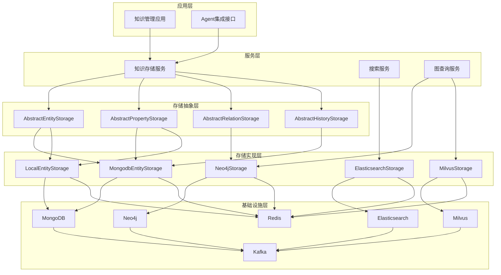

# AIKB

A knowledge management system intergated with agent

## Plan

## Basic Structure

- KnowledgeStorage
- Crew
- KnowledgeResource

```mermaid
graph TB
    subgraph "应用层"
        A[知识管理应用]
        B[Agent集成接口]
    end
    
    subgraph "服务层"
        C[知识存储服务]
        D[搜索服务]
        E[图查询服务]
    end
    
    subgraph "存储抽象层"
        F[AbstractEntityStorage]
        G[AbstractPropertyStorage]
        H[AbstractRelationStorage]
        I[AbstractHistoryStorage]
    end
    
    subgraph "存储实现层"
        J[MongodbEntityStorage]
        K[LocalEntityStorage]
        L[ElasticsearchStorage]
        M[Neo4jStorage]
        N[MilvusStorage]
    end
    
    subgraph "基础设施层"
        O[MongoDB]
        P[Elasticsearch]
        Q[Neo4j]
        R[Milvus]
        S[Kafka]
        T[Redis]
    end
    
    A --> C
    B --> C
    C --> F
    C --> G
    C --> H
    C --> I
    F --> J
    F --> K
    G --> J
    G --> K
    H --> M
    I --> J
    D --> L
    E --> M
    E --> N
    J --> O
    K --> O
    L --> P
    M --> Q
    N --> R
    J --> T
    K --> T
    L --> T
    M --> T
    N --> T
    O --> S
    P --> S
    Q --> S
    R --> S


```