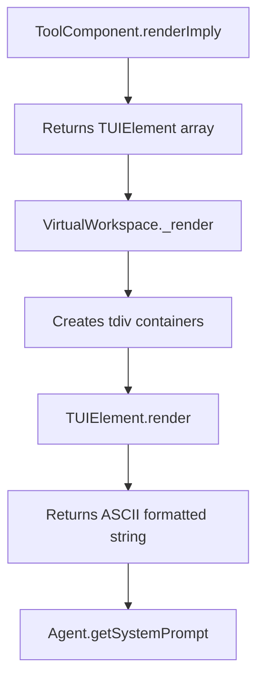
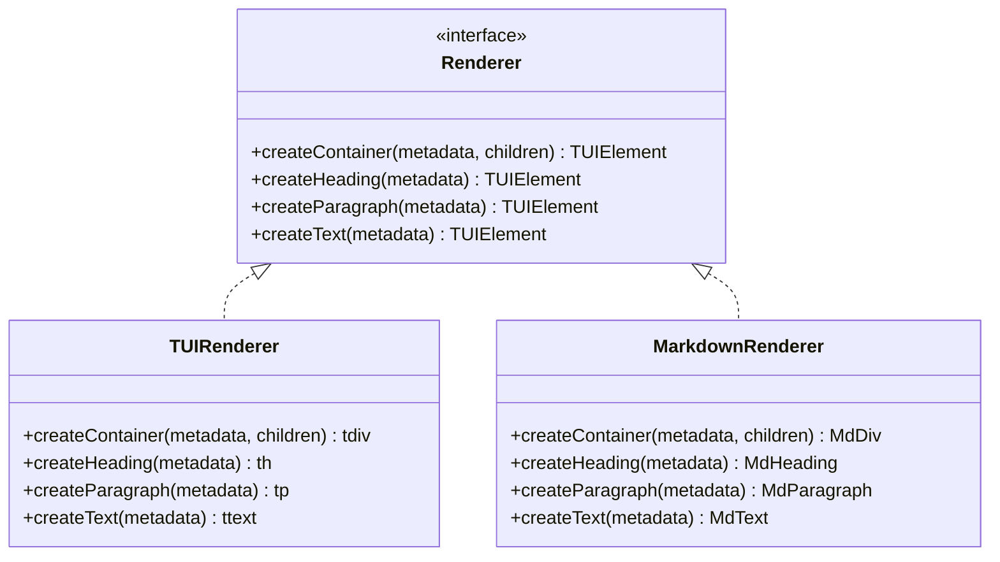

# Markdown Rendering Mode Design Plan

## Overview

This document describes the design for adding Markdown rendering support to the `statefulContext` module, enabling switching between TUI (Terminal UI) and Markdown rendering modes at Workspace initialization.

## Current Architecture Analysis

### TUI Rendering System

The current rendering system uses a class hierarchy:

```
TUIElement (abstract base)
├── tdiv (container with borders)
├── th (heading with underline)
├── tp (paragraph)
└── ttext (plain text)
```

Key characteristics:
- Uses ASCII box-drawing characters (`┌─┐`) for borders
- Fixed-width layout with padding/margin calculations
- `render()` method returns formatted string

### Rendering Flow



## Proposed Architecture

### Design Goals

1. **Minimal Changes**: Preserve existing TUI rendering code without modification
2. **Clean Abstraction**: Introduce renderer abstraction for both modes
3. **Configuration-Based**: Mode selection via `VirtualWorkspaceConfig`
4. **Backward Compatible**: Default to TUI mode

### Component Architecture



### New Type Definitions

```typescript
// In types.ts

/**
 * Rendering mode for workspace context
 */
export type RenderMode = 'tui' | 'markdown';

/**
 * Configuration options for VirtualWorkspace
 */
export interface VirtualWorkspaceConfig {
    // ... existing fields ...
    
    /**
     * Rendering mode for workspace context
     * - 'tui': Terminal UI with ASCII borders (default)
     * - 'markdown': Markdown format with headlines and separators
     */
    renderMode?: RenderMode;
}
```

### Markdown Element Classes

#### MdElement (Base Class)

```typescript
// ui/markdown/MdElement.ts

export abstract class MdElement {
    protected metadata: ElementMetadata;
    protected children: MdElement[];
    protected depth: number; // For headline level tracking
    
    constructor(metadata?: ElementMetadata, children?: MdElement[], depth?: number) {
        this.metadata = metadata || {};
        this.children = children || [];
        this.depth = depth ?? 0;
    }
    
    abstract render(): string;
    
    addChild(child: MdElement): void {
        this.children.push(child);
    }
    
    getChildren(): MdElement[] {
        return this.children;
    }
}
```

#### MdDiv (Container)

```typescript
// ui/markdown/MdDiv.ts

export class MdDiv extends MdElement {
    render(): string {
        const content = this.metadata.content ?? '';
        const childRenders = this.children.map(c => c.render()).join('\n\n');
        
        // Use horizontal rule for containers with borders
        const prefix = this.metadata.styles?.showBorder 
            ? '\n---\n\n' 
            : '';
        
        const result = [content, childRenders].filter(Boolean).join('\n\n');
        
        return prefix + result;
    }
}
```

#### MdHeading (Heading)

```typescript
// ui/markdown/MdHeading.ts

export class MdHeading extends MdElement {
    render(): string {
        const content = this.metadata.content ?? '';
        const level = this.depth + 1; // Calculate heading level from depth
        const hashes = '#'.repeat(Math.min(level, 6));
        
        return `${hashes} ${content}`;
    }
}
```

#### MdParagraph (Paragraph)

```typescript
// ui/markdown/MdParagraph.ts

export class MdParagraph extends MdElement {
    render(): string {
        const content = this.metadata.content ?? '';
        return content;
    }
}
```

#### MdText (Text)

```typescript
// ui/markdown/MdText.ts

export class MdText extends MdElement {
    render(): string {
        return this.metadata.content ?? '';
    }
}
```

### Renderer Interface

```typescript
// ui/Renderer.ts

import type { TUIElement } from './TUIElement.js';
import type { MdElement } from './markdown/MdElement.js';
import type { ElementMetadata, HeadingLevel } from '../types.js';

export interface IRenderer {
    /**
     * Create a container element
     */
    createContainer(metadata: ElementMetadata, children?: TUIElement[] | MdElement[]): TUIElement | MdElement;
    
    /**
     * Create a heading element
     */
    createHeading(metadata: { content?: string; level?: HeadingLevel }, depth?: number): TUIElement | MdElement;
    
    /**
     * Create a paragraph element
     */
    createParagraph(metadata: ElementMetadata): TUIElement | MdElement;
    
    /**
     * Create a text element
     */
    createText(metadata: ElementMetadata): TUIElement | MdElement;
    
    /**
     * Get the render mode
     */
    getMode(): RenderMode;
}

export class TUIRenderer implements IRenderer {
    createContainer(metadata: ElementMetadata, children?: TUIElement[]): tdiv {
        return new tdiv(metadata as tdivMetadata, children);
    }
    
    createHeading(metadata: { content?: string; level?: HeadingLevel }): th {
        return new th(metadata as thMetadata);
    }
    
    createParagraph(metadata: ElementMetadata): tp {
        return new tp(metadata as tpMetadata);
    }
    
    createText(metadata: ElementMetadata): ttext {
        return new ttext(metadata as ttextMetadata);
    }
    
    getMode(): 'tui' {
        return 'tui';
    }
}

export class MarkdownRenderer implements IRenderer {
    private baseDepth: number;
    
    constructor(baseDepth: number = 0) {
        this.baseDepth = baseDepth;
    }
    
    createContainer(metadata: ElementMetadata, children?: MdElement[]): MdDiv {
        return new MdDiv(metadata, children, this.baseDepth);
    }
    
    createHeading(metadata: { content?: string; level?: HeadingLevel }, depth?: number): MdHeading {
        return new MdHeading(
            { content: metadata.content },
            undefined,
            (depth ?? 0) + this.baseDepth
        );
    }
    
    createParagraph(metadata: ElementMetadata): MdParagraph {
        return new MdParagraph(metadata, undefined, this.baseDepth);
    }
    
    createText(metadata: ElementMetadata): MdText {
        return new MdText(metadata, undefined, this.baseDepth);
    }
    
    getMode(): 'markdown' {
        return 'markdown';
    }
}
```

### VirtualWorkspace Modifications

```typescript
// virtualWorkspace.ts

class VirtualWorkspace {
    private config: VirtualWorkspaceConfig;
    private renderer: IRenderer;
    
    constructor(...) {
        this.config = {
            // ... existing config ...
            renderMode: config.renderMode ?? 'tui', // Default to TUI
        };
        
        // Initialize renderer based on mode
        this.renderer = this.config.renderMode === 'markdown'
            ? new MarkdownRenderer()
            : new TUIRenderer();
    }
    
    private async _render(): Promise<TUIElement | MdElement> {
        if (this.config.renderMode === 'markdown') {
            return this._renderMarkdown();
        }
        return this._renderTUI();
    }
    
    private async _renderMarkdown(): Promise<MdElement> {
        const container = new MdDiv({
            content: `# VIRTUAL WORKSPACE: ${this.config.name}`,
        }, [], 0);
        
        // Add description if present
        if (this.config.description) {
            container.addChild(new MdParagraph({
                content: `**Description:** ${this.config.description}`,
            }, undefined, 1));
        }
        
        // Add skills section
        container.addChild(this.renderSkillsSectionMarkdown());
        
        // Add components
        const components = this.config.alwaysRenderAllComponents
            ? await this.skillManager.getAllComponentsWithIds()
            : this.skillManager.getActiveComponentsWithIds();
            
        for (const { componentId, component } of components) {
            const componentContainer = new MdDiv({
                content: `## ${this.activeSkill?.name || 'global'}:${componentId}`,
            }, [], 1);
            
            const componentRenders = await component.renderImply();
            componentRenders.forEach(el => componentContainer.addChild(el));
            container.addChild(componentContainer);
        }
        
        return container;
    }
    
    private async _renderTUI(): Promise<TUIElement> {
        // ... existing TUI rendering logic ...
    }
    
    async render(): Promise<string> {
        const context = await this._render();
        return context.render();
    }
}
```

### ToolComponent Modifications

```typescript
// toolComponent.ts

abstract class ToolComponent {
    // ... existing code ...
    
    /**
     * Render component as a UI element
     * @param renderer - The renderer to use (optional, for future extensibility)
     */
    async render(renderer?: IRenderer): Promise<TUIElement | MdElement> {
        const body = await this.renderImply();
        
        // If renderer is provided, use it (for future extensibility)
        // Otherwise, return based on body element types
        if (body.length > 0 && body[0] instanceof MdElement) {
            return new MdDiv({ styles: { showBorder: true } }, body);
        }
        return new tdiv({ styles: { showBorder: true } }, body as TUIElement[]);
    }
}
```

## File Structure

```
libs/agent-lib/src/statefulContext/
├── types.ts (modified - add RenderMode, update VirtualWorkspaceConfig)
├── virtualWorkspace.ts (modified - use renderer)
├── toolComponent.ts (modified - support both element types)
├── ui/
│   ├── index.ts (modified - export markdown elements)
│   ├── Renderer.ts (new - renderer interface and implementations)
│   ├── TUIElement.ts (unchanged)
│   ├── tdiv.ts (unchanged)
│   ├── text/
│   │   ├── th.ts (unchanged)
│   │   ├── tp.ts (unchanged)
│   │   └── ttext.ts (unchanged)
│   └── markdown/ (new directory)
│       ├── MdElement.ts (new - base class)
│       ├── MdDiv.ts (new - container)
│       ├── MdHeading.ts (new - heading)
│       ├── MdParagraph.ts (new - paragraph)
│       ├── MdText.ts (new - text)
│       └── index.ts (new - exports)
```

## Implementation Steps

### Step 1: Type Definitions
- [ ] Add `RenderMode` type to `types.ts`
- [ ] Add `renderMode` field to `VirtualWorkspaceConfig`

### Step 2: Create Markdown Element Classes
- [ ] Create `ui/markdown/` directory
- [ ] Implement `MdElement` base class
- [ ] Implement `MdDiv` container
- [ ] Implement `MdHeading` heading element
- [ ] Implement `MdParagraph` paragraph element
- [ ] Implement `MdText` text element
- [ ] Create `ui/markdown/index.ts` exports

### Step 3: Create Renderer Abstraction
- [ ] Create `ui/Renderer.ts` with `IRenderer` interface
- [ ] Implement `TUIRenderer` class
- [ ] Implement `MarkdownRenderer` class

### Step 4: Update UI Index
- [ ] Export markdown elements from `ui/index.ts`
- [ ] Export renderer classes from `ui/index.ts`

### Step 5: Modify VirtualWorkspace
- [ ] Add renderer initialization in constructor
- [ ] Create `_renderMarkdown()` method
- [ ] Modify `_render()` to dispatch based on mode
- [ ] Create `renderSkillsSectionMarkdown()` method

### Step 6: Update ToolComponent
- [ ] Modify `render()` method to support both element types

### Step 7: Testing
- [ ] Unit tests for Markdown element classes
- [ ] Unit tests for Renderer classes
- [ ] Integration tests for VirtualWorkspace with markdown mode
- [ ] Backward compatibility tests (TUI mode should work unchanged)

## Example Output Comparison

### TUI Mode (Current)

```
╔════════════════════════════════════════════════════════════╗
║               VIRTUAL WORKSPACE: Search Workspace            ║
╠════════════════════════════════════════════════════════════╣
║ Description: A workspace for searching                      ║
╠════════════════════════════════════════════════════════════╣
║ ╔═══════════════════════════════════════════════════════╗ ║
║ ║ SKILLS                                                 ║ ║
║ ╠═══════════════════════════════════════════════════════╣ ║
║ ║ **Skill ID:** `search-skill` [ACTIVE]                   ║ ║
║ ║ **Display Name:** Search Skill                         ║ ║
╚════════════════════════════════════════════════════════════╝
```

### Markdown Mode (New)

```markdown
# VIRTUAL WORKSPACE: Search Workspace

**Description:** A workspace for searching

---

## SKILLS

**Skill ID:** `search-skill` **[ACTIVE]**
**Display Name:** Search Skill

---

## search-skill:search-component

### Search Results

No results yet. Use the search tool to find items.
```

## Migration Path

### Phase 1: Add Markdown Support (Non-Breaking)
1. Add new types and markdown element classes
2. Add renderer abstraction
3. Modify VirtualWorkspace to support both modes
4. Default to TUI mode for backward compatibility

### Phase 2: Update Components (Optional)
1. Components can optionally support markdown-specific rendering
2. Override `renderImply()` to return MdElement[] when in markdown mode

### Phase 3: Enable Markdown Mode
1. Set `renderMode: 'markdown'` in workspace config
2. Verify all components render correctly

## Backward Compatibility

- **Default Behavior**: Workspaces without `renderMode` config default to `'tui'`
- **Existing Code**: All existing TUI element classes remain unchanged
- **Component Interface**: `ToolComponent.renderImply()` return type remains `TUIElement[]` (MdElement is compatible)
- **API Stability**: No breaking changes to public interfaces

## Future Extensions

1. **Custom Renderers**: The `IRenderer` interface allows for custom rendering implementations
2. **Dynamic Mode Switching**: Architecture supports runtime mode switching if needed in the future
3. **Component-Aware Rendering**: Components can detect render mode and customize output
4. **Nested Depth Tracking**: Markdown heading levels automatically adjust based on container nesting
