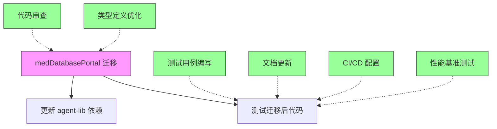

# 并行任务计划：medDatabasePortal 迁移期间

## 概述

在执行 medDatabasePortal 迁移的同时，以下任务可以并行进行，互不干扰。

## 并行任务矩阵

```
┌─────────────────────────────────────────────────────────────────┐
│                    medDatabasePortal 迁移                        │
│                    (主线任务)                                    │
├─────────────────────────────────────────────────────────────────┤
│  并行任务 1│  并行任务 2  │  并行任务 3 │  并行任务 4  │
│  测试用例  │  文档更新    │  CI/CD 配置 │  代码审查   │
└─────────────────────────────────────────────────────────────────┘
```

## 并行任务详情

### 任务 1: 测试用例编写

**负责人员：** 测试工程师
**依赖：** 无（可独立进行）
**产出：**
- `libs/bibliography-search/src/__tests__/pubmed.service.test.ts`
- `libs/bibliography-search/src/__tests__/BibliographySearchComponent.test.ts`

**工作内容：**
```typescript
// 1. PubmedService 测试
describe('PubmedService', () => {
  it('should search articles by term', async () => {
    const service = new PubmedService();
    const result = await service.searchByPattern({
      term: 'cancer',
      sort: 'date',
      sortOrder: 'dsc',
      filter: [],
      page: 1
    });
    expect(result.totalResults).toBeGreaterThan(0);
  });

  it('should get article detail by pmid', async () => {
    const service = new PubmedService();
    const detail = await service.getArticleDetail('12345678');
    expect(detail.pmid).toBe('12345678');
  });
});

// 2. BibliographySearchComponent 测试
describe('BibliographySearchComponent', () => {
  it('should handle search_pubmed tool call', async () => {
    const component = new BibliographySearchComponent();
    await component.handleToolCall('search_pubmed', { term: 'diabetes' });
    expect(component.currentResults).not.toBeNull();
  });
});
```

### 任务 2: 文档更新

**负责人员：** 技术文档工程师
**依赖：** 无（可独立进行）
**产出：**
- `docs/bibliography-search-guide.md`
- `docs/migration-guide.md`
- `README.md` 更新

**工作内容：**
```markdown
# Bibliography Search 组件使用指南

## 安装

```bash
pnpm add bibliography-search
```

## 使用方式

### 1. 直接使用 PubmedService

```typescript
import { PubmedService } from 'bibliography-search';

const service = new PubmedService();
const results = await service.searchByPattern({
  term: 'machine learning',
  sort: 'date',
  sortOrder: 'dsc',
  filter: [],
  page: 1
});
```

### 2. 使用 BibliographySearchComponent

```typescript
import { BibliographySearchComponent } from 'bibliography-search';
import { VirtualWorkspace } from 'agent-lib';

const workspace = new VirtualWorkspace();
const component = new BibliographySearchComponent();
workspace.addComponent(component);
```
```

### 任务 3: CI/CD 配置优化

**负责人员：** DevOps 工程师
**依赖：** 无（可独立进行）
**产出：**
- `.github/workflows/build.yml` 更新
- `.github/workflows/test.yml` 更新
- `tsup.config.base.ts` 共享配置

**工作内容：**
```yaml
# .github/workflows/build.yml
name: Build

on:
  push:
    branches: [main]
  pull_request:
    branches: [main]

jobs:
  build:
    runs-on: ubuntu-latest
    steps:
      - uses: actions/checkout@v4
      - uses: pnpm/action-setup@v2
        with:
          version: 10
      - uses: actions/setup-node@v4
        with:
          node-version: '20'
          cache: 'pnpm'
      
      - name: Install dependencies
        run: pnpm install
      
      - name: Build all packages
        run: pnpm -r build
      
      - name: Test
        run: pnpm -r test
```

### 任务 4: 代码审查

**负责人员：** 高级开发工程师
**依赖：** 无（可独立进行）
**产出：**
- 代码审查报告
- 技术债务清单
- 重构建议

**审查范围：**
1. agent-lib 中的装饰器使用
2. 依赖注入模式
3. 错误处理模式
4. 日志记录规范

### 任务 5: 性能基准测试

**负责人员：** 性能工程师
**依赖：** 无（可独立进行）
**产出：**
- 性能基准测试报告
- 性能优化建议

**工作内容：**
```typescript
// benchmark/pubmed.service.bench.ts
import { PubmedService } from 'bibliography-search';

const service = new PubmedService();

// 基准测试：搜索性能
console.time('search');
for (let i = 0; i < 10; i++) {
  await service.searchByPattern({ term: 'cancer', sort: 'date', sortOrder: 'dsc', filter: [], page: 1 });
}
console.timeEnd('search');
```

### 任务 6: 类型定义优化

**负责人员：** TypeScript 专家
**依赖：** 无（可独立进行）
**产出：**
- 优化的类型定义
- 类型导出优化

**工作内容：**
```typescript
// libs/bibliography-search/src/types/index.ts
export type { 
  PubmedSearchParams,
  ArticleProfile,
  ArticleDetail,
  Author,
  Keyword,
  FullTextSource,
  RetrivalStrategy,
  FieldConstraint
} from './pubmed.types.js';

// 使用 zod 进行运行时验证
import { z } from 'zod';

export const PubmedSearchParamsSchema = z.object({
  term: z.string(),
  sort: z.enum(['match', 'date', 'pubdate', 'fauth', 'jour']),
  sortOrder: z.enum(['asc', 'dsc']),
  filter: z.array(z.string()),
  page: z.number().nullable()
});
```

## 任务依赖关系图



## 时间线建议

| 阶段 | 主线任务 | 并行任务 1 | 并行任务 2 | 并行任务 3 |
|------|----------|------------|------------|------------|
| 1 | 创建包结构 | 测试框架搭建 | 文档大纲 | CI/CD 配置 |
| 2 | 迁移 PubmedService | 编写单元测试 | API 文档 | 构建流程 |
| 3 | 迁移 Component | 集成测试 | 使用指南 | 测试流程 |
| 4 | 更新依赖 | E2E 测试 | 迁移指南 | 部署流程 |
| 5 | 测试验证 | 性能测试 | 故障排除 | 发布流程 |

## 资源分配建议

| 任务 | 优先级 | 预计工作量 | 建议人员 |
|------|--------|------------|----------|
| medDatabasePortal 迁移 | P0 | 2-3天 | 1名高级工程师 |
| 测试用例编写 | P1 | 1-2天 | 1名测试工程师 |
| 文档更新 | P2 | 1天 | 1名文档工程师 |
| CI/CD 配置 | P1 | 0.5天 | 1名 DevOps |
| 代码审查 | P2 | 0.5天 | 1名高级工程师 |
| 性能基准测试 | P3 | 1天 | 1名性能工程师 |
| 类型定义优化 | P2 | 0.5天 | 1名 TypeScript 专家 |

## 风险评估

### 低风险（可完全并行）
- 测试用例编写
- 文档更新
- CI/CD 配置
- 性能基准测试

### 中风险（需要协调）
- 代码审查（需要了解迁移进度）
- 类型定义优化（需要与迁移同步）

### 高风险（需要串行）
- 无

## 总结

在 medDatabasePortal 迁移期间，可以并行执行 6 个独立任务：
1. **测试用例编写** - 独立进行，为迁移后的代码准备测试
2. **文档更新** - 独立进行，准备新的使用指南
3. **CI/CD 配置** - 独立进行，优化构建和部署流程
4. **代码审查** - 半独立，需要了解迁移进度
5. **性能基准测试** - 独立进行，建立性能基线
6. **类型定义优化** - 半独立，需要与迁移同步

这些并行任务可以显著缩短整体迁移时间，提高代码质量和可维护性。
