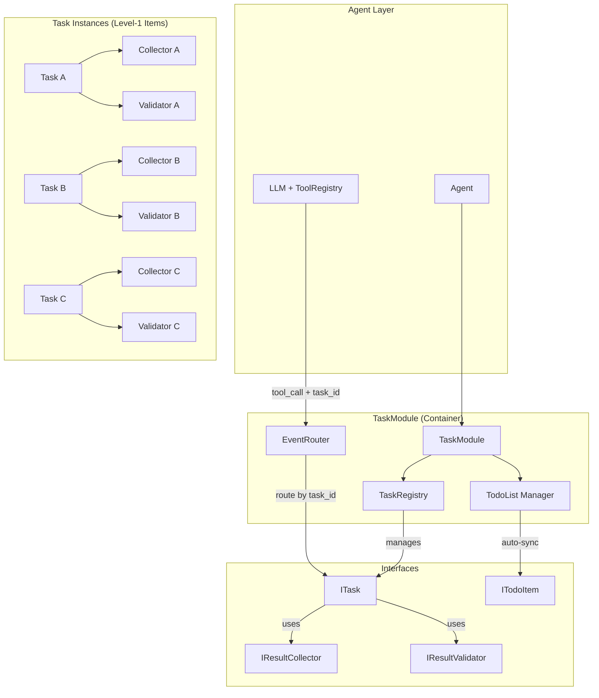

# Task Module Architecture Design (Revised)

## 核心设计原则

```
1. TaskModule 是容器，管理多个独立 Task 实例
2. 每个 Task 拥有专属的 Collector + Validator（隔离配置）
3. Task 创建 → 自动注册为 Level-1 TodoItem（双向同步）
4. Tool Call 通过 task_id 路由到目标 Task 的专属接收器
```

---

## 架构概览



---

## 核心接口定义

### 1. TaskModule (容器接口)

```typescript
// task/task-module.interface.ts

/**
 * TaskModule 作为 Task 容器，负责编排和协调
 */
export interface ITaskModule {
    // === Task 生命周期管理 ===
    
    /**
     * 创建一个新 Task（自动注册为 Level-1 TodoItem）
     */
    createTask(config: TaskCreationConfig): ITask;
    
    /**
     * 获取 Task 实例
     */
    getTask(taskId: string): ITask | undefined;
    
    /**
     * 获取所有一级 Task（对应 TodoList Level-1）
     */
    getRootTasks(): ITask[];
    
    /**
     * 销毁 Task（同步移除对应 TodoItem）
     */
    destroyTask(taskId: string): void;
    
    // === 批量操作 ===
    
    /**
     * 批量收集结果（按 task_id 分发到各自 Collector）
     */
    collectResults(entries: TaskResultEntry[]): CollectionReport;
    
    /**
     * 批量验证（按 task_id 分发到各自 Validator）
     */
    validateResults(entries: ValidationEntry[]): ValidationReport;
    
    // === Prompt 集成 ===
    
    /**
     * 生成包含所有 Task 状态的 TODO 列表（LLM 可读格式）
     */
    renderTodoListForPrompt(options?: RenderOptions): string;
    
    /**
     * 获取 Task 上下文摘要（用于构建 system prompt）
     */
    getTaskContextSummary(taskIds?: string[]): TaskContextSummary;
    
    // === 配置 ===
    
    /**
     * 设置默认 Collector/Validator（仅当 Task 未指定时使用）
     */
    setDefaults(config: TaskModuleDefaults): void;
}

export interface TaskCreationConfig {
    id: string;                           // 唯一标识
    description: string;                  // 任务描述（同步为 TodoItem description）
    collector: IResultCollector;          // 专属 Collector（必填）
    validator: IResultValidator;          // 专属 Validator（必填）
    priority?: TodoPriority;              // 同步为 TodoItem priority
    metadata?: Record<string, unknown>;   // 扩展元数据
}

export interface TaskResultEntry {
    taskId: string;
    data: unknown;
    context?: CollectionContext;
}

export interface ValidationEntry {
    taskId: string;
    result: CollectedResult;
}

export interface CollectionReport {
    success: boolean;
    results: Record<string, CollectedResult>;
    errors?: Record<string, string>;
}

export interface ValidationReport {
    results: Record<string, ValidationResult>;
    summary: { valid: number; invalid: number };
}
```

### 2. Task (独立任务接口)

```typescript
// task/task.interface.ts

/**
 * 独立 Task 实例契约
 * 每个 Task 拥有专属的 Collector + Validator + TodoItem 关联
 */
export interface ITask {
    readonly id: string;
    readonly description: string;
    readonly status: TaskStatus;
    
    // 专属组件（创建时注入，不可变）
    readonly collector: IResultCollector;
    readonly validator: IResultValidator;
    
    // 关联的 Level-1 TodoItem（自动同步）
    readonly todoItem: ITodoItem;
    
    // === 结果处理 ===
    
    /**
     * 收集结果（使用本 Task 专属 Collector）
     */
    collect(data: unknown, context?: CollectionContext): CollectedResult;
    
    /**
     * 验证结果（使用本 Task 专属 Validator）
     */
    validate(result: CollectedResult): ValidationResult;
    
    /**
     * 处理并验证（收集 + 验证 原子操作）
     */
    process(data: unknown, context?: CollectionContext): ProcessedResult;
    
    // === 状态管理 ===
    
    /**
     * 更新任务状态（同步更新关联 TodoItem）
     */
    updateStatus(status: TaskStatus, reason?: string): void;
    
    /**
     * 标记任务完成（自动更新 TodoItem 状态 + 触发完成事件）
     */
    complete(finalResult?: unknown): void;
    
    /**
     * 标记任务失败（自动更新 TodoItem 状态 + 触发错误事件）
     */
    fail(error: TaskError): void;
    
    // === 事件订阅 ===
    
    onResult(callback: TaskResultCallback): Subscription;
    onComplete(callback: TaskCompleteCallback): Subscription;
    onError(callback: TaskErrorCallback): Subscription;
}

export interface ProcessedResult {
    collected: CollectedResult;
    validation: ValidationResult;
    taskStatus: TaskStatus;
}

export type TaskResultCallback = (task: ITask, result: CollectedResult) => void | Promise<void>;
export type TaskCompleteCallback = (task: ITask, finalResult?: unknown) => void | Promise<void>;
export type TaskErrorCallback = (task: ITask, error: TaskError) => void | Promise<void>;
```

### 3. Result Collector & Validator (保持简洁)

```typescript
// task/collector/collector.interface.ts

export interface IResultCollector {
    readonly type: string;
    collect(data: unknown, context?: CollectionContext): CollectedResult;
    canCollect(data: unknown): boolean;
}

export interface CollectionContext {
    source?: 'llm_text' | 'tool_call' | 'external';
    toolName?: string;
    metadata?: Record<string, unknown>;
}

export interface CollectedResult {
    readonly type: string;
    readonly data: unknown;
    readonly metadata?: Record<string, unknown>;
    readonly timestamp: number;
}
```

```typescript
// task/validator/validator.interface.ts

export interface IResultValidator {
    readonly type: string;
    validate(result: CollectedResult): ValidationResult;
}

export interface ValidationResult {
    isValid: boolean;
    errors?: string[];
    warnings?: string[];
    metadata?: Record<string, unknown>;
}
```

### 4. TodoItem (与 Task 自动同步)

```typescript
// task/todo/todo-item.interface.ts

/**
 * TodoItem 接口（Level-1 由 Task 自动管理）
 */
export interface ITodoItem {
    readonly id: string;              // 与 Task.id 一致（Level-1）
    readonly description: string;     // 与 Task.description 同步
    status: TodoStatus;               // 与 Task.status 双向同步
    priority?: TodoPriority;
    level: 1;                         // Level-1 固定（由 Task 创建）
    
    // 子任务管理（LLM 可动态添加 Level-2）
    addChild(item: Level2TodoItem): void;
    getChildren(): Level2TodoItem[];
    
    // 元数据（只读，由 Task 同步）
    readonly meta: {
        source: 'task_auto_generated';
        taskId: string;
        createdAt: number;
        [key: string]: unknown;
    };
}

export interface Level2TodoItem {
    id: string;                       // LLM 动态生成
    description: string;
    status: TodoStatus;
    parentId: string;                 // 关联 Level-1 Task.id
    level: 2;
}

export type TodoStatus = 'pending' | 'in_progress' | 'completed' | 'failed';
export type TodoPriority = 'low' | 'medium' | 'high';
```

### 5. Event Router (结果路由)

```typescript
// task/router/event-router.interface.ts

/**
 * 简单路由：根据 task_id 将结果分发到目标 Task
 */
export interface IEventRouter {
    /**
     * 路由工具调用结果到指定 Task
     */
    routeToTask(taskId: string, payload: ToolCallPayload): RoutingResult;
    
    /**
     * 广播结果到多个 Task（可选）
     */
    broadcast(taskIds: string[], payload: ToolCallPayload): BroadcastResult;
}

export interface ToolCallPayload {
    toolName: string;
    result: unknown;
    metadata?: {
        callId?: string;
        confidence?: number;
        [key: string]: unknown;
    };
}

export interface RoutingResult {
    success: boolean;
    targetTaskId?: string;
    error?: string;
}

export interface BroadcastResult {
    successCount: number;
    failureCount: number;
    details: Array<{ taskId: string; success: boolean; error?: string }>;
}
```

---

## 关键交互流程

### 1. Task 创建 → 自动同步 TodoItem

```
createTask(config)
    │
    ├─ 1. 实例化 Task（注入 collector + validator）
    ├─ 2. 创建 Level-1 TodoItem（id/description/status 与 Task 同步）
    ├─ 3. 注册到 TaskRegistry
    ├─ 4. 注册到 TodoList Manager
    │
    └─ 返回 ITask 引用
```

### 2. Tool Call → 路由 → Task 专属 Collector

```
LLM 输出工具调用:
{
  "name": "report_result",
  "arguments": {
    "task_id": "task-analyze-code",  // 显式指定目标 Task
    "result": { ... }
  }
}
    │
    ▼
ToolRegistry 接收调用
    │
    ▼
IEventRouter.routeToTask("task-analyze-code", payload)
    │
    ▼
TaskRegistry 查找目标 Task
    │
    ▼
targetTask.collect(payload.result)  // 使用该 Task 专属 Collector
    │
    ▼
(可选) targetTask.validate(collectedResult)  // 使用该 Task 专属 Validator
    │
    ▼
触发 Task 的 onResult 回调
```

### 3. 状态同步：Task ↔ TodoItem

```
Task.updateStatus('completed')
    │
    ├─ 更新内部 status
    ├─ 自动调用 todoItem.status = 'completed'
    ├─ 触发 'task:status_changed' 事件
    │
    └─ (反向) TodoList 更新 UI / prompt 输出

TodoList 中 LLM 更新子任务状态
    │
    └─ 不影响 Level-1 Task 状态（除非所有子任务完成 → 可配置自动提升）
```

---

## 使用示例（接口层级）

### 创建带专属组件的 Task

```typescript
// 伪代码：展示接口协作关系

const taskModule: ITaskModule = container.resolve(TYPES.TaskModule);

// 为不同 Task 配置不同 Collector/Validator
const analysisTask = taskModule.createTask({
    id: 'task-code-analysis',
    description: 'Analyze uploaded codebase',
    collector: new CodeAnalysisCollector(),    // 专属
    validator: new SchemaValidator(codeSchema) // 专属
});

const docTask = taskModule.createTask({
    id: 'task-generate-docs',
    description: 'Generate documentation',
    collector: new TextCollector(),            // 专属
    validator: new CustomValidator(docRules)   // 专属
});

// 自动效果：
// - analysisTask.todoItem 和 docTask.todoItem 已作为 Level-1 项加入 TodoList
// - LLM prompt 中将看到两个一级任务
```

### LLM 工具调用定向投递

```typescript
// LLM 生成（概念示意）:
{
  "tool": "report_result",
  "args": {
    "task_id": "task-code-analysis",  // 定向到 analysisTask
    "result": { "files": 42, "issues": 3 }
  }
}

// 系统内部流转:
// 1. EventRouter 根据 task_id 找到 analysisTask
// 2. 调用 analysisTask.collect(...) → 使用 CodeAnalysisCollector
// 3. (可选) 调用 analysisTask.validate(...) → 使用 SchemaValidator
// 4. 触发 analysisTask 的 onResult 回调
// 5. docTask 完全不受影响（隔离）
```

### 批量处理结果

```typescript
// Agent 收到多个工具调用结果后批量处理:
const report = taskModule.collectResults([
    { taskId: 'task-code-analysis', data: { ... } },
    { taskId: 'task-generate-docs',  data: { ... } }
]);

// 内部：自动分发到各自 Task 的专属 Collector
// 返回：按 taskId 分组的收集结果报告
```

---

## 扩展性设计

### 1. 自定义 Collector/Validator

```typescript
// 只需实现接口即可注入到 Task
interface CustomCollector extends IResultCollector { /* ... */ }
interface CustomValidator extends IResultValidator { /* ... */ }

// 创建 Task 时使用:
taskModule.createTask({
    id: 'task-x',
    description: '...',
    collector: new CustomCollector(),  // 插件式替换
    validator: new CustomValidator()
});
```

### 2. 自定义路由策略

```typescript
// 扩展 IEventRouter 实现更复杂的路由逻辑
interface SmartRouter extends IEventRouter {
    // 例如：基于语义匹配、任务依赖图等
}
```

### 3. TodoItem 渲染定制

```typescript
// TaskModule.renderTodoListForPrompt 支持策略注入
interface RenderStrategy {
    formatTask(task: ITask): string;
    formatChildren(children: Level2TodoItem[]): string;
}
```

---

## 设计原则总结

| 原则 | 体现 |
|------|------|
| **容器-组件分离** | `ITaskModule` 管理生命周期，`ITask` 专注单一任务逻辑 |
| **依赖注入** | Collector/Validator 在 Task 创建时注入，不可变 |
| **自动同步** | Task ↔ Level-1 TodoItem 双向状态同步，减少样板代码 |
| **隔离性** | 每个 Task 的结果收集/验证完全独立，互不干扰 |
| **显式路由** | `task_id` 显式指定目标，避免歧义，便于调试 |

---

## 后续演进建议

1. **Task 模板** - 预定义 Collector+Validator+Description 组合，快速创建常见 Task
2. **依赖声明** - Task 可声明依赖其他 Task，支持执行顺序控制
3. **结果聚合** - 支持跨 Task 的结果汇总（用于最终报告生成）
4. **持久化接口** - `ITaskSnapshot` 支持任务状态保存/恢复
