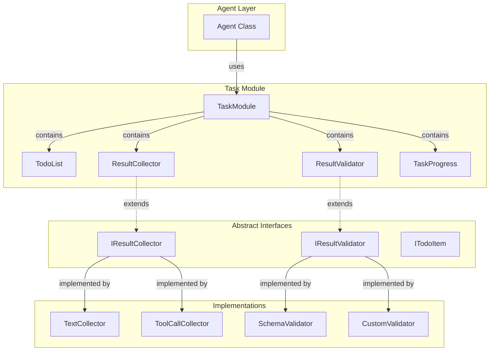

# Task Module Architecture Design

## Overview

The Task Module is designed to provide structured task management for the Agent framework, focusing on:
1. **TODO List Management** - Track and display task progress to guide LLM execution
2. **Multi-step Result Collection** - Accumulate LLM outputs across multiple iterations
3. **Pluggable Collectors & Validators** - Abstract interfaces for scenario-specific implementations

## Architecture Diagram



## Core Components

### 1. TaskModule (Main Class)

The central orchestrator that manages all task-related functionality.

**Responsibilities:**
- Initialize and manage TODO list
- Coordinate result collection
- Delegate validation to validators
- Provide task context to LLM

**Key Methods:**
```typescript
class TaskModule {
    // TODO List Management
    addTodoItem(item: TodoItem): void
    updateTodoItem(id: string, status: TodoStatus): void
    getTodoList(): TodoItem[]
    getTodoListForPrompt(): string  // Format for LLM

    // Result Collection
    collectResult(data: unknown, collector?: IResultCollector): void
    getCollectedResults(): CollectedResult[]
    getResultsForPrompt(): string  // Format for LLM

    // Validation
    validateResult(result: unknown, validator?: IResultValidator): ValidationResult
    setDefaultValidator(validator: IResultValidator): void

    // Progress Tracking
    getProgress(): TaskProgress
    updateProgress(update: ProgressUpdate): void
}
```

### 2. TodoList (Hierarchical)

Manages hierarchical task items with two levels:
- **Level 1 (Root)** - Hardcoded top-level tasks (predefined by Agent/system)
- **Level 2 (Children)** - LLM-dynamically created subtasks under each root task

**TodoItem Structure:**
```typescript
interface TodoItem {
    id: string
    description: string
    status: 'pending' | 'in_progress' | 'completed' | 'failed'
    priority?: 'low' | 'medium' | 'high'
    level: 1 | 2  // Level 1 = hardcoded root, Level 2 = LLM-created
    parentId?: string  // Parent ID for Level 2 items
    children?: TodoItem[]  // Child items for Level 1
    metadata?: Record<string, unknown>
}
```

**Prompt Format Example:**
```
=== TODO LIST ===
[ ] Task 1: Analyze the codebase
    [ ] 1.1: Identify main components
    [ ] 1.2: Review dependencies
[*] Task 2: Identify key components
    [*] 2.1: List core modules
    [ ] 2.2: Document interfaces
[ ] Task 3: Generate documentation
```

**Key Features:**
- Level 1 tasks are predefined/hardcoded by the Agent
- LLM can add Level 2 subtasks under any Level 1 task
- LLM can update status of both Level 1 and Level 2 tasks
- Parent task status automatically updates based on children

### 3. Result Collector (Abstract)

Abstract interface for collecting LLM outputs.

**Interface:**
```typescript
interface IResultCollector {
    readonly type: string
    collect(data: unknown): CollectedResult
    canCollect(data: unknown): boolean
}
```

**Base Implementations:**
- `TextCollector` - Collects text responses
- `ToolCallCollector` - Collects tool call information
- `ThinkingCollector` - Collects thinking phase results
- `CompositeCollector` - Chains multiple collectors

### 4. Result Validator (Abstract)

Abstract interface for validating LLM results.

**Interface:**
```typescript
interface IResultValidator {
    readonly type: string
    validate(data: unknown): ValidationResult
}
```

**Validation Result:**
```typescript
interface ValidationResult {
    isValid: boolean
    errors?: string[]
    warnings?: string[]
    metadata?: Record<string, unknown>
}
```

**Base Implementations:**
- `SchemaValidator` - Validates against Zod/JSON schema
- `CustomValidator` - Custom validation logic
- `CompositeValidator` - Chains multiple validators

### 5. TaskProgress

Tracks overall task execution progress.

**Structure:**
```typescript
interface TaskProgress {
    currentStep: number
    totalSteps: number
    percentage: number
    status: TaskStatus
    startTime: number
    endTime?: number
}
```

## Integration with Agent

### Dependency Injection

The TaskModule will be injected into the Agent via the DI container:

```typescript
// In DI types
TYPES.TaskModule: Symbol('TaskModule')
TYPES.ITaskModule: Symbol('ITaskModule')
TYPES.ResultCollector: Symbol('ResultCollector')
TYPES.ResultValidator: Symbol('ResultValidator')
```

### Agent Integration Points

1. **Initialization** - Agent receives TaskModule via constructor
2. **Start** - Initialize TODO list when agent starts
3. **Request Loop** - Collect results after each LLM response
4. **Prompt Building** - Include TODO and results in system prompt
5. **Validation** - Validate results before completion

### Example Agent Usage

```typescript
async start(query: string): Promise<Agent> {
    // Initialize TODO list from query
    this.taskModule.initializeFromQuery(query);

    // Add initial TODO items
    this.taskModule.addTodoItem({
        id: '1',
        description: 'Understand the task',
        status: 'in_progress'
    });

    // ... rest of start logic
}

protected async requestLoop(query: string): Promise<boolean> {
    // ... existing logic

    // Collect LLM response
    this.taskModule.collectResult(response.textResponse);

    // Validate if needed
    const validation = this.taskModule.validateResult(response);
    if (!validation.isValid) {
        // Handle validation errors
    }

    // Update TODO based on progress
    this.taskModule.updateTodoItem('1', 'completed');
    this.taskModule.addTodoItem({
        id: '2',
        description: 'Execute tool calls',
        status: 'in_progress'
    });
}
```

## File Structure

```
libs/agent-lib/src/task/
├── task.type.ts              # Existing types
├── task.errors.ts            # Existing errors
├── task.module.ts            # Main TaskModule class
├── todo/
│   ├── todo.type.ts          # TODO interfaces
│   └── TodoList.ts           # TODO list implementation
├── collector/
│   ├── collector.type.ts     # Collector interfaces
│   ├── TextCollector.ts      # Text collector
│   ├── ToolCallCollector.ts  # Tool call collector
│   └── CompositeCollector.ts # Composite collector
├── validator/
│   ├── validator.type.ts     # Validator interfaces
│   ├── SchemaValidator.ts    # Schema-based validator
│   └── CustomValidator.ts    # Custom validator
├── progress/
│   ├── progress.type.ts      # Progress interfaces
│   └── TaskProgress.ts       # Progress tracker
└── __tests__/
    ├── task.module.test.ts
    ├── todo.test.ts
    ├── collector.test.ts
    └── validator.test.ts
```

## Usage Examples

### Basic Usage

```typescript
import { TaskModule } from './task/task.module.js';
import { TextCollector } from './task/collector/TextCollector.js';
import { SchemaValidator } from './task/validator/SchemaValidator.js';

// Create task module with custom collector
const taskModule = new TaskModule({
    collector: new TextCollector(),
    validator: new SchemaValidator(mySchema)
});

// Add TODO items
taskModule.addTodoItem({
    id: '1',
    description: 'Analyze requirements',
    status: 'pending'
});

// Collect results
taskModule.collectResult('Analysis complete');

// Validate
const result = taskModule.validateResult({ foo: 'bar' });
```

### Custom Collector Implementation

```typescript
class CodeAnalysisCollector implements IResultCollector {
    readonly type = 'code-analysis';

    collect(data: unknown): CollectedResult {
        // Custom collection logic
        return {
            type: this.type,
            data: processData(data),
            timestamp: Date.now()
        };
    }

    canCollect(data: unknown): boolean {
        // Check if data can be collected
        return true;
    }
}
```

### Custom Validator Implementation

```typescript
class BusinessRuleValidator implements IResultValidator {
    readonly type = 'business-rule';

    validate(data: unknown): ValidationResult {
        const result = { isValid: true, errors: [] };

        // Custom validation logic
        if (!meetsBusinessRules(data)) {
            result.isValid = false;
            result.errors.push('Business rule violation');
        }

        return result;
    }
}
```

## Design Principles

1. **Separation of Concerns** - Each component has a single responsibility
2. **Open/Closed Principle** - Open for extension (custom collectors/validators), closed for modification
3. **Dependency Inversion** - Depend on abstractions, not concrete implementations
4. **Interface Segregation** - Small, focused interfaces
5. **Single Responsibility** - Each class does one thing well

## Future Enhancements

1. **Persistence** - Save/restore task state
2. **Async Collection** - Support async result collection
3. **Streaming Results** - Handle streaming LLM responses
4. **Multi-modal Results** - Support images, audio, etc.
5. **Task Templates** - Pre-defined TODO lists for common tasks
6. **Progress Estimation** - AI-powered time estimation
