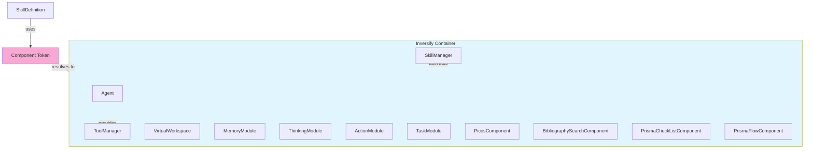

# Tool IoC Migration Analysis

## Executive Summary

The agent-lib project **already uses InversifyJS for dependency injection** in most of its core services. However, the **Tool system is NOT fully integrated with IoC** - it uses a hybrid approach where some parts use IoC while others use manual instantiation.

## Current Architecture

### IoC Usage (Already Implemented)

| Component                                                                              | IoC Status | Details                                     |
| -------------------------------------------------------------------------------------- | ---------- | ------------------------------------------- |
| [`Agent`](libs/agent-lib/src/agent/agent.ts)                                           | ✅ Full    | `@injectable()` with `@inject()` decorators |
| [`ToolManager`](libs/agent-lib/src/tools/ToolManager.ts)                               | ✅ Full    | `@injectable()` bound as singleton          |
| [`SkillManager`](libs/agent-lib/src/skills/SkillManager.ts)                            | ✅ Full    | `@injectable()` bound as singleton          |
| [`VirtualWorkspace`](libs/agent-lib/src/statefulContext/virtualWorkspace.ts)           | ✅ Full    | `@injectable()` with `@inject()`            |
| [`MemoryModule`](libs/agent-lib/src/memory/MemoryModule.ts)                            | ✅ Full    | `@injectable()` with `@inject()`            |
| [`ThinkingModule`](libs/agent-lib/src/thinking/ThinkingModule.ts)                      | ✅ Full    | `@injectable()` with `@inject()`            |
| [`ActionModule`](libs/agent-lib/src/action/ActionModule.ts)                            | ✅ Full    | `@injectable()` with `@inject()`            |
| [`TaskModule`](libs/agent-lib/src/task/TaskModule.ts)                                  | ✅ Full    | `@injectable()` with `@inject()`            |
| [`ComponentToolProvider`](libs/agent-lib/src/tools/providers/ComponentToolProvider.ts) | ✅ Full    | `@injectable()`                             |
| [`SkillToolProvider`](libs/agent-lib/src/tools/providers/SkillToolProvider.ts)         | ✅ Full    | `@injectable()`                             |
| [`GlobalToolProvider`](libs/agent-lib/src/tools/providers/GlobalToolProvider.ts)       | ✅ Full    | `@injectable()` with `@inject()`            |

### Non-IoC Usage (Manual Instantiation)

| Component                                                                                                        | Issue                                                         | Details |
| ---------------------------------------------------------------------------------------------------------------- | ------------------------------------------------------------- | ------- |
| [`ToolComponent`](libs/agent-lib/src/statefulContext/toolComponent.ts)                                           | ❌ Abstract class, manually instantiated in skill definitions |
| [`PicosComponent`](libs/agent-lib/src/components/PICOS/picosComponents.ts)                                       | ❌ Factory function in skill, not using IoC                   |
| [`BibliographySearchComponent`](libs/agent-lib/src/components/bibliographySearch/bibliographySearchComponent.ts) | ❌ Factory function in skill, not using IoC                   |
| [`PrismaCheckListComponent`](libs/agent-lib/src/components/PRISMA/prismaCheckListComponent.ts)                   | ❌ Factory function in skill, not using IoC                   |
| [`PrismaFlowComponent`](libs/agent-lib/src/components/PRISMA/prismaFlowComponent.ts)                             | ❌ Factory function in skill, not using IoC                   |

## The Problem

### 1. Skill Component Factory Pattern

Skills define components using **factory functions**:

```typescript
// pico-extraction.skill.ts
components: [
  createComponentDefinition(
    'pico-templater',
    'PICO Templater',
    'Formulates clinical research questions using PICO framework',
    async () => {
      // ← Factory function
      const { PicosComponent } = await import(
        '../../components/PICOS/picosComponents.js'
      );
      return new PicosComponent(); // ← Manual instantiation
    },
  ),
];
```

### 2. SkillManager Manual Component Instantiation

In [`SkillManager.activateSkill()`](libs/agent-lib/src/skills/SkillManager.ts:141-160):

```typescript
// BEFORE FIX (the issue we just fixed)
for (const componentDef of skill.components) {
  this.activeComponents.set(componentDef.componentId, componentDef.instance);
  // componentDef.instance is the factory function itself!
}
```

### 3. ComponentToolProvider Manual Injection

[`ComponentToolProvider`](libs/agent-lib/src/tools/providers/ComponentToolProvider.ts:18-24):

```typescript
constructor(
    private componentKey: string,
    private component: ToolComponent  // ← Passed directly, not injected
) {
    super();
    this.id = `component:${componentKey}`;
}
```

## Migration Feasibility Analysis

### ✅ Feasible: High

**The migration is highly feasible** because:

1. **InversifyJS is already used** - No new dependencies needed
2. **Most services are already IoC** - Only tool components need migration
3. **Clear separation of concerns** - ToolComponents are independent services
4. **Existing patterns** - Similar patterns already used (e.g., MemoryModule, ThinkingModule)

### Architecture Comparison

#### Current (Hybrid)

```mermaid
graph TB
    subgraph IoC_Services["IoC Services"]
        Agent
        ToolManager
        SkillManager
        VirtualWorkspace
        MemoryModule
        ThinkingModule
        ActionModule
        TaskModule
    end

    subgraph Manual["Manual Instantiation"]
        SkillDefinition["createComponentDefinition()"]
            ToolComponent["new PicosComponent()"]
        end
    end

    SkillManager -->|registers| ToolManager
    SkillManager -->|activates| ToolComponent
    ToolComponent -->|provides tools to| ToolManager

    style IoC_Services fill:#e1f5fe
    style Manual fill:#f9a8d4
```

#### Proposed (Full IoC)



## Migration Plan

### Phase 1: Add ToolComponent Types to DI

1. **Add component TYPE symbols** to [`di/types.ts`](libs/agent-lib/src/di/types.ts):

   ```typescript
   // Component TYPE symbols
   PicosComponent: Symbol('PicosComponent'),
   BibliographySearchComponent: Symbol('BibliographySearchComponent'),
   PrismaCheckListComponent: Symbol('PrismaCheckListComponent'),
   PrismaFlowComponent: Symbol('PrismaFlowComponent'),
   ```

2. **Bind components in container** [`di/container.ts`](libs/agent-lib/src/di/container.ts):
   ```typescript
   // Component bindings
   this.container
     .bind<PicosComponent>(TYPES.PicosComponent)
     .to(PicosComponent)
     .inRequestScope();
   this.container
     .bind<BibliographySearchComponent>(TYPES.BibliographySearchComponent)
     .to(BibliographySearchComponent)
     .inRequestScope();
   // ... other components
   ```

### Phase 2: Update ToolComponent Base Class

1. **Add `@injectable()` decorator** to [`ToolComponent`](libs/agent-lib/src/statefulContext/toolComponent.ts):

   ```typescript
   @injectable()
   export abstract class ToolComponent {
     // ... existing code
   }
   ```

2. **Add optional constructor injection** for dependencies:
   ```typescript
   constructor(
       @inject(TYPES.Logger) @optional() protected logger?: Logger
   ) {
       // ... existing code
   }
   ```

### Phase 3: Update ComponentToolProvider

1. **Modify constructor to accept component token**:

   ```typescript
   constructor(
       private componentToken: interfaces.Newable<ToolComponent>
   ) {
       super();
       this.component = container.get(componentToken);
       this.id = `component:${this.getComponentKey()}`;
   }
   ```

2. **Update `getComponentKey()` to use token**:
   ```typescript
   getComponentKey(): string {
       // Extract component type name from token
       return this.component.constructor.name;
   }
   ```

### Phase 4: Update SkillManager

1. **Update `activateSkill()` to resolve components from container**:
   ```typescript
   async activateSkill(skillName: string): Promise<SkillActivationResult> {
       // ... existing code

       if (skill.components) {
           for (const componentDef of skill.components) {
               // Resolve component from DI container
               const component = container.get(componentDef.componentToken);

               this.activeComponents.set(componentDef.componentId, component);
               // ... rest of activation logic
           }
       }
   }
   ```

### Phase 5: Update Skill Definitions

1. **Change factory functions to component tokens**:

   ```typescript
   // Before:
   components: [
     createComponentDefinition(
       'pico-templater',
       'PICO Templater',
       '...',
       async () => {
         const { PicosComponent } = await import('...');
         return new PicosComponent();
       },
     ),
   ];

   // After:
   components: [
     createComponentDefinition(
       'pico-templater',
       'PICO Templater',
       '...',
       TYPES.PicosComponent, // ← Use DI token
     ),
   ];
   ```

2. **Update `SkillDefinition.createComponentDefinition()`** to accept tokens:
   ```typescript
   export function createComponentDefinition(
     componentId: string,
     displayName: string,
     description: string,
     instanceOrToken: ToolComponent | interfaces.Newable<ToolComponent>,
   ): ComponentDefinition {
     return {
       componentId,
       displayName,
       description,
       instance: instanceOrToken,
     };
   }
   ```

### Phase 6: Update SkillToolProvider

1. **Remove manual component instantiation logic**:
   ```typescript
   // Remove the factory function handling in initializeComponentProviders()
   // Components are now resolved from container
   private initializeComponentProviders(): void {
       if (!this.skill.components) {
           return;
       }

       for (const componentDef of this.skill.components) {
           // Component is already resolved by container
           const component = container.get(componentDef.componentToken);

           const provider = new ComponentToolProvider(
               `${this.skill.name}:${componentDef.componentId}`,
               component
           );
           this.componentProviders.set(componentDef.componentId, provider);
       }
   }
   ```

## Benefits of Migration

| Benefit                  | Description                                                |
| ------------------------ | ---------------------------------------------------------- |
| **Consistency**          | All services use the same DI pattern                       |
| **Testability**          | Components can be easily mocked in tests                   |
| **Maintainability**      | Clear dependency graph, easier to understand               |
| **Extensibility**        | New components can be added without modifying SkillManager |
| **Lifecycle Management** | Container manages component lifecycle automatically        |
| **Type Safety**          | Compile-time checking of dependencies                      |

## Challenges and Considerations

| Challenge                  | Mitigation                                                 |
| -------------------------- | ---------------------------------------------------------- |
| **Circular Dependencies**  | Use `interfaces.Newable<T>` for lazy resolution            |
| **Async Initialization**   | Some components may need async setup - use factory pattern |
| **Backward Compatibility** | Keep factory pattern as fallback during transition         |
| **Test Updates**           | All skill tests need updating to use container             |

## Conclusion

**Recommendation: Proceed with Migration**

The tool system can be successfully migrated to full IoC pattern. The migration should be done incrementally:

1. Start with new components (use IoC from the start)
2. Gradually migrate existing components
3. Keep factory pattern as fallback for backward compatibility
4. Update tests to use container-based component resolution

This will result in a more maintainable, testable, and consistent architecture.
