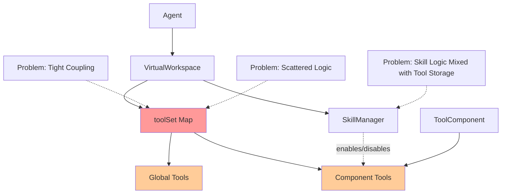
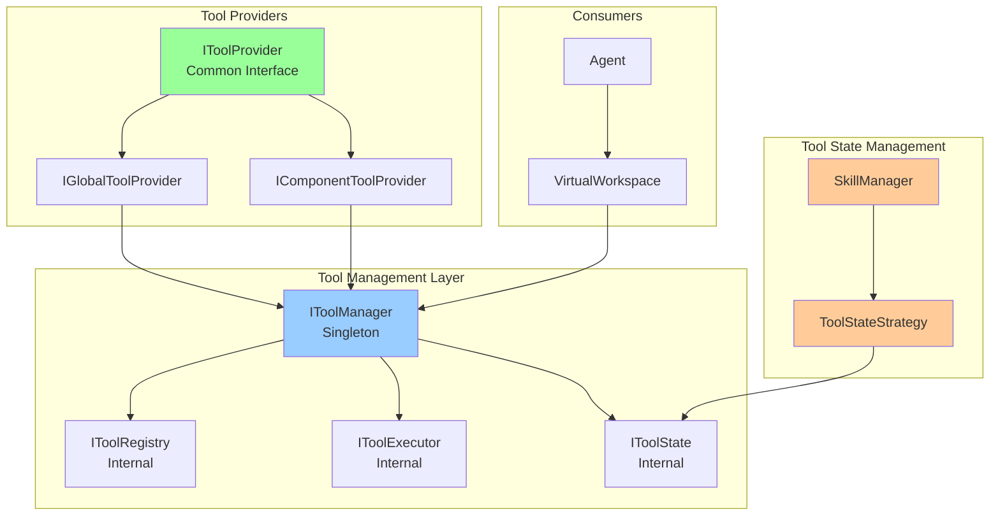

# Tool Management Refactoring Plan

## Executive Summary

This document outlines a comprehensive refactoring plan to centralize tool management in the agent-lib system using InversifyJS IoC (Inversion of Control) pattern. The current system has tools from two distinct sources (global tools, component tools) with a skill-based tool state management system for controlling tool activation.

## Current State Analysis

### Tool Sources

1. **Global Tools** ([`virtualWorkspace.ts:68-97`](../libs/agent-lib/src/statefulContext/virtualWorkspace.ts:68))
   - `attempt_completion`, `get_skill`, `list_skills`, `deactivate_skill`
   - Stored in `VirtualWorkspace.toolSet` Map
   - Always enabled

2. **Component Tools** ([`virtualWorkspace.ts:311-324`](../libs/agent-lib/src/statefulContext/virtualWorkspace.ts:311))
   - Registered via `registerComponent()`
   - Each `ToolComponent` has its own `toolSet: Map<string, Tool>`
   - Merged into `VirtualWorkspace.toolSet` with `ToolSource.COMPONENT`

### Skill System (Tool State Management)

**Important**: Skills do NOT provide separate tools. Instead, the Skill system controls which Component Tools are enabled/disabled.

- Skills define a list of `tools` (tool names) that should be active when that skill is selected
- When a skill is activated, only the tools listed in the skill are enabled
- All other component tools are disabled
- When no skill is active, all component tools are enabled

This is a **tool state management** pattern, not a separate tool source.

### Current Architecture Problems



**Issues:**
1. **Tight Coupling**: [`VirtualWorkspace`](../libs/agent-lib/src/statefulContext/virtualWorkspace.ts:18) directly manages all tools
2. **Scattered Logic**: Tool registration, execution, and state management spread across multiple classes
3. **No Central Registry**: Tools registered in different places without unified interface
4. **Limited IoC**: Existing DI system ([`TYPES`](../libs/agent-lib/src/di/types.ts:16)) not leveraged for tool management
5. **Hard to Test**: Direct instantiation makes testing difficult
6. **No Lifecycle Management**: Tools lack proper initialization/cleanup hooks
7. **Skill-Tool Coupling**: SkillManager directly manipulates VirtualWorkspace's internal toolSet

## Proposed Architecture

### Core Design Principles

1. **Single Responsibility**: Each module has one clear purpose
2. **Dependency Inversion**: Depend on abstractions, not concrete implementations
3. **Open/Closed**: Open for extension (new tool providers), closed for modification
4. **Interface Segregation**: Small, focused interfaces

### New Architecture Overview



**Key Design Decision**: Skills are NOT tool providers. Instead, they are **tool state strategies** that control which component tools are enabled/disabled.

## Detailed Design

### 1. Core Interfaces

#### IToolProvider
```typescript
// libs/agent-lib/src/tools/providers/IToolProvider.ts
export interface IToolProvider {
    /**
     * Unique identifier for this provider
     */
    readonly id: string;
    
    /**
     * Get all tools provided by this provider
     */
    getTools(): Promise<Tool[]> | Tool[];
    
    /**
     * Get a specific tool by name
     */
    getTool(name: string): Promise<Tool | undefined> | Tool | undefined;
    
    /**
     * Execute a tool call
     */
    executeTool(name: string, params: any): Promise<any>;
    
    /**
     * Provider priority (higher = checked first)
     */
    readonly priority: number;
}
```

#### IToolManager
```typescript
// libs/agent-lib/src/tools/IToolManager.ts
export interface IToolManager {
    /**
     * Register a tool provider
     */
    registerProvider(provider: IToolProvider): void;
    
    /**
     * Unregister a tool provider
     */
    unregisterProvider(providerId: string): boolean;
    
    /**
     * Get all registered tools
     */
    getAllTools(): ToolRegistration[];
    
    /**
     * Get available (enabled) tools
     */
    getAvailableTools(): Tool[];
    
    /**
     * Execute a tool call
     */
    executeTool(name: string, params: any): Promise<any>;
    
    /**
     * Enable a tool
     */
    enableTool(name: string): boolean;
    
    /**
     * Disable a tool
     */
    disableTool(name: string): boolean;
    
    /**
     * Check if tool is enabled
     */
    isToolEnabled(name: string): boolean;
    
    /**
     * Get tool source information
     */
    getToolSource(name: string): ToolSourceInfo | null;
    
    /**
     * Subscribe to tool availability changes
     */
    onAvailabilityChange(callback: (tools: Tool[]) => void): () => void;
}
```

### 2. ToolManager Implementation

```typescript
// libs/agent-lib/src/tools/ToolManager.ts
@injectable()
export class ToolManager implements IToolManager {
    private providers: Map<string, IToolProvider>;
    private toolRegistry: Map<string, ToolRegistration>;
    private availabilityCallbacks: Set<(tools: Tool[]) => void>;
    
    constructor(
        @inject(TYPES.ILogger) private logger: ILogger
    ) {
        this.providers = new Map();
        this.toolRegistry = new Map();
        this.availabilityCallbacks = new Set();
    }
    
    registerProvider(provider: IToolProvider): void {
        this.providers.set(provider.id, provider);
        this.refreshToolsFromProvider(provider);
        this.notifyAvailabilityChange();
    }
    
    private async refreshToolsFromProvider(provider: IToolProvider): Promise<void> {
        const tools = await provider.getTools();
        for (const tool of tools) {
            this.toolRegistry.set(tool.toolName, {
                tool,
                source: this.inferSource(provider),
                providerId: provider.id,
                enabled: true
            });
        }
    }
    
    async executeTool(name: string, params: any): Promise<any> {
        const registration = this.toolRegistry.get(name);
        if (!registration) {
            throw new ToolNotFoundError(name);
        }
        
        if (!registration.enabled) {
            throw new ToolDisabledError(name);
        }
        
        const provider = this.providers.get(registration.providerId!);
        if (!provider) {
            throw new ProviderNotFoundError(registration.providerId!);
        }
        
        return await provider.executeTool(name, params);
    }
    
    // ... other methods
}
```

### 3. Provider Implementations

#### GlobalToolProvider
```typescript
// libs/agent-lib/src/tools/providers/GlobalToolProvider.ts
@injectable()
export class GlobalToolProvider implements IToolProvider {
    readonly id = 'global-tools';
    readonly priority = 100;
    
    private tools: Map<string, Tool>;
    
    constructor() {
        this.tools = new Map();
        this.initializeTools();
    }
    
    private initializeTools(): void {
        const globalTools = [
            attempt_completion,
            get_skill,
            list_skills,
            deactivate_skill
        ];
        
        globalTools.forEach(tool => {
            this.tools.set(tool.toolName, tool);
        });
    }
    
    getTools(): Tool[] {
        return Array.from(this.tools.values());
    }
    
    getTool(name: string): Tool | undefined {
        return this.tools.get(name);
    }
    
    async executeTool(name: string, params: any): Promise<any> {
        const tool = this.tools.get(name);
        if (!tool) {
            throw new Error(`Global tool not found: ${name}`);
        }
        // Delegate to appropriate handler
        return await this.handleGlobalTool(name, params);
    }
}
```

#### ComponentToolProvider
```typescript
// libs/agent-lib/src/tools/providers/ComponentToolProvider.ts
@injectable()
export class ComponentToolProvider implements IToolProvider {
    readonly id: string;
    readonly priority = 50;
    
    constructor(
        private componentKey: string,
        private component: ToolComponent
    ) {}
    
    getTools(): Tool[] {
        return Array.from(this.component.toolSet.values());
    }
    
    async executeTool(name: string, params: any): Promise<any> {
        return await this.component.handleToolCall(name, params);
    }
}
```

### 3. Provider Implementations

#### GlobalToolProvider
```typescript
// libs/agent-lib/src/tools/providers/GlobalToolProvider.ts
@injectable()
export class GlobalToolProvider implements IToolProvider {
    readonly id = 'global-tools';
    readonly priority = 100;
    
    private tools: Map<string, Tool>;
    
    constructor() {
        this.tools = new Map();
        this.initializeTools();
    }
    
    private initializeTools(): void {
        const globalTools = [
            attempt_completion,
            get_skill,
            list_skills,
            deactivate_skill
        ];
        
        globalTools.forEach(tool => {
            this.tools.set(tool.toolName, tool);
        });
    }
    
    getTools(): Tool[] {
        return Array.from(this.tools.values());
    }
    
    getTool(name: string): Tool | undefined {
        return this.tools.get(name);
    }
    
    async executeTool(name: string, params: any): Promise<any> {
        const tool = this.tools.get(name);
        if (!tool) {
            throw new Error(`Global tool not found: ${name}`);
        }
        // Delegate to appropriate handler
        return await this.handleGlobalTool(name, params);
    }
}
```

#### ComponentToolProvider
```typescript
// libs/agent-lib/src/tools/providers/ComponentToolProvider.ts
@injectable()
export class ComponentToolProvider implements IToolProvider {
    readonly id: string;
    readonly priority = 50;
    
    constructor(
        private componentKey: string,
        private component: ToolComponent
    ) {}
    
    getTools(): Tool[] {
        return Array.from(this.component.toolSet.values());
    }
    
    async executeTool(name: string, params: any): Promise<any> {
        return await this.component.handleToolCall(name, params);
    }
}
```

### 4. Tool State Management (Skill System)

Skills are NOT tool providers. They are **tool state strategies** that control which component tools are enabled/disabled.

#### IToolStateStrategy
```typescript
// libs/agent-lib/src/tools/state/IToolStateStrategy.ts
export interface IToolStateStrategy {
    /**
     * Get the list of tool names that should be enabled
     */
    getEnabledTools(): string[];
    
    /**
     * Check if a specific tool should be enabled
     */
    shouldEnableTool(toolName: string): boolean;
    
    /**
     * Get the current strategy name (for debugging)
     */
    readonly strategyName: string;
}
```

#### NoSkillStrategy (default - all tools enabled)
```typescript
// libs/agent-lib/src/tools/state/NoSkillStrategy.ts
@injectable()
export class NoSkillStrategy implements IToolStateStrategy {
    readonly strategyName = 'no-skill';
    
    // When no skill is active, all component tools are enabled
    getEnabledTools(): string[] {
        return []; // Empty means "all"
    }
    
    shouldEnableTool(_toolName: string): boolean {
        return true;
    }
}
```

#### SkillBasedStrategy
```typescript
// libs/agent-lib/src/tools/state/SkillBasedStrategy.ts
@injectable()
export class SkillBasedStrategy implements IToolStateStrategy {
    readonly strategyName: string;
    
    constructor(
        private skill: Skill
    ) {
        this.strategyName = skill.name;
    }
    
    getEnabledTools(): string[] {
        return this.skill.tools?.map(t => t.toolName) ?? [];
    }
    
    shouldEnableTool(toolName: string): boolean {
        return this.skill.tools?.some(t => t.toolName === toolName) ?? false;
    }
}
```

#### IToolStateManager
```typescript
// libs/agent-lib/src/tools/state/IToolStateManager.ts
export interface IToolStateManager {
    /**
     * Get the current state strategy
     */
    getCurrentStrategy(): IToolStateStrategy;
    
    /**
     * Set strategy based on active skill
     */
    setStrategy(skill: Skill | null): void;
    
    /**
     * Apply current strategy to tool registry
     */
    applyStrategy(registry: IToolRegistry): void;
}
```

#### ToolStateManager Implementation
```typescript
// libs/agent-lib/src/tools/state/ToolStateManager.ts
@injectable()
export class ToolStateManager implements IToolStateManager {
    private currentStrategy: IToolStateStrategy;
    
    constructor(
        @inject(TYPES.IToolStateStrategyFactory)
        private strategyFactory: IToolStateStrategyFactory
    ) {
        // Default to no-skill strategy
        this.currentStrategy = new NoSkillStrategy();
    }
    
    getCurrentStrategy(): IToolStateStrategy {
        return this.currentStrategy;
    }
    
    setStrategy(skill: Skill | null): void {
        if (skill === null) {
            this.currentStrategy = new NoSkillStrategy();
        } else {
            this.currentStrategy = new SkillBasedStrategy(skill);
        }
    }
    
    applyStrategy(registry: IToolRegistry): void {
        const allTools = registry.getAllTools();
        
        for (const tool of allTools) {
            // Only apply to component tools, not global tools
            if (tool.source === ToolSource.COMPONENT) {
                const shouldBeEnabled = this.currentStrategy.shouldEnableTool(tool.toolName);
                if (shouldBeEnabled) {
                    registry.enableTool(tool.toolName);
                } else {
                    registry.disableTool(tool.toolName);
                }
            }
        }
        
        registry.notifyAvailabilityChange();
    }
}
```

### 5. DI Container Configuration

```typescript
// libs/agent-lib/src/di/container.ts
export function configureContainer(): Container {
    const container = new Container();
    
    // Tool Manager - Singleton
    container.bind<IToolManager>(TYPES.IToolManager)
        .to(ToolManager)
        .inSingletonScope();
    
    // Tool State Manager - Singleton
    container.bind<IToolStateManager>(TYPES.IToolStateManager)
        .to(ToolStateManager)
        .inSingletonScope();
    
    // Global Tool Provider - Singleton
    container.bind<IGlobalToolProvider>(TYPES.IGlobalToolProvider)
        .to(GlobalToolProvider)
        .inSingletonScope();
    
    // VirtualWorkspace - Request scope
    container.bind<IVirtualWorkspace>(TYPES.IVirtualWorkspace)
        .to(VirtualWorkspace)
        .inRequestScope();
    
    return container;
}
```

### 6. Updated TYPES

```typescript
// libs/agent-lib/src/di/types.ts
export const TYPES = {
    // ... existing types
    
    /**
     * IToolManager - Central tool management
     * @scope Singleton - Shared across all agents
     */
    IToolManager: Symbol('IToolManager'),
    
    /**
     * IToolProvider interface
     * @scope Transient - New instance per registration
     */
    IToolProvider: Symbol('IToolProvider'),
    
    /**
     * IGlobalToolProvider concrete
     * @scope Singleton - Shared across all agents
     */
    IGlobalToolProvider: Symbol('IGlobalToolProvider'),
    
    /**
     * IComponentToolProvider concrete
     * @scope Transient - New instance per component
     */
    IComponentToolProvider: Symbol('IComponentToolProvider'),
    
    /**
     * IToolStateManager - Tool state management (skill-based)
     * @scope Singleton - Shared across all agents
     */
    IToolStateManager: Symbol('IToolStateManager'),
    
    /**
     * IToolStateStrategy interface
     * @scope Transient - New instance per strategy
     */
    IToolStateStrategy: Symbol('IToolStateStrategy'),
};
```

## Implementation Steps

### Phase 1: Foundation (Core Interfaces & ToolManager)
- [ ] Create `IToolProvider` interface
- [ ] Create `IToolManager` interface
- [ ] Create `IToolStateStrategy` interface
- [ ] Create `IToolStateManager` interface
- [ ] Implement `ToolManager` class
- [ ] Implement `ToolStateManager` class
- [ ] Add DI types for tool management
- [ ] Write unit tests for ToolManager and ToolStateManager

### Phase 2: Provider Implementations
- [ ] Implement `GlobalToolProvider`
- [ ] Implement `ComponentToolProvider`
- [ ] Write unit tests for each provider

### Phase 3: State Strategy Implementations
- [ ] Implement `NoSkillStrategy` (default - all tools enabled)
- [ ] Implement `SkillBasedStrategy` (skill-controlled)
- [ ] Write unit tests for strategies

### Phase 4: VirtualWorkspace Refactoring
- [ ] Inject `IToolManager` into `VirtualWorkspace`
- [ ] Inject `IToolStateManager` into `VirtualWorkspace`
- [ ] Migrate global tools to `GlobalToolProvider`
- [ ] Update `registerComponent()` to create `ComponentToolProvider`
- [ ] Update `handleToolCall()` to use `IToolManager`
- [ ] Update `getAllTools()` to delegate to `IToolManager`

### Phase 5: SkillManager Integration
- [ ] Inject `IToolStateManager` into `SkillManager`
- [ ] Update skill activation to:
  - Set strategy via `IToolStateManager.setStrategy(skill)`
  - Apply strategy via `IToolStateManager.applyStrategy(toolManager)`
- [ ] Update skill deactivation to:
  - Set strategy to `NoSkillStrategy`
  - Apply strategy to re-enable all component tools

### Phase 6: Agent Integration
- [ ] Remove direct tool access from Agent
- [ ] All tool operations go through VirtualWorkspace -> IToolManager

### Phase 7: Testing & Documentation
- [ ] Integration tests for tool management
- [ ] Update existing tests
- [ ] Write migration guide
- [ ] Update API documentation

## Migration Strategy

### Backward Compatibility

```typescript
// VirtualWorkspace maintains backward compatible API
@injectable()
export class VirtualWorkspace implements IVirtualWorkspace {
    constructor(
        @inject(TYPES.IToolManager) private toolManager: IToolManager
    ) {
        // Delegate legacy methods to IToolManager
    }
    
    // Legacy method - delegates to IToolManager
    getAllTools(): ToolRegistration[] {
        return this.toolManager.getAllTools();
    }
    
    // Legacy method - delegates to IToolManager
    async handleToolCall(name: string, params: any): Promise<any> {
        return this.toolManager.executeTool(name, params);
    }
}
```

### Gradual Migration

1. **Step 1**: Introduce new interfaces alongside existing code
2. **Step 2**: Implement ToolManager and providers
3. **Step 3**: Update VirtualWorkspace to use IToolManager internally
4. **Step 4**: Update SkillManager to use IToolManager
5. **Step 5**: Deprecate direct tool access patterns
6. **Step 6**: Remove deprecated code in next major version

## Benefits

1. **Centralized Management**: Single source of truth for all tools
2. **Testability**: Easy to mock IToolManager for testing
3. **Extensibility**: New tool sources can be added without modifying existing code
4. **Consistency**: Uniform API for tool operations across all sources
5. **Lifecycle Management**: Proper initialization and cleanup hooks
6. **Observability**: Central point for logging and monitoring tool usage
7. **Type Safety**: Leverage TypeScript interfaces for compile-time checks

## Risks & Mitigation

| Risk | Impact | Mitigation |
|------|--------|------------|
| Breaking changes | High | Maintain backward compatibility during transition |
| Performance overhead | Medium | Cache tool lookups, use Map for O(1) access |
| Increased complexity | Medium | Clear interfaces, comprehensive documentation |
| Testing burden | Low | Parallel test suite development |

## Success Criteria

- [ ] All tool sources register through IToolManager
- [ ] Tool activation/disability works correctly
- [ ] Existing tests pass without modification
- [ ] New unit tests for ToolManager and providers
- [ ] Documentation updated
- [ ] No performance regression

## Open Questions

1. Should tool providers be lazy-loaded or eagerly registered?
2. How to handle tool name conflicts between providers?
3. Should we support tool versioning?
4. How to handle tool deprecation warnings?
