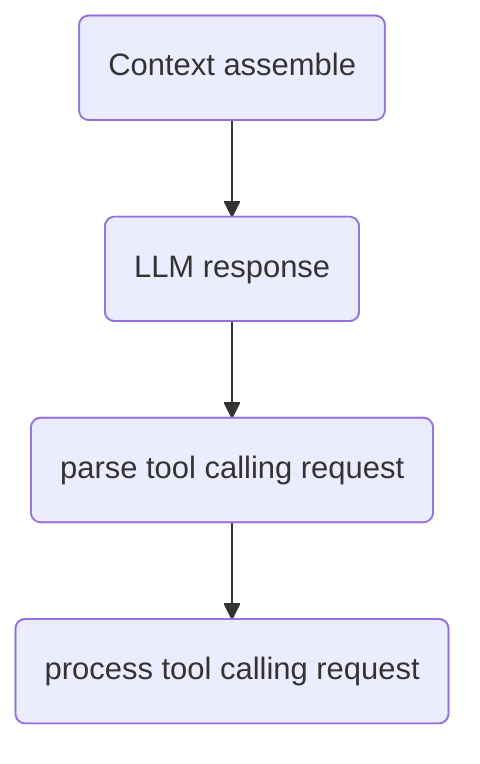

# agent-lib

This library was generated with [Nx](https://nx.dev).

## Running unit tests

Run `nx test agent-lib` to execute the unit tests via [Jest](https://jestjs.io).

## Tool calling workflow



## Dependency Injection with InversifyJS

This library uses InversifyJS for dependency injection, providing better testability, maintainability, and loose coupling between components.

### Quick Start

```typescript
import 'reflect-metadata';
import { getGlobalContainer } from './src/di/index.js';

const container = getGlobalContainer();
const agent = container.createAgent({
    agentPrompt: {
        capability: 'You are a helpful assistant',
        direction: 'Follow user instructions carefully'
    },
    config: {
        apiRequestTimeout: 60000
    }
});

await agent.start('Help me write code');
```

### Using AgentFactory (Backward Compatible)

For existing code, you can continue using the `AgentFactory` API:

```typescript
import { AgentFactory } from './src/agent/AgentFactory.js';
import { VirtualWorkspace } from './src/statefulContext/index.js';

const workspace = new VirtualWorkspace({});
const agent = AgentFactory.create(
    workspace,
    {
        capability: 'You are a helpful assistant',
        direction: 'Follow user instructions carefully'
    },
    {
        config: { apiRequestTimeout: 60000 },
        apiConfiguration: { apiModelId: 'gpt-4' }
    }
);
```

### Testing with DI

The DI container makes it easy to mock dependencies in tests:

```typescript
import 'reflect-metadata';
import { AgentContainer } from './src/di/container.js';
import { TYPES } from './src/di/types.js';

const container = new AgentContainer();
const internalContainer = container.getContainer();

// Mock ApiClient
const mockApiClient = {
    makeRequest: vi.fn().mockResolvedValue({
        toolCalls: [],
        textResponse: 'Mock response',
        requestTime: 100,
        tokenUsage: { promptTokens: 10, completionTokens: 5, totalTokens: 15 }
    })
};

internalContainer.rebind(TYPES.ApiClient).toConstantValue(mockApiClient);

const agent = container.createAgent({
    agentPrompt: { capability: 'Test', direction: 'Test' }
});
```

### Documentation

For comprehensive documentation on the DI system, including:
- Service identifiers and scopes
- Configuration options
- Architecture and dependency graph
- Migration guide from manual DI
- Best practices and troubleshooting

See [`src/di/README.md`](./src/di/README.md)
