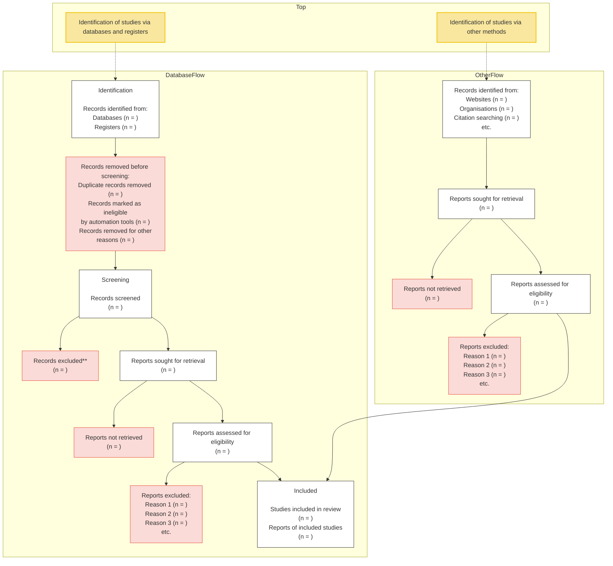

```mermaid
flowchart TD
    %% 样式定义
    classDef yellowBox fill:#f9e79f,stroke:#f1c40f,stroke-width:2px
    classDef blueBox fill:#85c1e9,stroke:#2e86c1,stroke-width:2px
    classDef whiteBox fill:#ffffff,stroke:#333,stroke-width:1px
    classDef excludeBox fill:#fadbd8,stroke:#e74c3c,stroke-width:1px

    %% 顶部标题框
    subgraph Top
        direction LR
        DB[Identification of studies via databases and registers]:::yellowBox
        OM[Identification of studies via other methods]:::yellowBox
    end

    %% 左侧主流程 - 数据库和注册库
    subgraph DatabaseFlow
        direction TB
        ID1["Identification<br><br>Records identified from:<br>Databases (n = )<br>Registers (n = )"]:::whiteBox
        
        REM["Records removed before screening:<br>Duplicate records removed (n = )<br>Records marked as ineligible<br>by automation tools (n = )<br>Records removed for other<br>reasons (n = )"]:::excludeBox
        
        SCR["Screening<br><br>Records screened<br>(n = )"]:::whiteBox
        
        EXC["Records excluded**<br>(n = )"]:::excludeBox
        
        RET1["Reports sought for retrieval<br>(n = )"]:::whiteBox
        
        NRET1["Reports not retrieved<br>(n = )"]:::excludeBox
        
        ASS1["Reports assessed for eligibility<br>(n = )"]:::whiteBox
        
        TEXC1["Reports excluded:<br>Reason 1 (n = )<br>Reason 2 (n = )<br>Reason 3 (n = )<br>etc."]:::excludeBox
        
        INC["Included<br><br>Studies included in review<br>(n = )<br>Reports of included studies<br>(n = )"]:::whiteBox
    end

    %% 右侧流程 - 其他方法
    subgraph OtherFlow
        direction TB
        ID2["Records identified from:<br>Websites (n = )<br>Organisations (n = )<br>Citation searching (n = )<br>etc."]:::whiteBox
        
        RET2["Reports sought for retrieval<br>(n = )"]:::whiteBox
        
        NRET2["Reports not retrieved<br>(n = )"]:::excludeBox
        
        ASS2["Reports assessed for eligibility<br>(n = )"]:::whiteBox
        
        TEXC2["Reports excluded:<br>Reason 1 (n = )<br>Reason 2 (n = )<br>Reason 3 (n = )<br>etc."]:::excludeBox
    end

    %% 连接关系 - 数据库流程
    ID1 --> REM
    REM --> SCR
    SCR --> EXC
    SCR --> RET1
    RET1 --> NRET1
    RET1 --> ASS1
    ASS1 --> TEXC1
    ASS1 --> INC

    %% 连接关系 - 其他方法流程
    ID2 --> RET2
    RET2 --> NRET2
    RET2 --> ASS2
    ASS2 --> TEXC2
    ASS2 --> INC

    %% 顶部到各流程的连接
    DB -.-> ID1
    OM -.-> ID2
```