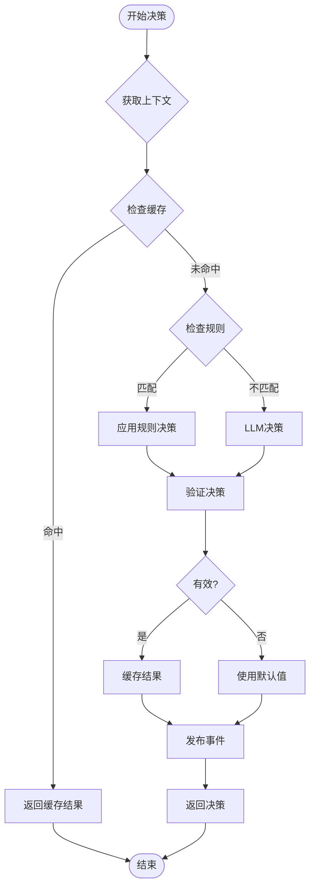
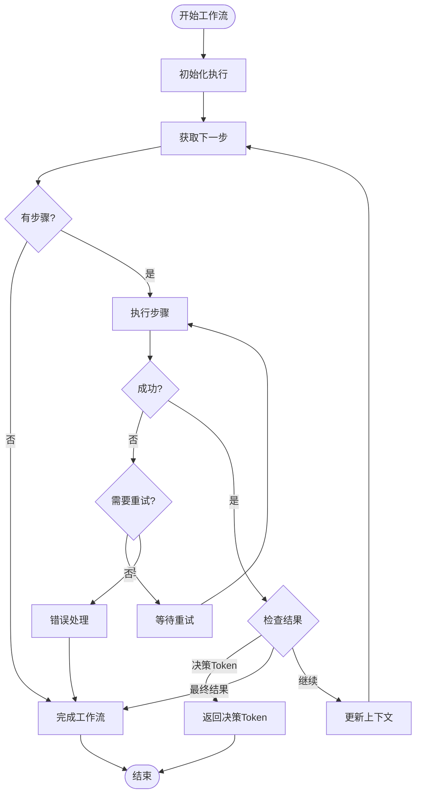
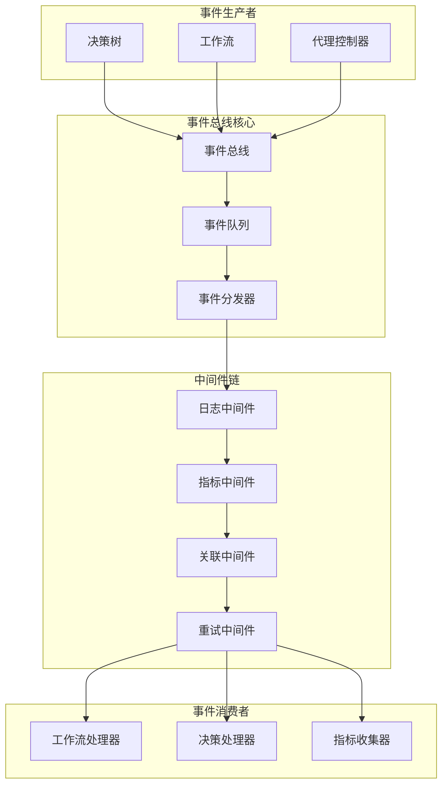
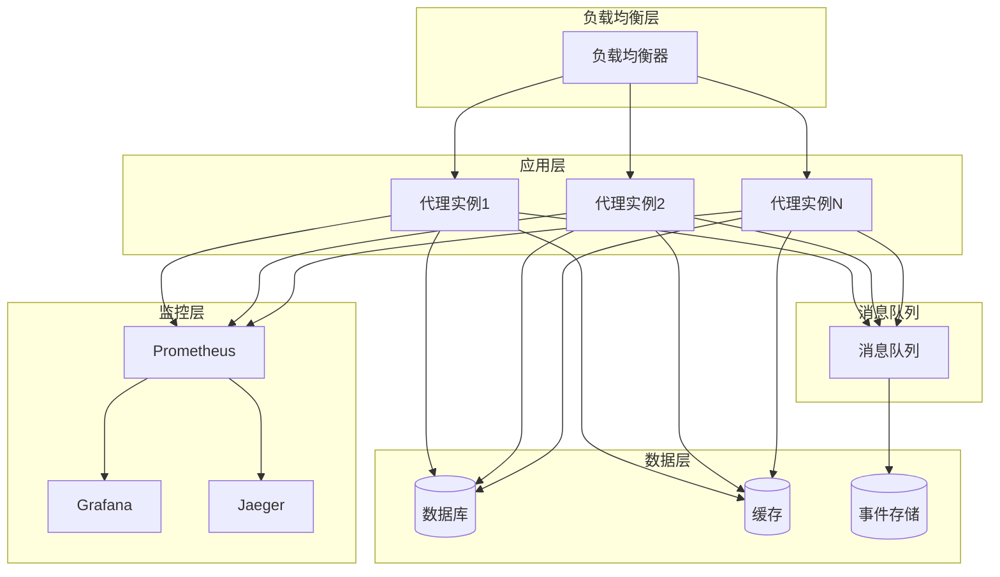

# agentLib

This library was generated with [Nx](https://nx.dev).

## Building

Run `nx build agentLib` to build the library.


### 7. 完整设计文档

# LLM Agent 事件驱动决策架构设计文档

## 1. 概述

本文档描述了一个基于事件驱动架构的LLM Agent决策系统，该系统通过DecisionTree和Workflow组件实现智能决策和任务执行。系统采用松耦合、可扩展的设计模式，支持复杂的业务逻辑处理和灵活的工作流编排。

### 1.1 设计目标

- **事件驱动**: 通过事件总线实现组件间的解耦通信
- **智能决策**: 结合规则引擎和LLM实现智能决策
- **工作流编排**: 支持复杂的多步骤任务执行
- **可扩展性**: 支持水平扩展和组件热插拔
- **可观测性**: 完整的监控、日志和追踪能力

### 1.2 核心组件

- **DecisionTree**: 决策树组件，根据上下文返回工作流token
- **Workflow**: 工作流组件，执行具体任务或返回另一个决策树token
- **EventBus**: 事件总线，处理系统内所有事件通信
- **AgentController**: 主控制器，协调整个决策流程

## 2. 系统架构

### 2.1 整体架构

系统采用分层架构设计，包含以下层次：

```
┌─────────────────────────────────────────────────────────────┐
│                    Client Layer                             │
├─────────────────────────────────────────────────────────────┤
│                   Gateway Layer                             │
├─────────────────────────────────────────────────────────────┤
│                  Agent Core Layer                           │
├─────────────────────────────────────────────────────────────┤
│                Decision & Execution Layer                   │
├─────────────────────────────────────────────────────────────┤
│                   Event System                             │
├─────────────────────────────────────────────────────────────┤
│                External Services Layer                      │
└─────────────────────────────────────────────────────────────┘
```

### 2.2 核心流程

1. **请求接收**: AgentController接收客户端请求
2. **决策制定**: DecisionTree分析请求上下文，返回工作流token
3. **工作流执行**: Workflow根据token执行相应的任务流程
4. **结果返回**: 将执行结果返回给客户端
5. **事件发布**: 整个过程中的关键节点都会发布事件

## 3. 详细设计

### 3.1 DecisionTree组件

#### 3.1.1 功能特性

- **规则匹配**: 支持基于条件的规则匹配
- **LLM决策**: 当规则不匹配时，使用LLM进行智能决策
- **缓存机制**: 缓存决策结果提高性能
- **指标收集**: 收集决策相关的性能指标

#### 3.1.2 决策流程



#### 3.1.3 配置示例

```typescript
const decisionTreeConfig = {
  id: 'main-router',
  name: 'Main Request Router',
  nodes: [
    {
      id: 'query-analysis',
      token: 'query-workflow',
      description: 'Handle user queries',
      condition: 'contains(input.toLowerCase(), "what") || contains(input.toLowerCase(), "how")',
      priority: 10,
      examples: [
        'What is the weather today?',
        'How do I create a new account?'
      ]
    }
  ],
  defaultToken: 'fallback-workflow',
  llmConfig: {
    model: 'gpt-4',
    temperature: 0.3,
    maxTokens: 500
  },
  cacheTTL: 300000
};
```

### 3.2 Workflow组件

#### 3.2.1 功能特性

- **步骤编排**: 支持顺序、并行、条件分支等执行模式
- **多种处理器**: 内置LLM、API、数据库、转换等处理器
- **错误处理**: 支持重试、回退、停止等错误处理策略
- **状态管理**: 完整的执行状态跟踪和恢复

#### 3.2.2 执行流程



#### 3.2.3 步骤类型

1. **LLM步骤**: 调用大语言模型进行文本处理
2. **API步骤**: 调用外部API服务
3. **数据库步骤**: 执行数据库操作
4. **转换步骤**: 数据格式转换和处理
5. **决策步骤**: 调用另一个决策树
6. **并行步骤**: 并行执行多个子步骤

### 3.3 事件系统

#### 3.3.1 事件总线架构



#### 3.3.2 事件类型

- **决策事件**: decision.started, decision.completed, decision.failed
- **工作流事件**: workflow.started, workflow.completed, workflow.failed
- **步骤事件**: step.started, step.completed, step.failed
- **系统事件**: agent.request.started, agent.request.completed, agent.request.failed

#### 3.3.3 中间件系统

1. **日志中间件**: 记录事件处理日志
2. **指标中间件**: 收集性能指标
3. **关联中间件**: 添加事件关联ID
4. **重试中间件**: 处理事件重试逻辑
5. **安全中间件**: 事件安全检查和过滤

## 4. 实现指南

### 4.1 项目结构

```
agent-lib/
├── src/
│   ├── core/
│   │   ├── agent-controller.ts
│   │   ├── decision-tree.ts
│   │   ├── workflow.ts
│   │   └── session-manager.ts
│   ├── events/
│   │   ├── event-bus.ts
│   │   ├── middleware/
│   │   └── persistence/
│   ├── handlers/
│   │   ├── llm-handler.ts
│   │   ├── api-handler.ts
│   │   ├── database-handler.ts
│   │   └── transform-handler.ts
│   ├── utils/
│   │   ├── condition-evaluator.ts
│   │   ├── retry-policy.ts
│   │   └── metrics-collector.ts
│   └── index.ts
├── tests/
├── examples/
└── docs/
```

### 4.2 依赖管理

```json
{
  "dependencies": {
    "eventemitter3": "^4.0.7",
    "uuid": "^9.0.0",
    "lodash": "^4.17.21",
    "winston": "^3.8.2"
  },
  "devDependencies": {
    "typescript": "^4.9.5",
    "jest": "^29.4.3",
    "@types/node": "^18.14.6"
  }
}
```

### 4.3 配置管理

系统支持通过配置文件进行灵活配置：

```json
{
  "eventBus": {
    "maxEventHistory": 10000,
    "enablePersistence": true,
    "persistenceType": "filesystem"
  },
  "decisionTrees": [...],
  "workflows": [...],
  "llm": {
    "defaultModel": "gpt-3.5-turbo",
    "apiKey": "${OPENAI_API_KEY}",
    "baseUrl": "https://api.openai.com/v1"
  },
  "monitoring": {
    "enableMetrics": true,
    "enableTracing": true
  }
}
```

## 5. 部署和运维

### 5.1 部署架构



### 5.2 扩展性考虑

1. **水平扩展**: 支持多实例部署和负载均衡
2. **垂直扩展**: 支持资源动态调整
3. **组件扩展**: 支持自定义步骤处理器和中间件
4. **存储扩展**: 支持多种存储后端

### 5.3 监控和告警

1. **性能指标**: 响应时间、吞吐量、错误率
2. **业务指标**: 决策准确率、工作流成功率
3. **系统指标**: CPU、内存、网络使用率
4. **告警规则**: 支持自定义告警规则和通知

## 6. 最佳实践

### 6.1 开发最佳实践

1. **事件设计**: 保持事件结构简单和一致
2. **错误处理**: 实现完善的错误处理和恢复机制
3. **测试策略**: 单元测试、集成测试、端到端测试
4. **代码质量**: 使用TypeScript、ESLint、Prettier

### 6.2 运维最佳实践

1. **配置管理**: 使用环境变量和配置文件
2. **日志管理**: 结构化日志和日志聚合
3. **监控告警**: 全面的监控和及时的告警
4. **备份恢复**: 定期备份和灾难恢复

### 6.3 性能优化

1. **缓存策略**: 多层缓存和缓存预热
2. **连接池**: 数据库和API连接池管理
3. **批处理**: 批量处理提高吞吐量
4. **异步处理**: 非阻塞异步处理模式

## 7. 总结

本设计文档描述了一个完整的基于事件驱动架构的LLM Agent决策系统。该系统具有以下优势：

1. **高可扩展性**: 事件驱动架构支持系统组件的独立扩展
2. **高可靠性**: 完善的错误处理和恢复机制
3. **高性能**: 缓存、连接池等优化策略
4. **高可观测性**: 完整的监控、日志和追踪能力
5. **高灵活性**: 支持动态配置和组件热插拔

该架构适用于需要复杂决策逻辑和工作流编排的AI应用场景，如智能客服、内容生成、数据分析等领域。通过合理的设计和实现，可以构建一个稳定、高效、可扩展的Agent系统。