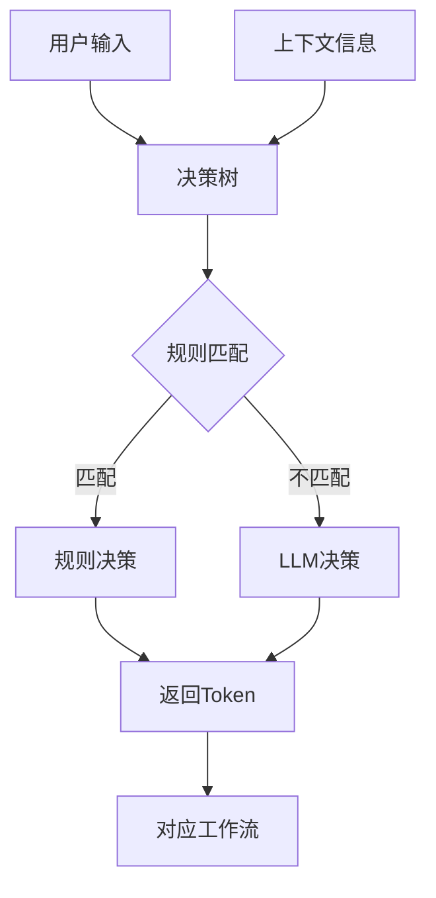

## 简化决策树的核心特性

### 1. 核心概念
- **输入**: 接收用户请求或上下文信息
- **决策**: 基于规则或LLM分析，返回一个工作流token
- **输出**: 返回决策结果（token + 置信度 + 推理过程）

### 2. 决策流程


### 3. 关键组件

**DecisionTree类**:
- 支持基于优先级的规则匹配
- 内置简单的条件评估器
- 支持LLM智能决策作为后备
- 提供置信度和推理过程

**DecisionRule接口**:
- token: 返回的工作流标识
- description: 规则描述
- condition: 匹配条件
- priority: 优先级

**SimpleLLMService**:
- 模拟LLM决策逻辑
- 基于关键词分析
- 提供置信度评估

### 4. 使用示例

```typescript
// 定义决策规则
const rules: DecisionRule[] = [
  {
    token: 'query-workflow',
    description: '处理查询请求',
    condition: 'contains(input, "什么") || contains(input, "如何")',
    priority: 10
  },
  {
    token: 'create-workflow',
    description: '处理创建请求',
    condition: 'contains(input, "创建") || contains(input, "新建")',
    priority: 9
  }
];

// 创建决策树
const decisionTree = new DecisionTree(
  rules,
  new SimpleLLMService(),
  'default-workflow'
);

// 使用决策树
const result = await decisionTree.decide({
  input: '如何创建一个新项目？'
});

console.log(result.token); // 'create-workflow'
console.log(result.confidence); // 0.9
console.log(result.reasoning); // '规则匹配: 处理创建请求'
```

### 5. 验证和测试

我提供了完整的验证示例，包括：
- **基础功能测试**: 验证各种输入场景的决策准确性
- **性能测试**: 测试决策树的响应时间和吞吐量
- **准确性验证**: 验证决策树在不同场景下的表现

### 6. 核心优势

- **简单易用**: 清晰的API设计，易于理解和集成
- **快速验证**: 专注于核心理念，去除复杂性
- **可扩展**: 支持规则和LLM的混合决策
- **可观测**: 提供详细的决策过程和置信度

这个简化的决策树原型为您提供了一个坚实的基础，可以快速验证决策树概念的有效性。一旦验证了核心理念，您可以逐步添加更复杂的功能，如事件系统、工作流编排等。

您可以使用这个原型来：
1. 验证决策逻辑的正确性
2. 测试不同场景下的决策效果
3. 评估LLM决策的准确性
4. 优化规则和优先级设置
5. 为后续的完整系统开发奠定基础