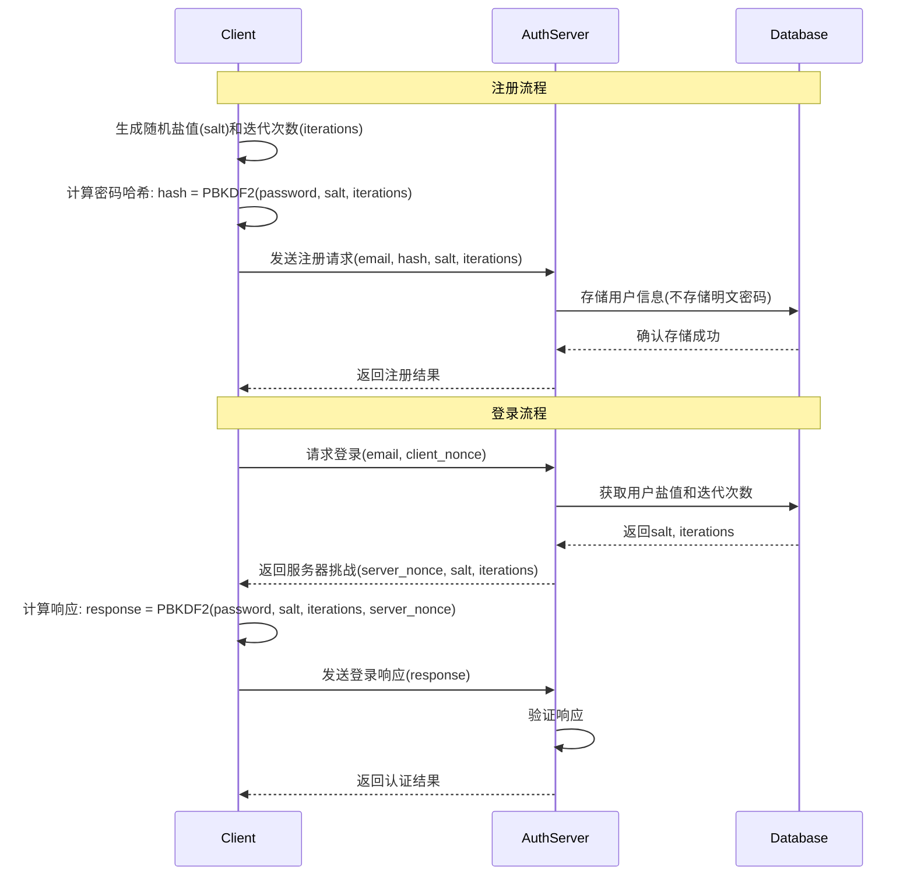

# gRPC Authentication System Design

## 架构调整概述

根据您的需求，我将原始的REST API设计调整为gRPC通信架构，并增强安全性和本地化支持。

## 主要变更

### 1. gRPC通信替代REST
- 使用Protocol Buffers定义服务接口
- 实现双向流通信支持
- 提供高性能的二进制协议传输
- 支持服务间高效通信

### 2. 密码安全增强
- 实现零知识密码验证（ZKPV）
- 客户端密码哈希，服务器端不存储明文密码
- 使用SRP（Secure Remote Password）协议
- 添加密码盐值和迭代次数的动态管理

### 3. 中国用户优化
- 移除firstName/lastName字段，使用单一name字段
- 支持中文名字和拼音搜索
- 添加手机号注册和验证支持
- 支持微信登录集成

## gRPC服务定义

### auth.proto

```protobuf
syntax = "proto3";

package auth;

import "google/protobuf/timestamp.proto";
import "google/protobuf/empty.proto";

// 认证服务定义
service AuthService {
  // 用户注册
  rpc Register(RegisterRequest) returns (AuthResponse);
  
  // 用户登录
  rpc Login(LoginRequest) returns (AuthResponse);
  
  // 刷新令牌
  rpc RefreshToken(RefreshTokenRequest) returns (TokenResponse);
  
  // 用户登出
  rpc Logout(LogoutRequest) returns (google.protobuf.Empty);
  
  // 验证邮箱
  rpc VerifyEmail(VerifyEmailRequest) returns (VerifyEmailResponse);
  
  // 重新发送验证邮件
  rpc ResendVerification(ResendVerificationRequest) returns (google.protobuf.Empty);
  
  // 忘记密码
  rpc ForgotPassword(ForgotPasswordRequest) returns (google.protobuf.Empty);
  
  // 重置密码
  rpc ResetPassword(ResetPasswordRequest) returns (google.protobuf.Empty);
  
  // 修改密码
  rpc ChangePassword(ChangePasswordRequest) returns (google.protobuf.Empty);
  
  // 获取用户信息
  rpc GetProfile(GetProfileRequest) returns (ProfileResponse);
  
  // 更新用户信息
  rpc UpdateProfile(UpdateProfileRequest) returns (ProfileResponse);
  
  // 删除账户
  rpc DeleteAccount(DeleteAccountRequest) returns (google.protobuf.Empty);
  
  // OAuth登录
  rpc OAuthLogin(OAuthLoginRequest) returns (AuthResponse);
  
  // 手机号注册
  rpc RegisterByPhone(RegisterByPhoneRequest) returns (AuthResponse);
  
  // 手机号登录
  rpc LoginByPhone(LoginByPhoneRequest) returns (AuthResponse);
  
  // 验证手机号
  rpc VerifyPhone(VerifyPhoneRequest) returns (VerifyPhoneResponse);
}

// 消息定义
message User {
  string id = 1;
  string email = 2;
  string name = 3;
  string avatar = 4;
  string phone = 5;
  bool is_email_verified = 6;
  bool is_phone_verified = 7;
  bool is_active = 8;
  google.protobuf.Timestamp last_login_at = 9;
  google.protobuf.Timestamp created_at = 10;
  google.protobuf.Timestamp updated_at = 11;
}

message TokenResponse {
  string access_token = 1;
  string refresh_token = 2;
  int64 expires_in = 3;
  string token_type = 4;
}

message AuthResponse {
  User user = 1;
  TokenResponse tokens = 2;
}

message RegisterRequest {
  string email = 1;
  string password_hash = 2;
  string salt = 3;
  int32 iterations = 4;
  string name = 5;
  string phone = 6;
}

message LoginRequest {
  string email = 1;
  string password_hash = 2;
  string client_nonce = 3;
}

message RefreshTokenRequest {
  string refresh_token = 1;
}

message LogoutRequest {
  string refresh_token = 1;
}

message VerifyEmailRequest {
  string token = 1;
}

message VerifyEmailResponse {
  bool success = 1;
  string message = 2;
}

message ResendVerificationRequest {
  string email = 1;
}

message ForgotPasswordRequest {
  string email = 1;
}

message ResetPasswordRequest {
  string token = 1;
  string password_hash = 2;
  string salt = 3;
  int32 iterations = 4;
}

message ChangePasswordRequest {
  string current_password_hash = 1;
  string new_password_hash = 2;
  string new_salt = 3;
  int32 new_iterations = 4;
}

message GetProfileRequest {
  string user_id = 1;
}

message ProfileResponse {
  User user = 1;
}

message UpdateProfileRequest {
  string user_id = 1;
  string name = 2;
  string avatar = 3;
}

message DeleteAccountRequest {
  string password_hash = 1;
}

message OAuthLoginRequest {
  string provider = 1;
  string auth_code = 2;
  string redirect_uri = 3;
}

message RegisterByPhoneRequest {
  string phone = 1;
  string password_hash = 2;
  string salt = 3;
  int32 iterations = 4;
  string name = 5;
  string sms_code = 6;
}

message LoginByPhoneRequest {
  string phone = 1;
  string password_hash = 2;
  string client_nonce = 3;
}

message VerifyPhoneRequest {
  string phone = 1;
  string sms_code = 2;
}

message VerifyPhoneResponse {
  bool success = 1;
  string message = 2;
}

// 错误定义
enum AuthError {
  AUTH_ERROR_UNSPECIFIED = 0;
  AUTH_ERROR_INVALID_CREDENTIALS = 1;
  AUTH_ERROR_USER_NOT_FOUND = 2;
  AUTH_ERROR_EMAIL_NOT_VERIFIED = 3;
  AUTH_ERROR_ACCOUNT_DISABLED = 4;
  AUTH_ERROR_TOKEN_EXPIRED = 5;
  AUTH_ERROR_TOKEN_INVALID = 6;
  AUTH_ERROR_RATE_LIMIT_EXCEEDED = 7;
  AUTH_ERROR_OAUTH_PROVIDER_ERROR = 8;
  AUTH_ERROR_PHONE_NOT_VERIFIED = 9;
  AUTH_ERROR_INVALID_SMS_CODE = 10;
}
```

## 密码安全架构

### 零知识密码验证（ZKPV）



### SRP协议实现

```typescript
// SRP协议常量
const SRP_GROUP = {
  N: BigInt("0x..."), // 大素数
  g: 2, // 生成元
  k: 3  // 乘法因子
};

// 客户端实现
class SRPClient {
  private a: bigint;
  private A: bigint;
  
  constructor(private email: string, private password: string) {}
  
  // 开始认证
  startAuth(): { email: string; A: string } {
    this.a = this.generateRandom();
    this.A = this.modPow(SRP_GROUP.g, this.a, SRP_GROUP.N);
    return { email: this.email, A: this.A.toString() };
  }
  
  // 处理服务器挑战
  handleChallenge(salt: string, B: string): { M: string } {
    const x = this.computeX(salt, this.password);
    const u = this.computeU(this.A.toString(), B);
    const S = this.computeS(B, x, u);
    const M = this.computeM(S);
    return { M: M.toString() };
  }
  
  // 验证服务器响应
  verifyServerResponse(HAMK: string): boolean {
    // 验证HAMK
    return this.validateHAMK(HAMK);
  }
}
```

## 数据库模式调整

### 更新的Prisma Schema

```prisma
model User {
  id                String    @id @default(dbgenerated("gen_random_uuid()")) @db.Uuid
  email             String    @unique @db.VarChar(255)
  name              String?   @db.VarChar(100) // 单一姓名字段，支持中文
  avatar            String?   @db.VarChar(500)
  phone             String?   @unique @db.VarChar(20) // 手机号
  passwordSalt      String?   @db.VarChar(64) // 密码盐值
  passwordHash      String?   @db.VarChar(128) // 密码哈希
  passwordIterations Int?      @default(100000) // PBKDF2迭代次数
  isEmailVerified   Boolean   @default(false)
  isPhoneVerified   Boolean   @default(false)
  isActive          Boolean   @default(true)
  lastLoginAt       DateTime? @db.Timestamptz(6)
  createdAt         DateTime  @default(now()) @db.Timestamptz(6)
  updatedAt         DateTime  @default(now()) @db.Timestamptz(6)
  
  // 关联关系
  refreshTokens     RefreshToken[]
  emailVerifications EmailVerification[]
  phoneVerifications PhoneVerification[]
  passwordResets    PasswordReset[]
  accounts          Account[]
  sessions          Session[]
  wechatAccounts    WechatAccount[]
  
  @@map("users")
}

model PhoneVerification {
  id        String   @id @default(dbgenerated("gen_random_uuid()")) @db.Uuid
  phone     String   @db.VarChar(20)
  code      String   @db.VarChar(10)
  expiresAt DateTime @db.Timestamptz(6)
  createdAt DateTime @default(now()) @db.Timestamptz(6)
  userId    String?  @db.Uuid
  
  user      User?    @relation(fields: [userId], references: [id], onDelete: Cascade)
  
  @@index([phone])
  @@index([code])
  @@index([expiresAt])
  @@map("phone_verifications")
}

model WechatAccount {
  id                String   @id @default(dbgenerated("gen_random_uuid()")) @db.Uuid
  userId            String   @db.Uuid
  wechatOpenId      String   @unique @db.VarChar(100)
  wechatUnionId     String?  @db.VarChar(100)
  nickname          String?  @db.VarChar(100)
  avatar            String?  @db.VarChar(500)
  accessToken       String?  @db.Text
  refreshToken      String?  @db.Text
  expiresAt         DateTime? @db.Timestamptz(6)
  createdAt         DateTime @default(now()) @db.Timestamptz(6)
  updatedAt         DateTime @default(now()) @db.Timestamptz(6)
  
  user              User     @relation(fields: [userId], references: [id], onDelete: Cascade)
  
  @@index([userId])
  @@index([wechatOpenId])
  @@map("wechat_accounts")
}

// 其他模型保持不变...
```

## 中国用户优化

### 1. 姓名字段优化
```typescript
// 用户DTO调整
export class RegisterDto {
  @IsEmail()
  email: string;
  
  @IsString()
  @MaxLength(100)
  @Matches(/^[\u4e00-\u9fa5a-zA-Z\s]+$/, {
    message: '姓名只能包含中文、英文字母和空格',
  })
  name: string; // 单一姓名字段，支持中文
  
  @IsOptional()
  @IsString()
  @Matches(/^1[3-9]\d{9}$/, {
    message: '请输入有效的手机号码',
  })
  phone?: string;
}
```

### 2. 手机号验证服务
```typescript
@Injectable()
export class PhoneVerificationService {
  async sendVerificationCode(phone: string): Promise<void> {
    // 生成6位数字验证码
    const code = Math.floor(100000 + Math.random() * 900000).toString();
    
    // 存储验证码
    await this.prisma.phoneVerification.create({
      data: {
        phone,
        code,
        expiresAt: new Date(Date.now() + 5 * 60 * 1000), // 5分钟过期
      },
    });
    
    // 发送短信（集成阿里云短信服务）
    await this.smsService.sendCode(phone, code);
  }
  
  async verifyCode(phone: string, code: string): Promise<boolean> {
    const verification = await this.prisma.phoneVerification.findFirst({
      where: {
        phone,
        code,
        expiresAt: { gt: new Date() },
      },
    });
    
    if (!verification) {
      return false;
    }
    
    // 标记手机号为已验证
    await this.prisma.user.updateMany({
      where: { phone },
      data: { isPhoneVerified: true },
    });
    
    // 删除验证码
    await this.prisma.phoneVerification.delete({
      where: { id: verification.id },
    });
    
    return true;
  }
}
```

### 3. 微信登录集成
```typescript
@Injectable()
export class WechatAuthService {
  async loginByWechat(code: string): Promise<AuthResponse> {
    // 获取微信访问令牌
    const wechatToken = await this.getWechatAccessToken(code);
    
    // 获取用户信息
    const wechatUser = await this.getWechatUserInfo(wechatToken.access_token);
    
    // 查找或创建用户
    let user = await this.findUserByWechatOpenId(wechatUser.openid);
    
    if (!user) {
      user = await this.createUserFromWechat(wechatUser);
    }
    
    // 生成JWT令牌
    const tokens = await this.tokenService.generateTokens(user.id, user.email);
    
    return { user, tokens };
  }
}
```

## gRPC服务实现

### 认证服务控制器
```typescript
@Controller()
export class AuthGrpcController {
  constructor(private authService: AuthService) {}
  
  @GrpcMethod('Register')
  async register(request: RegisterRequest): Promise<AuthResponse> {
    return this.authService.register(request);
  }
  
  @GrpcMethod('Login')
  async login(request: LoginRequest): Promise<AuthResponse> {
    return this.authService.login(request);
  }
  
  @GrpcMethod('RegisterByPhone')
  async registerByPhone(request: RegisterByPhoneRequest): Promise<AuthResponse> {
    return this.authService.registerByPhone(request);
  }
  
  @GrpcMethod('LoginByPhone')
  async loginByPhone(request: LoginByPhoneRequest): Promise<AuthResponse> {
    return this.authService.loginByPhone(request);
  }
}
```

## 安全增强措施

### 1. 传输安全
- 所有gRPC通信使用TLS加密
- 实现双向TLS认证
- 支持mTLS（双向TLS）用于服务间通信

### 2. 密码安全
- 客户端密码哈希，服务器端不存储明文
- 动态盐值和迭代次数
- 支持密码强度验证
- 实现密码历史记录防止重复使用

### 3. 验证码安全
- 短信验证码5分钟过期
- 图形验证码防止机器人攻击
- 限制验证码发送频率
- 记录验证码使用日志

这个调整后的设计更适合中国用户使用习惯，提供了更强的安全性，并使用gRPC提供高性能的通信方式。