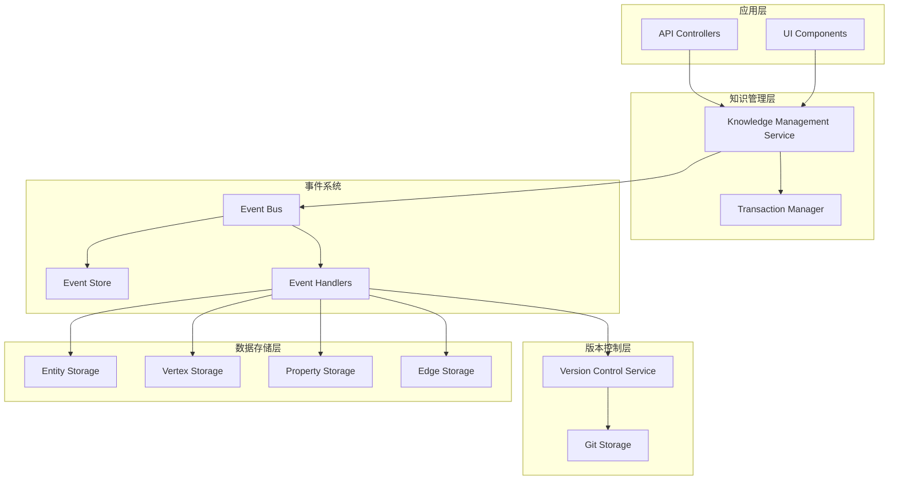

# 事件驱动知识管理架构设计

## 概述

本文档描述了一个事件驱动的知识管理架构，该架构整合了版本控制与实际数据存储，实现了知识编写与修改的统一事件驱动操作层。

## 架构目标

1. **统一操作接口**：通过事件驱动的方式统一所有知识操作
2. **版本控制集成**：自动将所有数据变更记录到版本控制系统
3. **事务一致性**：确保复杂操作的原子性
4. **可扩展性**：支持插件式的事件处理器
5. **审计追踪**：完整的事件溯源和审计能力

## 核心组件

### 1. 事件系统 (Event System)

#### 1.1 事件类型定义

```typescript
// 基础事件接口
interface KnowledgeEvent {
  eventId: string;
  eventType: string;
  timestamp: Date;
  userId?: string;
  sessionId?: string;
  correlationId?: string;
  causationId?: string;
  metadata?: Record<string, any>;
}

// 实体相关事件
interface EntityEvent extends KnowledgeEvent {
  entityType: 'entity';
  entityId: string;
}

interface EntityCreatedEvent extends EntityEvent {
  eventType: 'entity.created';
  data: EntityData;
}

interface EntityUpdatedEvent extends EntityEvent {
  eventType: 'entity.updated';
  oldData: EntityData;
  newData: EntityData;
  changes: Partial<EntityData>;
}

interface EntityDeletedEvent extends EntityEvent {
  eventType: 'entity.deleted';
  data: EntityData;
}

// 顶点相关事件
interface VertexEvent extends KnowledgeEvent {
  entityType: 'vertex';
  vertexId: string;
}

interface VertexCreatedEvent extends VertexEvent {
  eventType: 'vertex.created';
  data: VertexData;
}

interface VertexUpdatedEvent extends VertexEvent {
  eventType: 'vertex.updated';
  oldData: VertexData;
  newData: VertexData;
  changes: Partial<VertexData>;
}

interface VertexDeletedEvent extends VertexEvent {
  eventType: 'vertex.deleted';
  data: VertexData;
}

// 属性相关事件
interface PropertyEvent extends KnowledgeEvent {
  entityType: 'property';
  propertyId: string;
}

interface PropertyCreatedEvent extends PropertyEvent {
  eventType: 'property.created';
  data: PropertyData;
}

interface PropertyUpdatedEvent extends PropertyEvent {
  eventType: 'property.updated';
  oldData: PropertyData;
  newData: PropertyData;
  changes: Partial<PropertyData>;
}

interface PropertyDeletedEvent extends PropertyEvent {
  eventType: 'property.deleted';
  data: PropertyData;
}

// 边相关事件
interface EdgeEvent extends KnowledgeEvent {
  entityType: 'edge';
  edgeId: string;
}

interface EdgeCreatedEvent extends EdgeEvent {
  eventType: 'edge.created';
  data: EdgeData;
}

interface EdgeUpdatedEvent extends EdgeEvent {
  eventType: 'edge.updated';
  oldData: EdgeData;
  newData: EdgeData;
  changes: Partial<EdgeData>;
}

interface EdgeDeletedEvent extends EdgeEvent {
  eventType: 'edge.deleted';
  data: EdgeData;
}

// 批量操作事件
interface BatchOperationEvent extends KnowledgeEvent {
  eventType: 'batch.operation';
  operations: KnowledgeEvent[];
  operationType: 'create' | 'update' | 'delete' | 'mixed';
}

// 版本控制事件
interface VersionControlEvent extends KnowledgeEvent {
  entityType: 'version_control';
  repositoryId: string;
}

interface CommitCreatedEvent extends VersionControlEvent {
  eventType: 'commit.created';
  commitId: string;
  branchName: string;
  message: string;
  changes: ChangeSet;
}

interface BranchCreatedEvent extends VersionControlEvent {
  eventType: 'branch.created';
  branchName: string;
  baseCommitId?: string;
}

interface BranchMergedEvent extends VersionControlEvent {
  eventType: 'branch.merged';
  sourceBranch: string;
  targetBranch: string;
  mergeCommitId: string;
}
```

#### 1.2 事件总线接口

```typescript
interface IEventBus {
  // 发布事件
  publish<T extends KnowledgeEvent>(event: T): Promise<void>;
  
  // 订阅事件
  subscribe<T extends KnowledgeEvent>(
    eventType: string,
    handler: EventHandler<T>
  ): Promise<string>;
  
  // 取消订阅
  unsubscribe(subscriptionId: string): Promise<void>;
  
  // 批量发布事件
  publishBatch(events: KnowledgeEvent[]): Promise<void>;
}

interface EventHandler<T extends KnowledgeEvent> {
  (event: T): Promise<void>;
}
```

### 2. 事件处理器 (Event Handlers)

#### 2.1 版本控制事件处理器

```typescript
class VersionControlEventHandler {
  constructor(
    private versionControl: IGitVersionControl,
    private eventStore: IEventStore
  ) {}

  @EventHandler('entity.created')
  async handleEntityCreated(event: EntityCreatedEvent) {
    // 自动创建版本控制提交
    const changes: ChangeSet = {
      added: [{
        objectId: event.entityId,
        path: `entities/${event.entityId}`,
        type: 'entity',
        oldContent: null,
        newContent: event.data
      }],
      modified: [],
      deleted: []
    };

    await this.versionControl.createCommit({
      repositoryId: 'knowledge-base',
      branchName: 'main',
      message: `Create entity: ${event.entityId}`,
      author: { name: event.userId || 'system', email: 'system@example.com' },
      changes
    });
  }

  @EventHandler('entity.updated')
  async handleEntityUpdated(event: EntityUpdatedEvent) {
    const changes: ChangeSet = {
      added: [],
      modified: [{
        objectId: event.entityId,
        path: `entities/${event.entityId}`,
        type: 'entity',
        oldContent: event.oldData,
        newContent: event.newData
      }],
      deleted: []
    };

    await this.versionControl.createCommit({
      repositoryId: 'knowledge-base',
      branchName: 'main',
      message: `Update entity: ${event.entityId}`,
      author: { name: event.userId || 'system', email: 'system@example.com' },
      changes
    });
  }

  // 类似地处理其他数据类型的事件...
}
```

#### 2.2 数据存储事件处理器

```typescript
class DataStorageEventHandler {
  constructor(
    private entityStorage: IEntityStorage,
    private vertexStorage: IVertexStorage,
    private propertyStorage: IPropertyStorage,
    private edgeStorage: IEdgeStorage
  ) {}

  @EventHandler('entity.created')
  async handleEntityCreated(event: EntityCreatedEvent) {
    await this.entityStorage.create(event.data);
  }

  @EventHandler('entity.updated')
  async handleEntityUpdated(event: EntityUpdatedEvent) {
    await this.entityStorage.update(event.entityId, event.changes);
  }

  @EventHandler('entity.deleted')
  async handleEntityDeleted(event: EntityDeletedEvent) {
    await this.entityStorage.delete(event.entityId);
  }

  // 类似地处理其他数据类型的事件...
}
```

### 3. 事件存储 (Event Store)

```typescript
interface IEventStore {
  // 存储事件
  append(event: KnowledgeEvent): Promise<void>;
  
  // 批量存储事件
  appendBatch(events: KnowledgeEvent[]): Promise<void>;
  
  // 获取事件流
  getEvents(
    entityType?: string,
    entityId?: string,
    fromTimestamp?: Date,
    toTimestamp?: Date,
    limit?: number
  ): Promise<KnowledgeEvent[]>;
  
  // 获取特定事件
  getEvent(eventId: string): Promise<KnowledgeEvent | null>;
  
  // 事件重放
  replayEvents(
    handler: EventHandler<KnowledgeEvent>,
    fromEventId?: string,
    toEventId?: string
  ): Promise<void>;
}
```

### 4. 统一知识管理服务

```typescript
interface IKnowledgeManagementService {
  // 实体操作
  createEntity(data: Omit<EntityData, 'id'>, options?: OperationOptions): Promise<EntityData>;
  updateEntity(id: string, updates: Partial<EntityData>, options?: OperationOptions): Promise<EntityData>;
  deleteEntity(id: string, options?: OperationOptions): Promise<boolean>;
  
  // 顶点操作
  createVertex(data: Omit<VertexData, 'id'>, options?: OperationOptions): Promise<VertexData>;
  updateVertex(id: string, updates: Partial<VertexData>, options?: OperationOptions): Promise<VertexData>;
  deleteVertex(id: string, options?: OperationOptions): Promise<boolean>;
  
  // 属性操作
  createProperty(data: Omit<PropertyData, 'id'>, options?: OperationOptions): Promise<PropertyData>;
  updateProperty(id: string, updates: Partial<PropertyData>, options?: OperationOptions): Promise<PropertyData>;
  deleteProperty(id: string, options?: OperationOptions): Promise<boolean>;
  
  // 边操作
  createEdge(data: Omit<EdgeData, 'id'>, options?: OperationOptions): Promise<EdgeData>;
  updateEdge(id: string, updates: Partial<EdgeData>, options?: OperationOptions): Promise<EdgeData>;
  deleteEdge(id: string, options?: OperationOptions): Promise<boolean>;
  
  // 批量操作
  executeBatch(operations: BatchOperation[], options?: BatchOperationOptions): Promise<BatchResult>;
  
  // 复杂操作
  createEntityWithRelations(
    entityData: Omit<EntityData, 'id'>,
    vertices: Omit<VertexData, 'id'>[],
    properties: Omit<PropertyData, 'id'>[],
    edges: Omit<EdgeData, 'id'>[],
    options?: OperationOptions
  ): Promise<EntityWithRelations>;
}

interface OperationOptions {
  userId?: string;
  sessionId?: string;
  skipVersionControl?: boolean;
  customMetadata?: Record<string, any>;
}

interface BatchOperation {
  type: 'create' | 'update' | 'delete';
  entityType: 'entity' | 'vertex' | 'property' | 'edge';
  data?: any;
  id?: string;
  updates?: any;
}

interface BatchOperationOptions extends OperationOptions {
  transactional?: boolean; // 是否作为事务执行
  stopOnError?: boolean; // 遇到错误时是否停止
}

interface BatchResult {
  successful: Array<{ operation: BatchOperation; result: any }>;
  failed: Array<{ operation: BatchOperation; error: Error }>;
  totalProcessed: number;
  totalSuccessful: number;
  totalFailed: number;
}
```

### 5. 事务管理

```typescript
interface ITransactionManager {
  // 开始事务
  beginTransaction(transactionId?: string): Promise<string>;
  
  // 提交事务
  commitTransaction(transactionId: string): Promise<void>;
  
  // 回滚事务
  rollbackTransaction(transactionId: string): Promise<void>;
  
  // 获取事务状态
  getTransactionStatus(transactionId: string): Promise<TransactionStatus>;
  
  // 在事务中执行操作
  executeInTransaction<T>(
    operations: () => Promise<T>,
    options?: TransactionOptions
  ): Promise<T>;
}

enum TransactionStatus {
  ACTIVE = 'active',
  COMMITTED = 'committed',
  ROLLED_BACK = 'rolled_back',
  TIMEOUT = 'timeout'
}

interface TransactionOptions {
  timeout?: number;
  isolationLevel?: IsolationLevel;
  retryPolicy?: RetryPolicy;
}

enum IsolationLevel {
  READ_UNCOMMITTED = 'read_uncommitted',
  READ_COMMITTED = 'read_committed',
  REPEATABLE_READ = 'repeatable_read',
  SERIALIZABLE = 'serializable'
}

interface RetryPolicy {
  maxRetries: number;
  retryDelay: number;
  backoffMultiplier: number;
}
```

## 架构图



## 工作流程

### 1. 单一操作流程

1. **请求接收**：API/UI调用知识管理服务
2. **事件发布**：服务发布相应的事件
3. **事件处理**：事件处理器接收并处理事件
4. **数据存储**：数据存储处理器更新实际数据
5. **版本控制**：版本控制处理器创建版本记录
6. **事件存储**：事件存储器持久化事件

### 2. 批量操作流程

1. **事务开始**：事务管理器创建事务上下文
2. **批量事件**：服务发布批量操作事件
3. **原子执行**：在事务上下文中执行所有操作
4. **提交或回滚**：根据执行结果提交或回滚事务
5. **版本记录**：创建包含所有变更的版本提交

### 3. 复杂关系操作流程

1. **关系分析**：分析实体、顶点、属性、边之间的关系
2. **依赖排序**：按依赖关系排序操作
3. **事务执行**：在事务中按序执行所有操作
4. **一致性检查**：验证数据一致性
5. **版本提交**：创建包含完整变更集的版本提交

## 实现优势

1. **解耦性**：各组件通过事件通信，降低耦合度
2. **可扩展性**：新功能可以通过添加事件处理器实现
3. **可追溯性**：完整的事件历史和版本记录
4. **一致性**：事务管理确保数据一致性
5. **容错性**：事件重放和恢复机制
6. **性能**：异步事件处理提高系统性能

## 扩展点

1. **事件处理器插件**：支持自定义事件处理器
2. **存储后端**：支持多种事件存储实现
3. **版本控制策略**：支持不同的版本控制策略
4. **事务隔离级别**：支持不同的事务隔离级别
5. **事件序列化**：支持多种事件序列化格式

## 监控和运维

1. **事件监控**：监控事件发布和处理性能
2. **事务监控**：监控事务执行状态和性能
3. **版本监控**：监控版本控制操作
4. **告警机制**：异常情况自动告警
5. **性能分析**：系统性能分析和优化建议