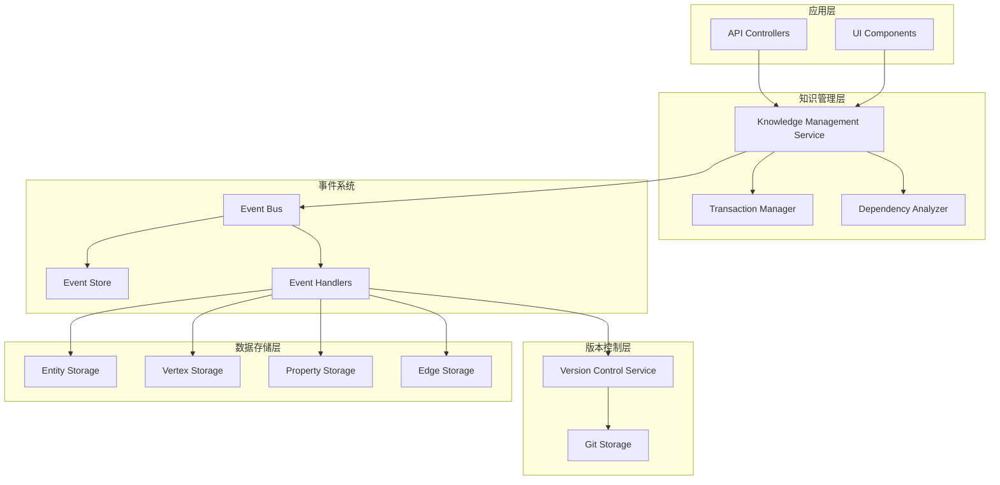

# 事件驱动知识管理系统

## 概述

本项目实现了一个完整的事件驱动知识管理系统，整合了版本控制与实际数据存储，为知识编写与修改提供了统一的操作层。系统采用事件溯源架构，确保了数据的完整性、可追溯性和版本控制的自动化。

## 核心特性

### 🔄 事件驱动架构
- **统一事件模型**：所有知识操作都通过事件进行
- **异步处理**：提高系统性能和响应性
- **解耦设计**：各组件通过事件通信，降低耦合度
- **可扩展性**：支持插件式的事件处理器

### 📝 版本控制集成
- **自动版本记录**：每次数据变更自动创建版本提交
- **Git风格操作**：支持分支、合并、回滚等Git操作
- **完整变更历史**：记录所有数据变更的详细信息
- **协作支持**：多用户并发编辑和分支管理

### 🔄 事务管理
- **原子操作**：确保复杂操作的一致性
- **事务隔离**：支持多种隔离级别
- **回滚机制**：操作失败时自动回滚
- **超时处理**：防止长时间运行的事务

### 📊 事件溯源
- **完整审计**：记录所有系统事件
- **事件重放**：支持系统状态恢复
- **快照支持**：定期创建状态快照
- **性能优化**：批量事件处理

## 系统架构



## 数据模型

### 核心数据类型

1. **Entity（实体）**：知识图谱中的核心概念
2. **Vertex（顶点）**：实体的具体表现或属性
3. **Property（属性）**：顶点的详细描述
4. **Edge（边）**：数据之间的关系

### 关系映射

- **start**: entity → vertex
- **middle**: vertex → vertex  
- **end**: vertex → property

## 事件类型

### 数据操作事件
- `entity.created` / `entity.updated` / `entity.deleted`
- `vertex.created` / `vertex.updated` / `vertex.deleted`
- `property.created` / `property.updated` / `property.deleted`
- `edge.created` / `edge.updated` / `edge.deleted`

### 系统事件
- `batch.operation`：批量操作
- `commit.created`：版本提交
- `branch.created` / `branch.merged`：分支操作

## 使用示例

### 基本操作

```typescript
// 创建实体
const entity = await knowledgeService.createEntity({
  nomanclature: [{ name: 'Artificial Intelligence', acronym: 'AI', language: 'en' }],
  abstract: {
    description: 'The simulation of human intelligence in machines',
    embedding: { config: { model: 'text-embedding-ada-002', dimensions: 1536 }, vector: [] }
  }
}, { userId: 'user123' });

// 更新实体
const updatedEntity = await knowledgeService.updateEntity(entity.id, {
  nomanclature: [{ name: 'AI and Machine Learning', acronym: 'AI/ML', language: 'en' }]
}, { userId: 'user123' });
```

### 批量操作

```typescript
const result = await knowledgeService.executeBatch([
  { type: 'create', entityType: 'entity', data: entityData },
  { type: 'create', entityType: 'vertex', data: vertexData },
  { type: 'create', entityType: 'edge', data: edgeData }
], { transactional: true, userId: 'user123' });
```

### 复杂关系操作

```typescript
const entityWithRelations = await knowledgeService.createEntityWithRelations(
  entityData,
  verticesData,
  propertiesData,
  edgesData,
  { userId: 'user123' }
);
```

### 版本控制操作

```typescript
// 查看历史
const history = await versionControl.getCommitHistory({
  repositoryId: 'knowledge-base',
  branchName: 'main',
  limit: 10
});

// 创建分支
await versionControl.createBranch({
  repositoryId: 'knowledge-base',
  branchName: 'feature/new-concept',
  author: { name: 'user123', email: 'user123@example.com' }
});

// 合并分支
const mergeResult = await versionControl.mergeBranch({
  repositoryId: 'knowledge-base',
  sourceBranch: 'feature/new-concept',
  targetBranch: 'main',
  author: { name: 'user123', email: 'user123@example.com' }
});
```

## 文档结构

```
docs/
├── README.md                           # 本文档
├── EVENT_DRIVEN_ARCHITECTURE.md          # 架构设计文档
├── IMPLEMENTATION_PLAN.md               # 实现计划
└── CODE_EXAMPLES.md                   # 代码示例
```

## 实现状态

### ✅ 已完成
- [x] 基础存储层（Entity、Vertex、Property、Edge）
- [x] Git风格版本控制系统
- [x] 事件驱动架构设计
- [x] 事务管理设计
- [x] 事件溯源机制
- [x] 完整的文档和示例

### 🚧 进行中
- [ ] 事件系统具体实现
- [ ] 统一知识管理服务
- [ ] 事件处理器实现
- [ ] 综合测试覆盖

### 📋 待实现
- [ ] 性能优化
- [ ] 监控和告警
- [ ] 部署配置
- [ ] 用户界面集成

## 技术栈

- **框架**: NestJS
- **语言**: TypeScript
- **版本控制**: 自实现Git风格系统
- **事件系统**: 自定义事件总线
- **存储**: 内存实现（可扩展为数据库）
- **测试**: Jest

## 性能特性

- **异步事件处理**：提高并发性能
- **批量操作**：减少数据库往返
- **事件分区**：支持水平扩展
- **缓存机制**：减少重复计算
- **索引优化**：快速数据检索

## 安全特性

- **事务隔离**：防止数据竞争
- **权限控制**：基于用户和会话的访问控制
- **审计日志**：完整的操作记录
- **数据验证**：输入数据验证和清理

## 扩展性

- **插件架构**：支持自定义事件处理器
- **多存储后端**：支持不同存储实现
- **微服务友好**：可拆分为独立服务
- **API版本控制**：向后兼容的API设计

## 监控和运维

- **事件监控**：跟踪事件处理性能
- **事务监控**：监控事务成功率和延迟
- **版本监控**：跟踪版本控制操作
- **资源监控**：CPU、内存、存储使用情况

## 贡献指南

1. 遵循现有的代码风格和架构模式
2. 为新功能添加相应的测试
3. 更新相关文档
4. 确保所有测试通过
5. 提交前运行代码检查

## 许可证

本项目采用 MIT 许可证。详见 LICENSE 文件。

## 联系方式

如有问题或建议，请通过以下方式联系：
- 创建 Issue
- 提交 Pull Request
- 发送邮件至项目维护者

---

**注意**: 这是一个设计文档，具体的实现代码需要根据实际需求进行开发。本文档提供了完整的架构设计和实现指导，可以作为开发的基础。