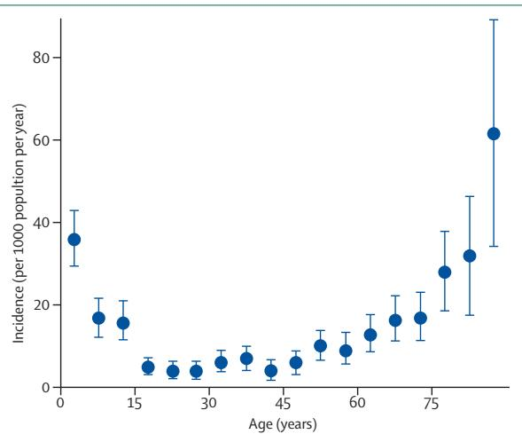
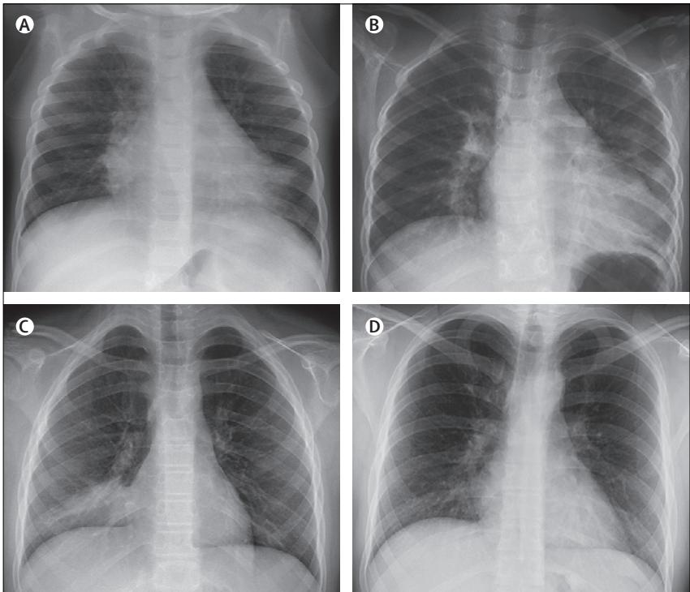
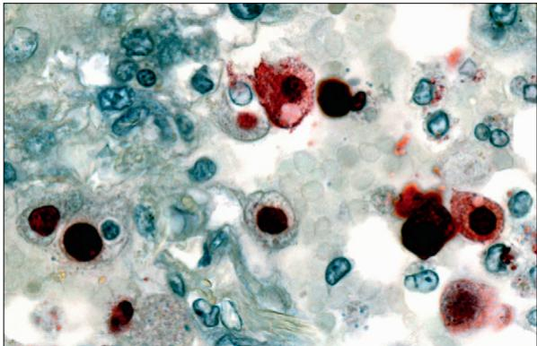

# Viral pneumonia

Olli Ruuskanen, Elina Lahti, Lance C Jennings, David R Murdoch

# Lancet 2011; 377: 1264–75

Published Online March 23, 2011 DOI:10.1016/S0140- 6736(10)61459-6

Department of Paediatrics, Turku University Hospitals, Turku, Finland (Prof O Ruuskanen MD,   
E Lahti MD); and Microbiology Unit, Canterbury Health   
Laboratories, and Department of Pathology, University of Otago, Christchurch, New Zealand (Prof D R Murdoch MD, L C Jennings PhD) Correspondence to: Prof Olli Ruuskanen,   
Department of Paediatrics,   
Turku University Hospitals,   
PL 52, 20521 Turku, Finland olli.ruuskanen@tyks.fi

About 200 million cases of viral community-acquired pneumonia occur every year—100 million in children and 100 million in adults. Molecular diagnostic tests have greatly increased our uwnderstanding of the role of viruses in pneumonia, and fi ndings indicate that the incidence of viral pneumonia has been underestimated. In children, respiratory syncytial virus, rhinovirus, human metapneumovirus, human bocavirus, and parainfl uenza viruses are the agents identifi ed most frequently in both developed and developing countries. Dual viral infections are common, and a third of children have evidence of viral-bacterial co-infection. In adults, viruses are the putative causative agents in a third of cases of community-acquired pneumonia, in particular infl uenza viruses, rhinoviruses, and coronaviruses. Bacteria continue to have a predominant role in adults with pneumonia. Presence of viral epidemics in the community, patient’s age, speed of onset of illness, symptoms, biomarkers, radiographic changes, and response to treatment can help diff erentiate viral from bacterial pneumonia. However, no clinical algorithm exists that will distinguish clearly the cause of pneumonia. No clear consensus has been reached about whether patients with obvious viral communityacquired pneumonia need to be treated with antibiotics. Apart from neuraminidase inhibitors for pneumonia caused by infl uenza viruses, there is no clear role for use of specifi c antivirals to treat viral community-acquired pneumonia. Infl uenza vaccines are the only available specifi c preventive measures. Further studies are needed to better understand the cause and pathogenesis of community-acquired pneumonia. Furthermore, regional diff erences in cause of pneumonia should be investigated, in particular to obtain more data from developing countries.

# Introduction

Pneumonia is a common illness that continues to be the major killer of young children in developing countries and elderly people in developed countries. Many microorganisms are associated with pneumonia, and now attention is turning to the importance of viruses as pathogens. Widespread introduction of Haemophilus infl uenzae type b and pneumococcal conjugate vaccines into immunisation programmes has led to speculation about the growing predominance of viruses as causes of childhood pneumonia. The emergence of severe acute respiratory syndrome (SARS), avian infl uenza A (H5N1) virus, and the 2009 pandemic infl uenza A (H1N1) virus has re-emphasised the important role of respiratory viruses as causes of severe pneumonia. New respiratory viruses—such as human metapneumovirus, coronaviruses NL63 and HKU1, and human bocavirus—have been discovered during the past decade. Importantly, the availability of molecular diagnostic assays (such as PCR) has greatly increased our ability to detect and characterise the epidemiology of respiratory virus infections. Findings of previous studies, in which conventional virological

# Search strategy and selection criteria

We searched PubMed for original research, reviews, and commentaries, with the terms “pneumonia and children/ adults”, “pneumonia and aetiology”, “viral pneumonia”, “pneumonia and viruses”, and names of specifi c respiratory viruses and pneumonia. No date or language restrictions were included. We paid special attention to reports published since 2000 when molecular diagnostics were introduced. We also searched our personal database of references gathered over the past 15 years and manually scanned references from selected reports and from selected authors.

diagnostic techniques were used, have most likely underestimated the role of viruses as pneumonia pathogens.1–5 In this Seminar, we review viral communityacquired pneumonia in immunocompetent children and adults, focusing on studies that have used modern molecular diagnostic techniques.

# Epidemiology of pneumonia

According to WHO estimates, 450 million cases of pneumonia are recorded every year; about 4 million people die from this illness, accounting for $7 \%$ of total mortality of 57 million people.6,7 The highest incidences arise in children younger than 5 years and in adults older than 75 years (fi gure 1).8 In developing countries, incidence could be fi ve times higher than in developed regions. In children, 156 million episodes of pneumonia are recorded annually, of which 151 million are present in developing countries.6,7 In 2008, 1·6 million children younger than 5 years died from pneumonia.9 5 million cases of childhood community-acquired pneumonia are reported yearly in developed countries, but mortality has declined strikingly and is now very rare. In a Canadian study, 25 319 admissions for childhood pneumonia took place during the 9-year study period; 11 deaths were recorded and only one death did not have a comorbid condition.10 Mortality of 1·2 per million previously healthy young adults has been recorded in the UK.11 In the USA alone, the economic burden of community-acquired pneumonia has been estimated to be more than US\$17 billion annually.12

# Diagnosis of viral pneumonia

Laboratory diagnosis of viral pneumonia has relied on detection of virus or viral antigen in upper-respiratory specimens (eg, nasopharyngeal aspirates) and lowerrespiratory samples (eg, induced sputum) by culture or immunofl uorescence microscopy, and on measurement of antibodies in paired serum samples. Introduction of PCR has increased the ability to detect respiratory viruses, including those that are diffi cult to culture. At least 26 viruses have now been associated with communityacquired pneumonia (panel).

Despite technological advances, establishing the cause of pneumonia remains challenging.13 Specimens from the lower-respiratory tract can be hard to obtain, and distinguishing possible prolonged shedding or colonisation from infection can be diffi cult. For diagnosis of viral pneumonia, reliance on testing of nasopharyngeal specimens presents its own challenges; detection of a virus in the nasopharynx could represent coincidental upper-respiratory infection or a pneumonia pathogen. Measurement of background prevalence of asymptomatic nasopharyngeal viral infection in a control group might help to clarify the size of this diagnostic issue at a population level, but this approach has been used only rarely in aetiological studies. Furthermore, most research has focused on patients admitted to hospital and, therefore, fi ndings might not be representative of mildto-moderate disease.

Several diff erent types of specimen from the upper and lower airway have been used in aetiological studies of community-acquired pneumonia, including: nasopharyngeal aspirates or washes; swabs from the nasopharynx, nose, or throat; combined nasopharygeal and throat swabs; expectorated and induced sputum; tracheal aspirates; bronchoalveolar lavage; and lung puncture.14,15 Recovery of virus fl uctuates according to specimen type, which probably accounts for some of the variability of fi ndings between studies.

Most studies of the cause of viral pneumonia have used upper-respiratory specimens to test for viruses. In children, nasopharyngeal aspirates are generally deemed the specimen of choice because both nasal and nasopharyngeal mucus samples are gathered. Respiratory viruses have been noted in $9 5 \%$ of mucus samples obtained by nasopharyngeal aspiration from children with respiratory infection.16 Obtaining an aspirate is, however, unpleasant and requires a suction device. Nasal swabs taken with a sterile cotton swab from a depth of $2 - 3 \mathrm { c m }$ have comparable sensitivity to nasopharyngeal aspirates for culture of all major respiratory viruses, except respiratory syncytial virus.17 Flocked swabs with nylon fi bres in a perpendicular fashion are now preferred by many clinicians because they are convenient to use and have a similar sensitivity to nasopharyngeal aspirates for detection by PCR of respiratory viruses.15,17,18 In adults, nasopharyngeal swabs have a higher sensitivity than throat swabs, but they can be less sensitive than nasopharyngeal washes.14 Transnasal nasopharyngeal fl ocked swabs also have high virus detection rates in adults.19,20

Lower-respiratory specimens have obvious advantages for establishing the cause of pneumonia because they come from the site of infection. However, obtaining

  
Figure 1: Age-specifi c incidence of community-acquired pneumonia Error bars $= 9 5 \%$ CIs. Modifi ed from reference 8 with permission of Oxford University Press.   
\*Mostly in children. †Mostly in developing countries.

# Panel: Viruses linked to community-acquired pneumonia in children and adults

• Respiratory syncytial virus Rhinovirus Infl uenza A, B, and C viruses Human metapneumovirus Parainfl uenza viruses types 1, 2, 3, and 4 Human bocavirus\* Coronavirus types 229E, OC43, NL63, HKU1, SARS Adenovirus Enteroviruses Varicella-zoster virus Hantavirus Parechoviruses Epstein-Barr virus Human herpesvirus 6 and 7 Herpes simplex virus Mimivirus Cytomegalovirus†   
• Measles†

reliable specimens that are not contaminated by fl ora from the upper airway is diffi cult. Induced sputum specimens have been used in paediatric pneumonia studies, although assuring that the specimens are representative of the lower-respiratory tract can be challenging.21 High-quality specimens can be obtained by thoracic needle aspiration, but this technique has not been adopted widely because of safety concerns, despite a low complication rate.22,23

In general, PCR-based methods are between two and fi ve times more sensitive than conventional virus diagnostic methods (culture, antigen detection, and serological assays) for detection of respiratory viruses.

# Seminar

<table><tr><td></td><td> Suggests viral cause</td><td>Suggests bacterial cause</td></tr><tr><td>Age</td><td>Younger than 5 years</td><td>Adults</td></tr><tr><td>Epidemic situation</td><td>Ongoing viral epidemic</td><td></td></tr><tr><td>History of ilness</td><td>Slow onset</td><td>Rapid onset</td></tr><tr><td>Clinical profile</td><td>Rhinitis, wheezing</td><td>High fever,tachypnoea</td></tr><tr><td>Biomarkers</td><td></td><td></td></tr><tr><td>Total white-blood cell count</td><td> &lt;10x10° celsper L</td><td> &gt;15x10° cells per L</td></tr><tr><td>C-reactive protein concentration in serum &lt;20 mg/L</td><td></td><td> &gt;60 mg/L</td></tr><tr><td>Procalcitonin concentration in serum</td><td> &lt;0·1 μg/L</td><td> &gt;0.5 μg/L</td></tr><tr><td>Chest radiograph findings</td><td>Sole interstitial infltrates,bilaterallyLobar alveolar infiltrates</td><td></td></tr><tr><td>Response to antibiotic treatment</td><td>Slow or non-responsive</td><td>Rapid</td></tr></table>

  
Table 1: Variables used to distinguish viral from bacterial pneumonia   
Figure 2: Chest radiographs of patients with viral pneumonia (A) Pneumonia caused by human bocavirus in a 1-year-old girl. Chest radiograph shows alveolar infi ltrates in right middle lobe and left lower lobe. (B) Pneumonia caused by metapneumovirus and Haemophilus infl uenzae in a 7-year-old girl. Chest radiograph shows alveolar infi ltrate in left lower lobe. (C) Pneumonia caused by rhinovirus and Streptococcus pneumoniae in an 11-year-old girl. Chest radiograph shows alveolar infi ltrate in right lower lobe. (D) Pneumonia caused by adenovirus in a 22-year-old man. Chest radiograph shows alveolar and interstitial infi ltrates in right lower lobe.

This benefi t applies particularly to adults and elderly people, who might have a smaller nasopharyngeal viral load than children.24,25 Moreover, some respiratory viruses can only be detected readily by PCR. Development of several multiplex assays has enabled simultaneous detection of up to 15 diff erent viruses, and use of these tests is becoming standard for identifi cation of respiratory viruses.26,27

The ability to diff erentiate viral from bacterial pneumonia could have important management implications. Despite advances, diagnostic tests still fail to identify causative agents in many aff ected individuals.28 As a result, other variables have been used to distinguish viral from bacterial pneumonia (table 1). However, no clinical algorithm exists to discern clearly the cause of pneumonia. This absence is perhaps not surprising in view of the probable important interaction between viruses and bacteria in pathogenesis of pneumonia.

Respiratory viruses usually follow seasonal patterns of activity and are most likely to cause pneumonia during those times. Epidemics of respiratory syncytial virus typically happen every or every other year in late autumn, rhinovirus epidemics arise in autumn and spring, whereas infl uenza peaks are seen during late autumn and early winter. Several viruses can be co-circulating at specifi c times of the year, even during the highest epidemic peaks of one virus.29

Although viral pneumonia is being recognised increasingly in adults, it still seems to be most typical in children, especially in infants younger than 2 years.30 According to the British Thoracic Society, fever higher than $3 8 \cdot 5 ^ { \circ } \mathrm { C }$ , a respiratory rate greater than 50 breaths per min, and chest recession are suggestive of bacterial rather than viral pneumonia; by comparison, young age, wheezing, fever less than $3 8 \cdot 5 ^ { \circ } \mathrm { C }$ , and striking chest recession are suggestive of a viral cause.1 However, clinical signs and symptoms of viral and bacterial pneumonia are highly variable and overlap; there fore, they cannot be relied on. Importantly, typical pneumococcal pneumonia (sudden onset, high fever, chills, pleuritic chest pain, lobar infi ltrates, leucocytosis) is only one part of the range of bacterial pneumonia.31

White-blood-cell count and concentrations in serum of C-reactive protein and procalcitonin are variables studied widely in children and adults with community-acquired pneumonia. In general, these biomarkers are raised signifi cantly in individuals with bacterial pneumonia compared with patients with viral pneumonia (table 1),19,32–35 although none has suffi cient sensitivity or specifi city to be used in isolation. Use of procalcitonin in clinical practice to identify bacterial infection and help guide antimicrobial treatment has been the focus of many studies. This substance increases within $^ { 6 - 1 2 \mathrm { ~ h ~ } }$ after onset of bacterial infection and halves daily when infection is controlled.34 In the context of pneumonia, concentrations of procalcitonin greater than $0 { \cdot } 5 ~ \mu \mathrm { g } / \mathrm { L }$ support bacterial infection, whereas repeatedly low amounts suggest that bacterial infection is unlikely. However, the exact role of procalcitonin in management of pneumonia is still the subject of ongoing discussion and debate.35

Recommendations from the American Thoracic Society are that diagnosis of pneumonia should be made on the basis of chest radiography.36 Interstitial infi ltrates on chest radiographs are generally believed to suggest a viral cause of pneumonia and alveolar infi ltrates to indicate a bacterial cause (fi gure 2). However, bacteria and viruses alone or together can induce a broad range of chest radiographic changes, and alterations are only helpful in specifi c cases to confi rm a microbial cause of pneumonia. In one study, bacterial infection was noted in 97 $( 7 1 \% )$ of 137 children with alveolar infi ltrates, whereas 97 $( 7 2 \% )$ of 134 with bacterial pneumonia had alveolar infi ltrates.33 In children with viral pneumonia, 40 $( 4 9 \% )$ had alveolar changes. Of 85 children with bacteraemic pneumococcal pneumonia, alveolar infi ltrates were recorded in 77 $( 9 1 \% )$ and interstitial infi ltrates alone in eight $( 9 \% )$ .37 Multilobe disease in various cases of viral pneumonia was reported in half of 88 adults with community-acquired pneumonia.19 Thoracic CT indicated tree-bud opacities, multifocal consolidations, and ground-glass opacities in adults with viral pneumonia without any evidence of possible concomitant bacterial infection; however, a viral cause was never suggested by the radiologists.38

Table 2: Occurrence of pneumonia and other fi ndings in 4277 children with laboratory-confi rmed viral respiratory infection at Turku University Hospital, Finlan   

<table><tr><td></td><td>Rhinovirus (n=580)</td><td>Respiratory syncytial virus (n=1655)</td><td>Adenovirus (n=902)</td><td>Parainfluenza virus 1(n=94)</td><td>Parainfluenza virus 2 (n=49)</td><td>Parainfluenza virus 3 (n=315)</td><td>Influenza A virus (n=544)</td><td>Influenza B virus (n=139)</td></tr><tr><td>Pneumonia</td><td>18%</td><td>16%</td><td>8%</td><td>9%</td><td>6%</td><td>14%</td><td>9%</td><td>8%</td></tr><tr><td>Wheezy bronchitis</td><td>22%</td><td>12%</td><td>2%</td><td>2%</td><td>4%</td><td>8%</td><td>6%</td><td>6%</td></tr><tr><td> Otitis media</td><td>23%</td><td>59%</td><td>24%</td><td>27%</td><td>20%</td><td>30%</td><td>26%</td><td>19%</td></tr><tr><td>Non-specified acute respiratory infection</td><td>14%</td><td>32%</td><td>37%</td><td>27%</td><td>22%</td><td>50%</td><td>44%</td><td>53%</td></tr><tr><td>Bronchiolitis</td><td>3%</td><td>34%</td><td>1%</td><td>2%</td><td>10%</td><td>5%</td><td>1%</td><td>1%</td></tr><tr><td>Laryngitis</td><td>2%</td><td>2%</td><td>1%</td><td>37%</td><td>53%</td><td>10%</td><td>5%</td><td>4%</td></tr><tr><td>Tonsilis</td><td>2%</td><td>0</td><td>30%</td><td>1%</td><td>0</td><td>2%</td><td>5%</td><td>4%</td></tr><tr><td>Fever without afocus</td><td>2%</td><td>1%</td><td>5%</td><td>10%</td><td>0</td><td>2%</td><td>1%</td><td>2%</td></tr><tr><td>Eebrilecovulsion</td><td>1%</td><td>2%</td><td>7%</td><td>4%</td><td>0</td><td>5%</td><td>12%</td><td>9%</td></tr><tr><td>Fever ≥38°C</td><td>44%</td><td>63%</td><td>81%</td><td>77%</td><td>76%</td><td>63%</td><td>94%</td><td>89%</td></tr></table>

Rhinovirus infections are from $^ { 1 9 8 7 }$ to 2006; other respiratory virus infections are from 1980 to 1999. Modifi ed from reference 51, with permission of John Wiley and Sons.

Intuitively, bacterial pneumonia should respond to appropriate antibacterial treatment but viral pneumonia should not. In a study of 153 children admitted with community-acquired pneumonia, median duration of fever was $1 4 \ \mathrm { h }$ after onset of antibiotic treatment.39 No diff erence was recorded between those diagnosed with viral and bacterial pneumonia. However, children with mixed viral and bacterial infections became afebrile over a longer period. Undetected bacterial co-infection probably accounts for the response to antibacterial treatment in patients with apparent viral pneumonia.

Community-acquired pneumonia is a dynamic situation. Biomarkers and infi ltrates on chest radiographs are only snapshots of this active state. Findings of follow-up studies, after $1 2 { - } 2 4 \ \mathrm { h }$ , might be totally diff erent.

# Causes of viral pneumonia Paediatric studies

We identifi ed nine studies of community-acquired pneumonia $\scriptstyle ( \mathrm { n = 4 2 7 9 }$ episodes) in which the viral cause had been searched for by PCR. In most of these investigations, virus culture and antigen detection were also used.21,30,40–46 Seven studies were undertaken in developed countries and two in developing countries. Evidence of viral infection was recorded in $4 9 \%$ (range 43–67) of cases. Prevalence of community-acquired pneumonia associated with respiratory syncytial virus $( 1 1 \% )$ , infl uenza viruses $( 1 0 \% )$ , parainfl uenza viruses $( 8 \% )$ , and adenovirus $( 3 \% )$ was similar to that reported in studies in which only conventional diagnostic approaches were used.1,2 Exact numbers of diff erent viruses are diffi cult to compare from one study to another because several techniques were applied. When serological assays alone were used, evidence of a viral cause was obtained in $2 0 { - } 4 3 \%$ of children with community-acquired pneumonia, and respiratory syncytial virus was dominant.47–50 PCR has increased detection of rhinoviruses $( 1 8 \% )$ and enteroviruses $( 7 \% )$ Of newly described viruses, human bocavirus was recorded in $5 \%$ of cases and human metapneumovirus in $8 \%$ . Coronaviruses were seen in 22 $( 7 \% )$ of 338 children in one study.41 In a 3-year prospective study in Finland, the overall probable cause of pneumonia was recorded in $8 5 \%$ of children, with bacterial infection in $5 3 \%$ and viral infection in $6 2 \%$ .30 The most comprehensive study from a virological perspective searched for 14 viruses in 338 children with pneumonia over a 2-year period.41 Prevalence of viral infection was $67 \%$ , with respiratory syncytial virus, rhinoviruses, human bocavirus, human meta pneumo virus, and parainfl uenza viruses being the most common agents.

Many researchers have focused on the role of single respiratory viruses as a cause of childhood communityacquired pneumonia or have studied sole virus infections and looked for pneumonia in their clinical profi les (table 2). Globally, respiratory syncytial virus continues to be the major causative viral agent of pneumonia in children and could be the predominant viral cause of severe pneumonia in this population.52,53 With the advent of PCR techniques, rhinoviruses have been detected increasingly in childhood pneumonia.54 The clinical profi le of 643 rhinovirus infections in children admitted to hospital has been reported in seven studies,55–61 and 11– $. 5 3 \%$ had pneumonia. However, the role of rhinoviruses in pneumonia is still questioned because of the frequent detection of rhinoviruses in asymptomatic individuals (mean prevalence $1 5 \%$ ), strikingly more than for other respiratory viruses (prevalence $1 - 5 \% )$ .62 Jartti and colleagues suggested that PCR is likely to detect a true but asymptomatic infection.62 A diffi culty with rhinoviruses is the paucity of serological tests to verify acute infection. In immunocompetent individuals, rhinoviral clearance after symptomatic infection is rapid (average 1–3 weeks).18

Pneumonia was diagnosed in $10 \%$ of children admitted with acute human metapneumovirus respiratory infection,63–66 with the highest prevalence $( 4 4 \% )$ in infants younger than 12 months.66 It has also been recorded in $1 1 - 7 5 \%$ of children with human bocavirus infection.67 In a study from Thailand of infants younger than 5 years admitted with pneumonia, human bocavirus was the third most prevalent agent detected, after rhinovirus and respiratory syncytial virus, accounting for $12 \%$ of all cases.68 Although the role of human bocavirus in pneumonia is still being clarifi ed, serological evidence suggests it is a cause of human infection. With a novel IgM and IgG enzyme immunoassay, $9 6 \%$ of children with a high load of human bocavirus in nasopharyngeal aspirates and $9 2 \%$ of wheezy children with viraemia had diagnostic seroresponses.69 Human bocavirus was identifi ed serologically in 12 $( 1 2 \% )$ of 101 children with community-acquired pneumonia in Italy.70

Although prevalence of adenovirus-associated pneumonia is fairly low (range $2 - 1 2 \%$ ), this type of infection is important to recognise because it might induce severe and fatal necrotising pneumonia (especially serotypes 3, 7, and 14).30,40–46,71 In China, adenovirus DNA was detected in $9 \%$ of post-mortem pulmonary tissue specimens from 175 children with fatal pneumonia.72 Of note, PCR is substantially more sensitive for identifi cation of adenovirus than is antigen detection.73

Human coronaviruses 229E and OC43, and newly discovered types NL63 and HKU1, have been linked to community-acquired pneumonia in children.74,75 Infection with human coronavirus was detected in $3 \%$ of children and adolescents in a large pneumonia study in Thailand.76

# Research in adults

We identifi ed ten studies of adults with communityacquired pneumonia $\scriptstyle ( 1 = 2 9 1 0$ episodes) in which PCR was used to test for respiratory viruses. Evidence of viral infection was detected in $2 2 \%$ of cases.19,20,77–85 In most of these studies, a comprehensive array of conventional virological methods were also implemented to better defi ne the role of viruses in adults with communityacquired pneumonia. Similar to fi ndings of paediatric studies, prevalence of infection with infl uenza viruses $( 8 \% )$ , respiratory syncytial virus $( 3 \% )$ , parainfl uenza viruses $( 2 \% )$ , and adenovirus $( 2 \% )$ is comparable with values recorded with conventional diagnostic methods alone.5,36 Serological techniques only were used in four studies; evidence of viral community-acquired pneumonia was noted in $1 0 { - } 2 3 \%$ of patients.86–89 Use of PCR has augmented detection of viruses that are diffi cult to identify with conventional methods, including rhinoviruses $( 6 \% )$ , human coronaviruses $( 5 \% )$ , and human metapneumovirus $( 1 \% )$ . As a result, overall prevalence of respiratory viral infection in PCR studies $( 1 5 - 5 6 \% )$ is generally higher than for studies in which PCR was not implemented. With a full set of tests, fi ndings of three reports suggest that a third of adult cases of community-acquired pneumonia are associated with viral infection.19,20,85

Other researchers have focused on the role of specifi c respiratory viruses in adults with community-acquired pneumonia. Respiratory syncytial virus is recognised increasingly as a cause of illness in adults,90 and roughly $2 - 9 \%$ of elderly patients admitted with pneumonia in the USA have infection associated with this virus.91 Infections with respiratory syncytial virus are linked to substantial mortality.92 Several outbreaks of severe respiratory disease (including fatal pneumonia) in elderly residents of nursing homes have been associated with rhinoviruses.93,94 Adenoviruses have been implicated in $90 \%$ of pneumoniarelated admissions in basic military trainees.95 An outbreak of pneumonia associated with adenovirus serotype 14 has been reported.96 When searched for systematically, coronaviruses have been detected in samples from a small proportion $( 2 \mathrm { - } 6 \% )$ of adults with pneumonia.76,97 These patients had clinical illnesses indistinguishable from those in individuals with community-acquired pneumonia associated with other micro organisms. $2 \%$ of asymptomatic controls also had human coronavirus infection.76

Infections with human metapneumovirus arise throughout adulthood. Outbreaks of this viral infection associated with fatal outcome have been reported from long-term care facilities.98,99 Of patients admitted with human metapneumovirus infection, $2 7 \%$ had chest radiographic infi ltrates, $12 \%$ required ventilatory support, and $7 \%$ died.100 Human bocavirus is an uncommon cause of pneumonia in adults. As part of a surveillance project in Thailand, this virus was detected in fi ve $( 1 \% )$ of 667 adults (age 20 years or older) admitted with pneumonia and in one of 126 $( 1 \% )$ controls without febrile or respiratory illness.68

# Pneumonia associated with SARS, avian infl uenza, and 2009 pandemic infl uenza

During 2002 and 2003, the SARS coronavirus caused severe respiratory infection in more than 8000 people and led to 774 deaths. Up to a third of patients with SARS became critically ill. Pneumonia with lung injury arose in about $16 \%$ of all individuals infected with the virus and in $80 \%$ of critically ill patients. By contrast with other viral pneumonias, children were fairly well protected from severe illness.101

Since November, 2003, avian infl uenza A (H5N1) virus has caused more than 450 human infections, with a case-fatality proportion of about $60 \%$ . Multiorgan failure usually develops within 1 week from onset of illness, with lymphopenia, thrombocytopenia, and raised concentrations of aminotransferase and creatinine. Almost all patients with avian infl uenza develop pneumonia. Cause of death is most typically progressive respiratory failure.102

Since March, 2009, pandemic infl uenza A (H1N1) virus has spread in more than 200 countries over the world, causing about 18 000 deaths. In the USA alone, more than 59 million people have been infected.103 In Australia, the rate of admission was 23 per 100 000 population. Critical illness arose most commonly in adults with a median age of 40 years and has been rare in those older than 65 years.103–105 Half of patients with critical illness had viral pneumonitis or acute respiratory distress syndrome.103,106 In Germany, pneumonia was diagnosed in 275 $( 0 \cdot 7 \% )$ of 40 729 patients with pandemic H1N1 virus infection; half of these were admitted.107 In the UK, 102 $( 2 9 \% )$ of 349 patients with chest radiographs had fi ndings consistent with pneumonia. Median age of patients with pneumonia was 26 years.108 Poor outcomes from H1N1 virus infection have been recorded in pregnant women, indigenous populations, and individuals with substantial obesity or serious comorbidities.

Chest radiographic infi ltrates in SARS, H5N1, and H1N1 infections were most usually interstitial, patchy, and bilateral.109

# Detection of several viruses

In 1997, Drews and colleagues110 reviewed eight studies of a total of 1341 cases of respiratory viral infection detected mostly with conventional techniques. These researchers noted dual viral infection in 67 $( 5 \% )$ cases. Detection of several viruses in a fairly high proportion of cases has been a feature of pneumonia aetiological studies in which PCR was used. In particular, for childhood pneumonia, two or three viruses have been detected in $1 0 { - } 2 0 \%$ of children.21,30,40–46 Specifi cally, human bocavirus is detected frequently in association with other respiratory viruses.67–69 In a Thai pneumonia study, 40 $( 9 1 \% )$ of 44 children younger than 5 years with human bocavirus infections had co-infection with other viruses.68 The combination of human bocavirus and rhinovirus was the most typical dual infection. In a comprehensive virological study of childhood pneumonia, two or more viruses were detected in 61 $( 1 8 \% )$ of 338 pneumonia episodes, and three viruses were recorded in nine cases.41 Human bocavirus was associated with other viruses in 33 $( 6 9 \% )$ of 48 episodes, followed by infl uenza viruses (13/25; $5 2 \%$ ) and respiratory syncytial virus $( 3 4 / 6 7 ; 5 1 \% )$ . In another study, $64 \%$ of children with human bocavirus infection and co-infection with another virus had serological evidence of acute human bocavirus infection.69

The clinical relevance of detection of several viruses in pneumonia, and the association with severe illness, is uncertain.111–113 Viral-viral interaction in vivo is poorly understood. Viruses might interact indirectly or directly, resulting in complementation or inhibition. Children with pneumonia caused by co-infection with human bocavirus and other viruses have more wheezing than with viral pneumonia associated with a sole pathogen.69 In one study, viral co-infections were associated with more severe pneumonia than were single infections, when rates of admission were looked at.41

# Viral-bacterial co-infection

Interest has grown with respect to the interaction of bacteria and viruses in the pathogenesis of pneumonia. Evidence from cell culture, ecological, post-mortem, and clinical studies support this area of interest. A favoured hypothesis is that viral infection is followed by secondary bacterial infection. Researchers who reassessed data from the infl uenza pandemics of 1918, 1957, and 1968 have suggested that most deaths during these periods probably resulted from secondary bacterial pneumonia.114 This fi nding contrasts with avian H5N1-associated pneumonia, which seems to be a primarily viral infection.102 In patients with 2009 pandemic H1N1 infection, secondary bacterial infection developed in $4 - 2 4 \%$ of cases.103,106,115

Evidence of probable mixed viral-bacterial infection has been recorded in up to $45 \%$ of cases of communityacquired pneumonia in children.21,30,40–46 Not surprisingly, the most typical combination is Streptococcus pneumoniae with various respiratory viruses. In developing countries, both viruses and bacteria have been detected directly in lung aspirate samples from children with pneumonia.22 In a study from The Gambia, 45 of 74 children had evidence of pneumococcal communityacquired pneumonia and 15 $( 3 3 \% )$ of these also had evidence of a respiratory virus infection, shown by virus culture or serological tests.116 In a study from Nigeria,117 virological analysis was done in 122 children with community-acquired pneumonia. 61 $( 5 0 \% )$ had evidence of viral infection and, of those, ten $( 1 6 \% )$ also had blood cultures positive for bacteria, most usually Staphylococcus aureus. Furthermore, ten $( 1 6 \% )$ of 62 cases with measles-associated community-acquired pneumonia had bacteraemia.117

Mixed viral-bacterial infections in adults with community-acquired pneumonia seem to be reported less frequently than those in children.19,20,77–85 In one study, both viral and bacterial pathogens were noted in 35 $( 1 4 \% )$ of 242 cases.84 In another investigation, evidence of mixed viral and bacterial infections was reported in 45 $( 1 5 \% )$ of 304 patients (median age 70 years). The most frequent combinations were rhinovirus plus Strep pneumoniae and infl uenza A plus Strep pneumoniae.19 Undoubtedly, detection of several pathogens will be noted more frequently as more elaborate diagnostic tests are used as

  
Figure 3: Immunolocalisation of 2009 pandemic infl uenza H1N1 viral antigen in lung tissue

Viral antigens (red staining) are present in nuclei of alveolar-lining cells. Reprinted from reference 132 with permission of the American Society for Investigative Pathology.

part of pneumonia aetiological studies. Presuming that viral infection precedes bacterial infection, we are likely to continue underestimating the true incidence of viralbacterial co-infection because of diffi culties detecting the earlier infection.

Evidence, albeit sparse, suggests that mixed infections could induce a more severe infl ammatory and clinical disease than individual bacterial or viral infections.19,84,118 Concomitant infl uenza virus and Staph aureus infection can cause severe fatal pneumonia in children and adults.119–121 Moreover, in one pneumonia study, half of children with treatment failure had evidence of mixed viral-bacterial infection.39 Similarly, in adults, rhinoviruspneumococcal and infl uenza-bacterial pneumonia co-infections are associated with severe pneumonia and raised mortality.19,84,121 Detection of Strep pneumoniae in the nasopharynx of patients with 2009 pandemic H1N1 infection predicted severe disease outcome.122

# Pathology

Post-mortem studies provide direct evidence for a viral cause of pneumonia and descriptions of characteristics of lung histopathology. Many diff erent respiratory viruses have been detected in lung tissue in case reports or in larger series.

In 200 children who died from serious respiratory infections in Brazil, use of immunohistochemical techniques aided detection of viruses in lung tissue from 53 $( 3 4 \% )$ with bronchopneumonia and 18 $( 4 2 \% )$ with interstitial pneumonitis, predominantly respiratory syncytial virus, infl uenza A and B viruses, adenovirus, and parainfl uenza viruses types 1, 2, and 3.123 In another study from Mexico, PCR detected respiratory syncytial virus in lung tissue from 29 $( 3 0 \% )$ of 98 children who died from pneumonia.124 Of archived lung tissue from 175 children who died of pneumonia in south China, 20 samples had adenovirus detected by PCR or by immunohistochemistry.72 Rhinovirus infection of the lung has also been shown by histopathology.125

The nature of histopathological changes in viral pneumonia varies, possibly an indication of diff erences in viral infections and comorbidity. Generally, interstitial pneumonitis with lymphocytic infi ltrations is seen in viral pneumonitis.123 In fatal cases of pneumonia caused by respiratory syncytial virus infection, post-mortem evidence shows infection of both bronchial and alveolar epithelium.126 Most cells around the bronchioles and in the alveolar interstitium were alveolar macrophages and monocytes, and CD3- positive lymphocytes were also seen frequently around bronchioles. In rhinovirus pneumonia, hyperplasia and desquamation of alveolar-lining cells and immunohistochemical localisation of rhinoviral antigen in alveolar epithelial cells and macrophages were seen.125 In fatal cases of human metapneumovirus pneumonia, pathological analysis indicated bilateral haemorrhagic bronchopneumonia.127

Histopathological fi ndings in fatal cases of SARS and avian H5N1 infection are quite similar and have been characterised by diff use alveolar damage, desquamation of pneumocytes, oedema, and hyaline-membrane formation.128,129 Diff use alveolar damage has also been recorded in the lungs of people who died of 2009 pandemic H1N1 infections (fi gure 3). Furthermore, necrotising bronchiolitis, diff use alveolar damage with alveolar haemorrhage, alveolar septal oedema, hyaline membranes, hyperplasia of type 2 pneumocytes, and necrosis of bronchiolar walls have been noted.130,131 Histopathological evidence of bacterial co-infection was reported in 29 of 100 fatal H1N1 cases.132

# Management

Do all patients with community-acquired pneumonia, including those with evidence of viral infection, need to be treated with antibiotics? To date, no clear consensus exists on this issue. Some experts recommend that all patients with pneumonia should receive antibiotic treatment, because exclusion of the presence of bacterial infection is impossible. Recommendations of the British Thoracic Society are that antibiotic treatment can be withheld in young children with mild illness in whom viral infection is likely.1 As far as we know, only one randomised placebo-controlled study has been done to investigate the need for antibiotic treatment in childhood community-acquired pneumonia.133 $\mathrm { ~ I n ~ } 1 3 6$ children, no clinically signifi cant effi cacy of antibiotics was recorded. Most study children had fairly mild disease and the investigation was undertaken during an epidemic of respiratory syncytial virus, so most participants probably had pneumonia caused by this virus. Further randomised placebo-controlled trials of antibiotic treatment for pneumonia are unlikely to happen because of ethical concerns.

Opportunities are currently limited in clinical practice for use of antivirals in the treatment of pneumonia (table 3).134 Neuraminidase inhibitors, such as oseltamivir and zanamivir, were developed during the 1990s and now have established roles in early treatment of infl uenza A and B infections. In children and adults, neuraminidase inhibitors reduce median time to resolution of symptoms by 0·5–2·5 days when administered within $4 8 \mathrm { { h } }$ of onset of symptoms.135 Importantly, early use of neuraminidase inhibitors can reduce development of complications such as pneumonia.136 The Infectious Diseases Society of America extends treatment with neuraminidase inhibitors to admitted infl uenza patients whose onset of symptoms is more than 48 h before presentation.137 Selection of the most appropriate antiviral to treat infl uenza should be made on the basis of relevant susceptibility data. Before emergence of the 2009 pandemic H1N1 virus, the seasonal H1N1 virus developed resistance to oseltamivir, and treatment with either zanamivir or amantadine or rimantidine was recommended, whereas the seasonal H3N2 virus was resistant to amantadine and rimantidine. If subtype information is unavailable, zanamivir or a combination of oseltamivir and rimantadine is recommended.137 The 2009 pandemic H1N1 virus remains susceptible to neuraminidase inhibitors, and oseltamivir has been used widely for treatment of pneumonia caused by this virus. Although resistance to oseltamivir has been reported in people with 2009 pandemic H1N1 virus infection, it has been largely restricted to immunocompromised individuals.103 All isolates are still susceptible to zanamivir. Intravenous use of peramivir or zanamivir could be lifesaving in critically ill patients with infl uenza.138,139

Experience with antivirals for community-acquired pneumonia caused by viruses other than infl uenza is scarce, with existing knowledge mainly from case reports and some treatment studies in immunosuppressed patients. Ribavirin has a broad antiviral range, including respiratory syncytial virus, human metapneumovirus, and parainfl uenza and infl uenza viruses.140 Effi cacy of ribavirin aerosol treatment for bronchiolitis and pneumonia caused by respiratory syncytial virus infection is modest at best. Intravenous ribavirin could be considered for treatment of severe pneumonia caused by infection with respiratory syncytial virus, human metapneumovirus, or parainfl uenza virus, on the basis of experience in immunosuppressed patients.141

New antiviral agents are in development for respiratory syncytial virus infection, including small interfering RNAs.142 In several case studies of immunocompromised patients, clinical effi cacy of cidofovir has been shown for severe adenovirus pneumonia.143 Cidofovir should be considered for treatment of new adenovirus subtype 14 pneumonia. Researchers reported successful manage ment of human metapneumovirus pneumonia with a combination of intravenous ribavirin and immuno globulin.144 Varicella pneumonia should be treated with aciclovir.145

Use of corticosteroids for treatment of viral communityacquired pneumonia is controversial and can vary according to the causative virus. The ineff ectiveness of these agents for treatment of respiratory syncytial virus infections is well established.146 For management of SARS, inconclusive results were reported in 26 treatment studies, and possible harm was indicated in four trials.147 High-dose corticosteroids were administered to a third of patients with 2009 pandemic H1N1 virus infection,148 but use of these agents is not recommended because of prolonged viral shedding in seasonal infl uenza and increased mortality in avian H5N1 and, possibly, 2009 pandemic H1N1 virus infections.103 On the other hand, some data suggest that corticosteroids can augment outcome of pneumonia caused by infection with varicella-zoster virus (in combination with aciclovir) and hantavirus.149

Table 3: Possibilities for antiviral treatment and prevention of severe viral pneumonia   

<table><tr><td></td><td>Treatment</td><td>Prevention</td></tr><tr><td>Influenza A and B viruses</td><td>Oseltamivir (oral); zanamivir (inhalation, intravenous); peramivir (intravenous)</td><td>Vaccines (inactivated,live); oseltamivir; zanamivir</td></tr><tr><td>Influenza A virus</td><td>Amantadine (oral); rimantadine (oral)</td><td></td></tr><tr><td>Respiratory syncytial virus</td><td>Ribavirin (inhalation,intravenous)</td><td>Palivizumab (intramuscular)</td></tr><tr><td>Adenovirus</td><td>Cidofovir (intravenous)</td><td>Vaccine for types 4 and 7*</td></tr><tr><td>Rhinovirus</td><td>Pleconarilt</td><td>Alfa interferon (intranasal)</td></tr><tr><td>Enteroviruses</td><td>Pleconarilt</td><td>：</td></tr><tr><td>Human metapneumovirus</td><td>Ribavirin (intravenous)</td><td>：</td></tr><tr><td>Hantavirus</td><td>Ribavirin (intravenous)</td><td>：</td></tr><tr><td>Varicella-zoster virus</td><td>Aciclovir (intravenous)</td><td>Vaccine</td></tr><tr><td colspan="3">*Long successfuluse in US militaryconscripts, no productionnow. tHas been usedforcompassonatecases.</td></tr></table>

# Prevention

Possibilities to prevent viral community-acquired pneumonia are limited. Infl uenza vaccines have been used since the mid 1940s and they now have an established role in prevention of infl uenza A and B virus infections. Importantly, inactivated infl uenza vaccine is eff ective in young children, including those younger than 2 years.150 During the 2009 H1N1 pandemic, a monovalent vaccine against the virus was developed.103 Its active use could have played a part in the course of the initial pandemic wave in some countries—eg, in Finland, only 44 fatal cases were recorded. In addition to vaccines, infl uenza A and B virus infections can be prevented by prophylactic use of neuraminidase inhibitors.137 Severe respiratory syncytial virus infections in high-risk neonates have been prevented successfully with palivizumab, a humanised monoclonal antibody, which is administered during a respiratory syncytial virus epidemic.151 This agent has been shown to prevent admissions related to respiratory syncytial virus by $5 0 \%$ in premature infants. Since the 1960s, several types of vaccines for respiratory syncytial virus have been developed without success. Live-attenuated vaccines produced by reverse genetics are now in clinical studies.142 Pneumonia caused by adenovirus types 4 and 7 has been prevented in military trainees by an oral vaccine, with $9 5 \%$ effi cacy.

Unfortunately, confl ict over the manufacturing process stopped production in 1996.95 Pneumococcal conjugate vaccine was shown to prevent a third of viral pneumonia cases in a study in South Africa, most probably by prevention of superimposed bacterial co-infections.152

# Future research

Despite many advances, further studies are still needed to better understand the role of viruses in the cause and pathogenesis of community-acquired pneumonia. Increased availability of molecular diagnostic methods enables us to evaluate our understanding of viral pneumonia and to reassess all existing dogma. Further clarifi cation is needed of the role of bacterial-viral interaction in the pathogenesis of pneumonia and of the importance of viruses as pneumonia pathogens in the world after widespread implementation of $H$ infl uenzae type b and pneumococcal conjugate vaccines. Also, examination of regional diff erences in causes of pneumonia is needed urgently, particularly to obtain additional data from developing countries. Detailed understanding of the viral cause of community-acquired pneumonia will guide antiviral drug and vaccine developments.

# Contributors

All authors contributed to the writing of this Seminar.

# Confl icts of interest

EL and DRM declare that they have no confl icts of interest. OR has been a consultant to Novartis Vaccines and Abbot. LCJ has received grant support from Hoff mann La-Roche and honoraria or travel assistance from Hoff mann La-Roche, GlaxoSmithKline, Sanofi Pasteur, Baxter, Novartis, Wyeth, and CSL for participation in advisory groups and scientifi c meetings.

# References

1 British Thoracic Society of Standards of Care Committee. BTS guidelines for the management of community acquired pneumonia in childhood. Thorax 2002; 57 (suppl 1): i1–24.   
2 McIntosh K. Community-acquired pneumonia in children. N Engl J Med 2002; 346: 429–37.   
3 File TM. Community-acquired pneumonia. Lancet 2003; 362: 1991–2001.   
4 Durrington HJ, Summers C. Recent changes in the management of community-acquired pneumonia in adults. BMJ 2008; 336: 1429–33.   
5 Lim WS, Baudoin SV, George RC, et al. British Thoracic Society guidelines for the management of community acquired pneumonia in adults: update 2009. Thorax 2009; 64 (suppl III): iii1–55.   
6 Rudan I, Boschi-Pinto C, Biloglav Z, Mulholland K, Campbell H. Epidemiology and etiology of childhood pneumonia. Bull World Health Organ 2008; 86: 408–16.   
7 WHO. Revised global burden of disease 2002 estimates. 2004. http://www.who.int/healthinfo/global_burden_disease/estimates_ regional_2002_revised/en/ (accessed Nov 5, 2010).   
8 Jokinen C, Heiskanen L, Juvonen H, et al. Incidence of communityacquired pneumonia in the population of four municipalities in eastern Finland. Am J Epidemiol 1993; 137: 977–88.   
9 Black RE, Cousens S, Johnson HL, et al, for the Child Health Epidemiology Reference Group of WHO and UNICEF. Global, regional, and national causes of child mortality in 2008: a systematic analysis. Lancet 2010; 375: 1969–87.   
10 de Wals P, Robin E, Fortin E, Thibeault R, Ouakki M, Douville-Fradet M. Pneumonia after implementation of the pneumococcal conjugate vaccine program in the province of Quebec, Canada. Pediatr Infect Dis J 2008; 27: 963–68.   
11 Simpson JCG, Macfarlane JT, Watson J, Woodhead MA. A national confi dential enquiry into community acquired pneumonia deaths in young adults in England and Wales. Thorax 2000; 55: 1040–45.   
12 File TM, Marrie TJ. Burden of community acquired pneumonia in North American adults. Postgrad Med 2010; 122: 130–41.   
13 Murdoch DR, O’Brien KL, Scott AG, et al. Breathing new life into pneumonia diagnostics. J Clin Microbiol 2009; 47: 3405–08.   
14 Lieberman D, Lieberman D, Shimoni A, Keren-Naus A, Steinberg R, Shemer-Avni Y. Identifi cation of respiratory viruses in adults: nasopharyngeal versus oropharyngeal sampling. $J$ Clin Microbiol 2009; 47: 3439–43.   
15 Loens K, Van Heirstraeten L, Malhotra-Kumar S, Goossens H, Ieven M. Optimal sampling sites and methods for detection of pathogens possibly causing community-acquired lower respiratory tract infections. J Clin Microbiol 2009; 47: 21–31.   
16 Ruohola A, Waris M, Allander T, Ziegler T, Heikkinen T, Ruuskanen O. Viral etiology of common cold in children, Finland. Emerg Infect Dis 2009; 15: 344–46.   
17 Heikkinen T, Marttila J, Salmi AA, Ruuskanen O. Nasal swab versus nasopharyngeal aspirate for isolation of respiratory viruses. $J$ Clin Microbiol 2002; 40: 4337–39.   
18 Peltola V, Waris M, Österback R, Susi P, Ruuskanen O, Hyypiä T. Rhinovirus transmission within families with children: incidence of symptomatic and asymptomatic infections. $J$ Infect Dis 2008; 197: 382–89.   
19 Jennings LC, Anderson TP, Beynon KA, et al. Incidence and characteristics of viral community-acquired pneumonia in adults. Thorax 2008; 63: 42–48.   
20 Johansson N, Kalin M, Tiveljung-Lindell A, Giske C, Hedlund J. Etiology of community-acquired pneumonia: increased microbiological yield with new diagnostic methods. Clin Infect Dis 2010; 50: 202–09.   
21 Lahti E, Peltola V, Waris M, et al. Induced sputum in the diagnosis of childhood community-acquired pneumonia. Thorax 2009; 64: 252–57.   
22 Adegbola RA, Falade AG, Sam BE, et al. The etiology of pneumonia in malnourished and well-nourished Gambian children. Pediatr Infect Dis J 1994; 13: 975–82.   
23 Vuori-Holopainen E, Peltola H. Reappraisal of lung tap: review of an old methods for better etiologic diagnosis of childhood pneumonia. Clin Infect Dis 2001: 32: 715–26.   
24 Talbot HK, Falsey AR. The diagnosis of viral respiratory disease in older adults. Clin Infect Dis 2010: 50: 747–51.   
25 She RC, Polage CR, Caram LB, et al. Performance of diagnostic tests to detect respiratory viruses in older adults. Diagn Microbiol Infect Dis 2010; 67: 246–50.   
26 Tiveljung-Lindell A, Rotzen-Östlund M, Gupta S, et al. Development and implementation of a molecular diagnostic platform for daily rapid detection of 15 respiratory viruses. J Med Virol 2009; 81: 167–75.   
27 Arens MQ, Buller RS, Rankin A, et al. Comparison of the Eragen multi-code respiratory virus panel with conventional viral testing and real-time multiplex PCR assays for detection of respiratory viruses. J Clin Microbiol 2010; 48: 2387–95.   
28 Murdoch DR, Jennings LC, Bhat N, Anderson TP. Emerging advances in rapid diagnostics of respiratory infections. Infect Dis Clin North Am 2010; 24: 791–807.   
29 Mäkelä MJ, Puhakka T, Ruuskanen O, et al. Viruses and bacteria in the etiology of the common cold. J Clin Microbiol 1998; 36: 539–42.   
30 Juvén T, Mertsola J, Waris M, et al. Etiology of community-acquired pneumonia in 254 hospitalized children. Pediatr Infect Dis J 2000; 19: 293–98.   
31 van der Poll T, Opal SM. Pathogenesis, treatment, and prevention of pneumococcal pneumonia. Lancet 2009; 374: 1543–56.   
32 Flood R, Badik J, Aronoff S. The utility of serum C-reactive protein in diff erentiating bacterial from nonbacterial pneumonia in children. Pediatr Infect Dis J 2008; 27: 95–99.   
33 Virkki R, Juven T, Rikalainen H, Svedström E, Mertsola J, Ruuskanen O. Diff erentiation of bacterial and viral pneumonia in children. Thorax 2002; 57: 438–41.   
34 Schuetz P, Albrich W, Christ-Crain M, Chastre J, Mueller B. Procalcitonin for guidance of antibiotic therapy. Expert Rev Anti Infect Ther 2010; 8: 575–87.   
35 Gilbert DN. Use of plasma procalcitonin levels as an adjunct to clinical microbiology. J Clin Microbiol 2010; 48: 2325–29.   
36 Mandell LA, Wunderink RG, Anzueto A, et al. Infectious Diseases Society of America/American Thoracic Society consensus guidelines on the management of community-acquired pneumonia in adults. Clin Infect Dis 2007; 44 (suppl 2): S27–72.   
37 Toikka P, Virkki R, Mertsola J, Ashorn P, Eskola J, Ruuskanen O. Bacteremic pneumococcal pneumonia in children. Clin Infect Dis 1999; 29: 568–72.   
38 Shiley KT, van Deerlin VM, Miller WT Jr. Chest CT features of community-acquired respiratory viral infections in adult inpatients with lower respiratory tract infections. J Thorac Imaging 2010; 25: 68–75.   
39 Juvén T, Mertsola J, Waris M, Leinonen M, Ruuskanen O. Clinical response to antibiotic therapy for community-acquired pneumonia. Eur J Pediatr 2004; 163: 140–44.   
40 Tsolia MN, Psarras S, Bossios A, et al. Etiology of community-acquired pneumonia in hospitalized school-age children: evidence for high prevalence of viral infections. Clin Infect Dis 2004; 39: 681–86.   
41 Cilla G, Oñate E, Perez-Yarza EG, Montes M, Vicente D, Perez-Trallero E. Viruses in community-acquired pneumonia in children aged less than 3 years old: high rate of viral coinfection. $J$ Med Virol 2008; 80: 1843–49.   
42 Hamano-Hasegawa K, Morozumi M, Nakayama E, et al. Comprehensive detection of causative pathogens using real-time PCR to diagnose pediatric community-acquired pneumonia. $J$ Infect Chemother 2008; 14: 424–32.   
43 Nascimento-Carvalho CM, Ribeiro CT, Cardoso MRA, et al. The role of respiratory viral infections among children hospitalized for community-acquired pneumonia in a developing country. Pediatr Infect Dis J 2008; 27: 939–41.   
44 Samramsamruajkit R, Hiranrat T, Chieochansin T, et al. Prevalence, clinical presentations and complications among hospitalized children with infl uenza pneumonia. Jpn J Infect Dis 2008; 6: 446–49.   
45 Cevey-Macherel M, Galetto-Lacour A, Gervaix A, et al. Etiology of community-acquired pneumonia in hospitalized children based on WHO clinical guidelines. Eur J Pediatr 2009; 168: 1429–36.   
46 Wolf DG, Greenberg D, Shemer-Avni Y, Givon-Lavi N, Bar-Ziv J, Dagan R. Association of human metapneumovirus with radiologically diagnosed community-acquired alveolar pneumonia in young children. J Pediatr 2010; 156: 115–20.   
47 Ausina V, Coll P, Sambeat M, et al. Prospective study on the etiology of community-acquired pneumonia in children and adults in Spain. Eur J Clin Microbiol Infect Dis 1988; 7: 343–47.   
48 Claesson BA, Trollfors B, Brolin I, et al. Etiology of community-acquired pneumonia in children based on antibody responses to bacterial and viral antigens. Pediatr Infect Dis J 1989; 8: 856–62.   
49 Heiskanen-Kosma T, Korppi M, Jokinen C, et al. Etiology of chilhood pneumonia: serologic results of a prospective, population-based study. Pediatr Infect Dis J 1998; 17: 986–91.   
50 Don M, Fasoli L, Paldanius M, et al. Aetiology of community-acquired pneumonia: serological results of a paediatric survey. Scand J Infect Dis 2005; 37: 806–12.   
51 Peltola V, Jartti T, Putto-Laurila A, et al. Rhinovirus infections in children: a retrospective and prospective hospital-based study. $J$ Med Virol 2009; 81: 1831–38.   
52 Berkley JA, Munywoki P, Ngama M, et al. Viral etiology of severe pneumonia among Kenyan children and infants. JAMA 2010; 303: 2051–57.   
53 Nair H, Nokes DJ, Gessner BD, et al. Global burden of acute lower respiratory infections due to respiratory syncytial virus in young children: a systematic review and meta-analysis. Lancet 2010; 375: 1545–55.   
54 Hayden FG. Rhinovirus and the lower respiratory tract. Rev Med Virol 2004; 14: 17–31.   
55 Calvo C, García-García ML, Blanco C, Pozo F, Flecha IC, Pérez-Breña P. Role of rhinovirus in hospitalized infants with respiratory tract infections in Spain. Pediatr Infect Dis J 2007; 26: 904–08.   
56 Cheuk DKL, Tang IWH, Chan KH, Woo PCY, Peiris MJS, Chiu SS. Rhinovirus infection in hospitalized children in Hong Kong: a prospective study. Pediatr Infect Dis J 2007; 26: 995–1000.   
57 Miller EK, Edwards KM, Weinberg GA, et al. A novel group of rhinoviruses is associated with asthma hospitalizations. $J$ Allergy Clin Immunol 2009; 123: 98–104.   
58 Miller EK, Lu X, Erdman DD, et al, for the New Vaccine Surveillance Network. Rhinovirus-associated hospitalizations in young children. $J$ Infect Dis 2007; 195: 773–81.   
59 Pierangeli A, Gentile M, Di Marco P, et al. Detection and typing by molecular techniques of respiratory viruses in children hospitalized for acute respiratory infection in Rome, Italy. J Med Virol 2007; 79: 463–68.   
60 Renwick N, Schweiger B, Kapoor V, et al. A recently identifi ed rhinovirus genotype is associated with severe respiratory tract infection in children in Germany. J Infect Dis 2007; 196: 1754–60.   
61 Louie JK, Roy-Burman A, Guardia-LaBar L, et al. Rhinovirus associated with severe lower respiratory tract infections in children. Pediatr Infect Dis J 2009; 28: 337–39.   
62 Jartti T, Jartti L, Peltola V, Waris M, Ruuskanen O. Identifi cation of respiratory viruses in asymptomatic subjects: asymptomatic respiratory viral infections. Pediatr Infect Dis J 2008; 27: 1103–07.   
63 Werno AM, Anderson TP, Jennings LC, Jackson PM, Murdoch DR. Human metapneumovirus in children with bronchiolitis or pneumonia. J Paediatr Child Health 2004; 40: 549–51.   
64 Esper F, Boucher D, Weibel C, Martinello RA, Kahn JS. Human metapneumovirus infection in the United States: clinical manifestations associated with a newly emerging respiratory infection in children. Pediatrics 2003; 111: 1407–10.   
65 Williams JV, Harris PA, Tollefson SJ, et al. Human metapneumovirus and lower respiratory tract disease in otherwise healthy infants and children. N Engl J Med 2004; 350: 443–50.   
66 Camps M, Ricart S, Dimova V, et al. Prevalence of human metapneumovirus among hospitalized children younger than 1 year in Catalonia, Spain. J Med Virol 2008; 80: 1452–60.   
67 Schildgen O, Muller A, Allander T, et al. Human bocavirus: passenger or pathogen in acute respiratory tract infections? Clin Microbiol Rev 2008; 21: 291–304.   
68 Fry AM, Lu X, Chittaganpitch M, et al. Human bocavirus: a novel parvovirus epidemiologically associated with pneumonia requiring hospitalization in Thailand. J Infect Dis 2007; 195: 1038–45.   
69 Söderlund-Venermo M, Lahtinen A, Jartti T, et al. Clinical assessment and improved diagnosis of bocavirus-induced wheezing in children, Finland. Emerg Infect Dis 2009; 15: 1423–30.   
70 Don M, Söderlund-Venermo M, Valent F, et al. Serologically verifi ed human bocavirus pneumonia in children. Pediatr Pulmonol 2010; 45: 120–26.   
71 Carballal G, Videla C, Misirlian A, Requeijo PV, Aguilar MC. Adenovirus type 7 associated with severe and fatal acute lower respiratory infections in Argentine children. BMC Pediatr 2002; 2: 6.   
72 Ou Z-Y, Zeng Q-Y, Wang F-H, et al. Retrospective study of adenovirus in autopsied pulmonary tissue of pediatric fatal pneumonia in South China. BMC Infect Dis 2008; 8: 122.   
73 Arnold JC, Singh KK, Spector SA, Sawyer MH. Undiagnosed respiratory viruses in children. Pediatrics 2008; 121: e631–37.   
74 Heugel J, Martin ET, Kuypers J, Englund JA. Coronavirus-associated pneumonia in previously healthy children. Pediatr Infect Dis J 2007; 26: 753–55.   
75 Lau SKP, Woo PCY, Yip CCY, et al. Coronavirus HKU1 and other coronavirus infections in Hong Kong. $J$ Clin Microbiol 2006; 44: 2063–71.   
76 Dare RK, Fry AM, Chittaganpitch M, Sawanpanyalert P, Olsen SJ, Erdman DD. Human coronavirus infections in rural Thailand: a comprehensive study using real-time reverse-transcription polymerase chain reaction assays. J Infect Dis 2007; 96: 1321–28.   
77 Templeton KE, Scheltinga SA, van den Eeden WCJFM, Graff elman AW, van den Broek PJ, Claas ECJ. Improved diagnosis of the etiology of community-acquired pneumonia with real-time polymerase chain reaction. Clin Infect Dis 2005; 41: 345–51.   
78 Marcos MA, Camps M, Pumarola T, et al. The role of viruses in the aetiology of community-acquired pneumonia in adults. Antivir Ther 2006; 11: 351–59.   
79 Saito A, Kohno S, Matsushima T, et al. Prospective multicenter study of the causative organisms of community-acquired pneumonia in adults in Japan. J Infect Chemother 2006; 12: 63–69.   
80 Charles PG, Whirby M, Fuller AJ, et al. The etiology of communityacquired pneumonia in Australia: why penicillin plus doxycycline or a macrolide is the most appropriate therapy. Clin Infect Dis 2008; 46: 1513–21.   
81 Hohenthal U, Vainionpää R, Meurman O, et al. Aetiological diagnosis of community acquired pneumonia: utility of rapid microbiological methods with respect to disease severity. Scand J Infect Dis 2008; 40: 131–38.   
82 Hohenthal U, Vainionpää R, Nikoskelainen J, Kotilainen P. The role of rhinovirus and enteroviruses in community acquired pneumonia in adults. Thorax 2008; 63: 658–59.   
83 Johnstone J, Majumdar SR, Fox JD, Marrie TJ. Viral infection in adults hospitalized with community-acquired pneumonia: prevalence, pathogens, and presentation. Chest 2008; 134: 1141–48.   
84 Diederen BMW, Van Der Eerden MM, Vlaspolder F, Boersma WG, Kluytmans JAJW, Peeters MF. Detection of respiratory viruses and Legionella spp by real-time polymerase chain reaction in patients with community acquired pneumonia. Scand J Infect Dis 2009; 41: 45–50.   
85 Lieberman D, Shimoni A, Shemer-Avni Y, Keren-Naos A, Shtainberg R, Lieberman D. Respiratory viruses in adults with community-acquired pneumonia. Chest 2010; 138: 811–16.   
86 Ruiz M, Ewig S, Marcos MA, et al. Etiology of community-acquired pneumonia: impact of age, comorbidity, and severity. Am J Respir Crit Care Med 1999; 160: 397–405.   
87 Lim WS, Macfarlane JT, Boswell TCJ, et al. Study of community acquired pneumonia aetiology (SCAPA) in adults admitted to hospital: implications for management. Thorax 2001; 56: 296–301.   
88 Lauderdale T, Chang F, Ben R, et al. Etiology of community acquired pneumonia among adults patients requiring hospitalization in Taiwan. Respir Med 2005; 99: 1079–86.   
89 Almirall J, Boixeda R, Bolibar I, et al. Diff erences in the etiology of community-acquired pneumonia according to site of care: a population-based study. Respir Med 2007; 101: 2168–75.   
90 Falsey AR, Hennessey PA, Formica MA, Cox C, Walsh EE. Respiratory syncytial virus infection in elderly and high-risk adults. N Engl J Med 2005; 352: 1749–59.   
91 Han LL, Alexander JP, Anderson LJ. Respiratory syncytial virus pneumonia among the elderly: an assessment of disease burden. J Infect Dis 1999; 179: 25–30.   
92 Thompson WW, Shay DK, Weistraub E, et al. Mortality associated with infl uenza and respiratory syncytial virus in the United States. JAMA 2003; 289: 179–86.   
93 Hicks LA, Shepard CW, Britz PH, et al. Two outbreaks of severe respiratory disease in nursing homes associated with rhinovirus. J Am Geriatr Soc 2006; 54: 284–89.   
94 Longtin J, Marchand-Austin A, Winter A, et al. Rhinovirus outbreaks in long-term care facilities, Ontario, Canada. Emerg Infect Dis 2010; 16: 1463–65.   
95 Tucker SN, Tingley DW, Scallan CD. Oral adenoviral-based vaccines: historical perspective and future opportunity. Expert Rev Vaccines 2008; 7: 25–31.   
96 Esposito DH, Gardner TJ, Schneider E, et al. Outbreak of pneumonia associated with emergent human adenovirus serotype 14: southeast Alaska, 2008. Clin Infect Dis 2010; 202: 214–22.   
97 Woo PCY, Lau SKP, Tsoi H-W, et al. Clinical and molecular epidemiological features of coronavirus HKU1-associated community-acquired pneumonia. J Infect Dis 2005; 192: 1898–907.   
98 Boivin G, De Serres G, Hamelin M-E, et al. An outbreak of severe respiratory tract infection due to human metapneumovirus in a long term-care facility. Clin Infect Dis 2007; 44: 1152–58.   
99 Louie JK, Schnurr DP, Pan C-Y, et al. A summer outbreak of human metapneumovirus infection in a long-term-care facility. J Infect Dis 2007; 196: 705–08.   
100 Walsh EE, Peterson DR, Falsey AR. Human metapneumovirus infections in adults: another piece of the puzzle. Arch Intern Med 2008; 168: 2489–96.   
101 Levy MM, Baylor MS, Bernard GR, et al. Clinical issues and research in respiratory failure from severe acute respiratory syndrome. Am J Respir Crit Care Med 2005; 171: 518–26.   
102 The Writing Committee of the World Health Organization (WHO) Consultation on human infl uenza A/H5. Avian infl uenza A (H5N1) infection in humans. N Engl J Med 2005; 353: 1374–85.   
103 Writing Committee of the WHO Consultation on Clinical Aspects of Pandemic (H1N1) 2009 Infl uenza. Clinical aspects of pandemic 2009 infl uenza A (H1N1) virus infection. N Engl J Med 2010; 362: 1708–19.   
104 Bishop JF, Murnane MP, Owen R. Australia’s winter with the 2009 pandemic infl uenza A (H1N1) virus. N Engl J Med 2009; 361: 2591–94.   
105 Kotsimbos T, Waterer G, Jenkins C, et al, on behalf of the Thoracic Society of Australia and New Zealand H1N1 Infl uenza 09 Task Force. Infl uenza A/H1N1_09: Australia and New Zealand’s winter of discontent. Am J Respir Crit Care Med 2010; 181: 300–06.   
106 Louie JK, Acosta M, Winter K, et al, for the California Pandemic (H1N1) Working Group. Factors associated with death or hospitalization due to pandemic 2009 infl uenza A (H1N1) infection in California. JAMA 2009; 302: 1896–902.   
107 Poggensee G, Gilsdorf A, Buda S, et al. The fi rst wave of pandemic infl uenza (H1N1) 2009 in Germany: from initiation to acceleration. BMC Infect Dis 2010; 10: 155.   
108 Nguyen-Van-Tam JS, Openshaw PJM, Hashim A, et al. Risk factors for hospitalisation and poor outcome with pandemic A/H1N1 infl uenza: United Kingdom fi rst wave (May–September 2009). Thorax 2010; 65: 645–51.   
109 Agarwal PP, Cinti S, Kazerooni EA. Chest radiographic and CT fi ndings in novel swine-origin infl uenza A (H1N1) virus (S-OIV) infections. Am J Radiol 2009; 193: 1488–93.   
110 Drews AL, Atmar RL, Glezen WP, Baxter BD, Piedra PA, Greenberg SB. Dual respiratory virus infections. Clin Infect Dis 1997; 25: 1421–29.   
111 Jennings LC, Anderson TP, Werno AM, Beynon KA, Murdoch DR. Viral etiology of acute respiratory tract infections in children presenting to hospital: role of polymerase chain reaction and demonstration of multiple infections. Pediatr Infect Dis J 2004; 23: 1003–07.   
112 Calvo C, García-García ML, Blanco C, et al. Multiple simultaneous viral infections in infants with acute respiratory tract infections in Spain. J Clin Virol 2008; 42: 268–72.   
113 Midulla F, Scagnolori C, Bonci E, et al. Respiratory syncytial virus, human bocavirus and rhinovirus bronchiolitis in infants. Arch Dis Child 2010; 95: 35–41.   
114 Morens DM, Taubenberger JK, Fauci AS. Predominant role of bacterial pneumonia as a cause of death in pandemic infl uenza: implications for pandemic infl uenza preparedness. J Infect Dis 2008; 198: 962–70.   
115 Kumar A, Zarychanski R, Pinto R, et al. Critically ill patients with 2009 infl uenza A (H1N1) infection in Canada. JAMA 2009; 302: 1872–79.   
116 Forgie IM, O’Neill KP, Lloyd-Evans N, et al. Etiology of acute lower respiratory tract infections in Gambian children: II—acute lower respiratory tract infections in children ages one to nine years presenting at the hospital. Pediatr Infect Dis J 1991; 10: 42–47.   
117 Johnson A-W, Osinusi K, Aderele WI, et al. Etiologic agents and outcome determinants of community-acquired pneumonia in urban children: a hospital-based study. J Nat Med Assoc 2008; 100: 370–85.   
118 McCullers JA. Insights into the interaction between infl uenza virus and pneumococcus. Clin Microbiol Rev 2006; 19: 571–82.   
119 Finelli L, Fiore A, Dhara R, et al. Infl uenza-associated pediatric mortality in the United States: increase of Staphylococcus aureus coinfection. Pediatrics 2008; 122: 805–11.   
120 Reed C, Kallen AJ, Patton M, et al. Infection with community-onset Staphylococcus aureus and infl uenza virus in hospitalized children. Pediatr Infect Dis J 2009; 28: 572–76.   
121 Seki M, Kosai K, Yanagihara K, et al. Disease severity in patients with simultaneous infl uenza and bacterial pneumonia. Intern Med 2007; 46: 953–58.   
122 Palacios G, Hornig M, Cisterna D, et al. Streptococcus pneumoniae coinfection is correlated with the severity of H1N1 pandemic infl uenza. PloS One 2009; 4: e8540–44.   
123 do Carmo Debur M, Raboni SM, Flizikowski FBZ, et al. Immunohistochemical assessment of respiratory viruses in necropsy samples from lethal and non-pandemic seasonal respiratory infections. J Clin Pathol 2010; 63: 930–34.   
124 Bustamante-Calvillo ME, Velázquez FR, Cabrera-Munõz L, et al. Molecular detection of respiratory syncytial virus in postmortem lung tissue samples from Mexican children deceased with pneumonia. Pediatr Infect Dis J 2001; 20: 495–501.   
125 Imakita M, Shiraki K, Yutani C, Ishibashi-Ueda H. Pneumonia caused by rhinovirus. Clin Infect Dis 2000; 30: 611–12.   
126 Johnson JE, Gonzales RA, Olson SJ, Wright PF, Graham BS. The histopathology of fatal untreated human respiratory syncytial virus infection. Mod Pathol 2007; 20: 108–19.   
127 Donoso AF, León JA, Camacho JF, Cruces PI, Ferrés M. Fatal hemorrhagic pneumonia caused by human metapneumovirus in an immunocompetent child. Pediatr Intern 2008; 50: 589–91.   
128 Nicholls JM, Poon LLM, Lee KC, et al. Lung pathology of fatal severe acute respiratory syndrome. Lancet 2003; 361: 1773–78.   
129 Korteweg C, Jiang G. Pathology, molecular biology, and pathogenesis of avian infl uenza A (H5N1) infection in humans. Am J Pathol 2008; 172: 1155–70.   
130 Soto-Abraham MV, Soriano-Rosas J, Diaz-Quinonez A, et al. Pathological changes associated with the 2009 H1N1 virus. N Engl J Med 2009; 361: 2001–03.   
131 Mauad T, Hajjar LA, Callegari GD, et al. Lung pathology in fatal novel human infl uenza A (H1N1) infection. Am J Respir Crit Care Med 2010; 181: 72–79.   
132 Shieh W-J, Blau DM, Denison AM, et al. 2009 pandemic infl uenza A (H1N1): pathology and pathogenesis of 100 fatal cases in the United States. Am J Pathol 2010; 177: 166–75.   
133 Friis B, Andersen P, Brenoe E, et al. Antibiotic treatment of pneumonia and bronchiolitis. Arch Dis Child 1984; 59: 1038–45.   
134 Wong SSY, Yuen K-Y. Antiviral therapy for respiratory tract infections. Respirology 2008; 13: 950–71.   
135 Shun-Shin M, Thompson M, Heneghan C, Perera R, Harnden A, Mant D. Neuraminidase inhibitors for treatment and prophylaxis of infl uenza in children: systematic review and meta-analysis of randomised controlled trials. BMJ 2009; 339: 3172–80.   
136 Yu H, Liao Q, Yuan Y, et al. Eff ectiveness of oseltamivir on disease progression and viral RNA shedding in patients with mild pandemic 2009 infl uenza A H1N1: opportunistic retrospective study of medical charts in China. BMJ 2010; 341: c4779.   
137 Harper SA, Bradley JS, Englund JA, et al. Seasonal infl uenza in adults and children: diagnosis, treatment, chemoprophylaxis, and institutional outbreak management—clinical practice guidelines of the Infectious Diseases Society of America. Clin Infect Dis 2009; 48: 1003–32.   
138 Birnkrant D, Cox E. The emergency use authorization of peramivir for treatment of 2009 H1N1 infl uenza. N Engl J Med 2009; 361: 2204–07.   
139 Härter G, Zimmermann O, Maier L, et al. Intravenous zanamivir for patients with pneumonitis due to pandemic (H1N1) 2009 infl uenza virus. Clin Infect Dis 2010; 50: 1249–51.   
140 Yin MT, Brust JCM, van Tieu H, Hammer SM. Antiherpes, anti-hepatitis virus, and anti-respiratory virus agents. In: Richman DD, Whitley RJ, Hayden FG, eds. Clinical virology, 3rd edn. Washington: ASM Press, 2009: 217–64.   
141 Hopkins P, McNeil K, Kermeen F, et al. Human metapneumovirus in lung transplant recipients and comparison to respiratory syncytial virus. Am J Respir Crit Care Med 2008; 178: 876–81.   
142 Empey KM, Pebbles S, Koll JK. Pharmacologic advances in the treatment and prevention of respiratory syncytial virus. Clin Infect Dis 2010; 50: 1258–67.   
143 Doan ML, Mallory GB, Kaplan SL, et al. Treatment of adenovirus pneumonia with cidofovir in pediatric lung transplant recipients. $J$ Heart Lung Transplant 2007; 26: 883–89.   
144 Bonney D, Razali H, Turner A, Will A. Successful treatment of human metapneumovirus pneumonia using combination therapy with intravenous ribavirin and immune globulin. Br J Haematol 2009; 145: 667–69.   
145 Frangites CY, Pneumatikos I. Varicella-zoster virus pneumonia in adults: report of 14 cases and review of the literature. Eur J Intern Med 2004; 15: 364–70.   
146 Jartti T, Vanto T, Heikkinen T, Ruuskanen O. Systemic glucocorticoids in childhood expiratory wheezing: relation between age and viral etiology with effi cacy. Pediatr Infect Dis J 2002; 21: 873–78.   
147 Stockman LJ, Bellamy R, Garner P. SARS: systematic review of treatment eff ects. PLoS Med 2006; 3: e343.   
148 Falagas ME, Vouloumanou EK, Baskouta E, Rafailidis PI, Polyzos K, Rello J. Treatment options for 2009 H1N1 infl uenza: evaluation of the published evidence. Int J Antimicrob Agents 2010; 35: 421–30.   
149 Cheng VCC, Tang BSF, Wu AKL, Chu CM, Yuen KY. Medical treatment of viral pneumonia including SARS in immunocompetent adult. J Infect 2004; 49: 262–73.   
150 Heinonen S, Silvennoinen H, Lehtinen P, Vainionpää R, Ziegler T, Heikkinen T. Eff ectiveness of inactivated infl uenza vaccine in children aged 9 months to 3 years: an observational cohort study. Lancet Infect Dis (published online Nov 23, 2010). DOI:10.1016/S1473-3099(10)70255-3.   
151 American Academy of Pediatrics. Policy statement: modifi ed recommendations for use of palivizumab for prevention of respiratory syncytial virus infections. Pediatrics 2009; 124: 1694–701.   
152 Madhi SA, Klugman KP, The Vaccine Trialist Group. A role for Streptococcus pneumoniae in virus associated pneumonia. Nat Med 2004; 10: 811–13.