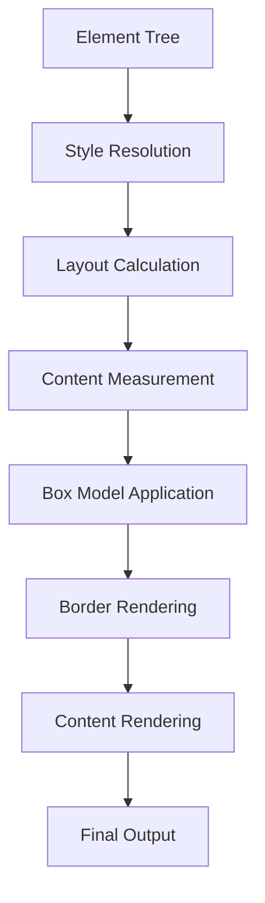

# TUI Elements Enhancement Plan
## HTML-like Component System Design

## Overview
This document outlines a comprehensive enhancement plan for the TUI (Terminal UI) elements system, transforming it into a more robust HTML-like component framework inspired by modern web development patterns.

## Current State Analysis

### Existing Components
- **tdiv**: Basic container with border, padding, margin, and alignment
- **renderInfoBox**: Utility function for rendering info boxes

### Current Limitations
1. Only one element type (tdiv)
2. Limited styling options
3. No semantic elements (header, footer, section, etc.)
4. No text-specific elements (paragraph, heading, list, etc.)
5. No layout elements (flex/grid-like)
6. No component composition utilities
7. No theme/styling system
8. No event handling hooks

---

## Proposed Architecture

### 1. Core Element Base Class

```typescript
/**
 * Base class for all TUI elements
 * Provides common functionality and rendering infrastructure
 */
abstract class TUIElement {
    protected metadata: ElementMetadata;
    protected children: TUIElement[];

    constructor(metadata: ElementMetadata, children?: TUIElement[]) {
        this.metadata = metadata;
        this.children = children || [];
    }

    abstract render(): string;

    // Common utility methods
    protected calculateDimensions(): Dimensions;
    protected applyStyles(): string;
}
```

### 2. Element Type Hierarchy

#### 2.1 Container Elements

##### tdiv (Enhanced)
Enhanced version of current tdiv with additional features:
- Flexbox-like layout support (flex-direction, justify-content, align-items)
- Grid-like layout support (grid-template-columns, gap)
- Overflow handling
- Z-index for stacking

```typescript
interface tdivMetadata extends ElementMetadata {
    layout?: 'block' | 'flex' | 'grid';
    flexDirection?: 'row' | 'column';
    justifyContent?: 'flex-start' | 'center' | 'flex-end' | 'space-between' | 'space-around';
    alignItems?: 'flex-start' | 'center' | 'flex-end' | 'stretch';
    gap?: number;
    overflow?: 'visible' | 'hidden' | 'scroll';
    zIndex?: number;
}
```

##### tspan (Inline Container)
Inline container for grouping text elements:
```typescript
class tspan extends TUIElement {
    // Inline text container, similar to HTML <span>
}
```

##### tsection (Semantic Section)
Semantic container for content sections:
```typescript
class tsection extends TUIElement {
    // Similar to HTML <section>
}
```

#### 2.2 Text Elements

##### th (Heading)
Headings with different levels:
```typescript
class th extends TUIElement {
    level: 1 | 2 | 3 | 4 | 5 | 6;
    // Similar to HTML <h1>-<h6>
}

interface thMetadata extends ElementMetadata {
    level?: 1 | 2 | 3 | 4 | 5 | 6;
    underline?: boolean;
}
```

##### tp (Paragraph)
Paragraph element:
```typescript
class tp extends TUIElement {
    // Similar to HTML <p>
}

interface tpMetadata extends ElementMetadata {
    indent?: number;
    lineHeight?: number;
}
```

##### ttext (Text)
Basic text element:
```typescript
class ttext extends TUIElement {
    // Similar to HTML text nodes
}

interface ttextMetadata extends ElementMetadata {
    bold?: boolean;
    italic?: boolean;
    underline?: boolean;
    strikethrough?: boolean;
    color?: TextColor;
    backgroundColor?: TextColor;
}
```

#### 2.3 List Elements

##### tul (Unordered List)
Bullet point lists:
```typescript
class tul extends TUIElement {
    // Similar to HTML <ul>
}

interface tulMetadata extends ElementMetadata {
    bulletStyle?: 'disc' | 'circle' | 'square' | 'dash' | 'arrow';
    indent?: number;
}
```

##### tol (Ordered List)
Numbered lists:
```typescript
class tol extends TUIElement {
    // Similar to HTML <ol>
}

interface tolMetadata extends ElementMetadata {
    numberingStyle?: 'decimal' | 'lower-alpha' | 'upper-alpha' | 'lower-roman' | 'upper-roman';
    start?: number;
}
```

##### tli (List Item)
List item element:
```typescript
class tli extends TUIElement {
    // Similar to HTML <li>
}
```

#### 2.4 Table Elements

##### ttable (Table)
Table structure:
```typescript
class ttable extends TUIElement {
    // Similar to HTML <table>
}

interface ttableMetadata extends ElementMetadata {
    columnWidths?: number[];
    border?: 'none' | 'outer' | 'all' | 'horizontal' | 'vertical';
    headerBorder?: boolean;
}
```

##### thead (Table Header)
Table header:
```typescript
class thead extends TUIElement {
    // Similar to HTML <thead>
}
```

##### tbody (Table Body)
Table body:
```typescript
class tbody extends TUIElement {
    // Similar to HTML <tbody>
}
```

##### tr (Table Row)
Table row:
```typescript
class tr extends TUIElement {
    // Similar to HTML <tr>
}
```

##### thc (Table Header Cell)
Table header cell:
```typescript
class thc extends TUIElement {
    // Similar to HTML <th>
}

interface thcMetadata extends ElementMetadata {
    align?: 'left' | 'center' | 'right';
    bold?: boolean;
}
```

##### tdc (Table Data Cell)
Table data cell:
```typescript
class tdc extends TUIElement {
    // Similar to HTML <td>
}

interface tdcMetadata extends ElementMetadata {
    align?: 'left' | 'center' | 'right';
    colspan?: number;
    rowspan?: number;
}
```

#### 2.5 Form Elements

##### tinput (Input Field)
Input field for user input:
```typescript
class tinput extends TUIElement {
    // Similar to HTML <input>
}

interface tinputMetadata extends ElementMetadata {
    type?: 'text' | 'password' | 'number';
    placeholder?: string;
    maxLength?: number;
    value?: string;
}
```

##### tbutton (Button)
Button element:
```typescript
class tbutton extends TUIElement {
    // Similar to HTML <button>
}

interface tbuttonMetadata extends ElementMetadata {
    primary?: boolean;
    secondary?: boolean;
    action?: string;
}
```

#### 2.6 Layout Elements

##### trow (Row Layout)
Horizontal layout container:
```typescript
class trow extends TUIElement {
    // Flex row layout
}
```

##### tcol (Column Layout)
Vertical layout container:
```typescript
class tcol extends TUIElement {
    // Flex column layout
}
```

##### tgrid (Grid Layout)
Grid layout container:
```typescript
class tgrid extends TUIElement {
    // CSS Grid-like layout
}

interface tgridMetadata extends ElementMetadata {
    columns?: number | string[];
    rows?: number | string[];
    gap?: number;
}
```

#### 2.7 Semantic Elements

##### theader (Page Header)
Page header section:
```typescript
class theader extends TUIElement {
    // Similar to HTML <header>
}
```

##### tfooter (Page Footer)
Page footer section:
```typescript
class tfooter extends TUIElement {
    // Similar to HTML <footer>
}
```

##### tnav (Navigation)
Navigation section:
```typescript
class tnav extends TUIElement {
    // Similar to HTML <nav>
}
```

##### tmain (Main Content)
Main content section:
```typescript
class tmain extends TUIElement {
    // Similar to HTML <main>
}
```

##### taside (Sidebar)
Sidebar content:
```typescript
class taside extends TUIElement {
    // Similar to HTML <aside>
}
```

---

### 3. Enhanced Style System

#### 3.1 Color Palette

```typescript
interface ColorPalette {
    // ANSI colors
    black: string;
    red: string;
    green: string;
    yellow: string;
    blue: string;
    magenta: string;
    cyan: string;
    white: string;

    // Bright colors
    brightBlack: string;
    brightRed: string;
    brightGreen: string;
    brightYellow: string;
    brightBlue: string;
    brightMagenta: string;
    brightCyan: string;
    brightWhite: string;

    // Custom colors
    primary?: string;
    secondary?: string;
    accent?: string;
    success?: string;
    warning?: string;
    error?: string;
}
```

#### 3.2 Theme System

```typescript
interface Theme {
    name: string;
    colors: ColorPalette;
    borders: {
        single: border;
        double: border;
        rounded: border;
        dashed: border;
    };
    fonts: {
        default: string;
        heading: string;
        mono: string;
    };
    spacing: {
        xs: number;
        sm: number;
        md: number;
        lg: number;
        xl: number;
    };
}
```

#### 3.3 Style Composition

```typescript
interface ComputedStyles {
    // Box model
    width: number;
    height: number;
    padding: Spacing;
    margin: Spacing;
    border: border;

    // Typography
    color: string;
    backgroundColor: string;
    bold: boolean;
    italic: boolean;
    underline: boolean;

    // Layout
    display: 'block' | 'inline' | 'flex' | 'grid';
    flexDirection: 'row' | 'column';
    justifyContent: string;
    alignItems: string;
    gap: number;

    // Positioning
    position: 'static' | 'relative' | 'absolute';
    zIndex: number;
}
```

---

### 4. Component Composition Utilities

#### 4.1 Builder Pattern

```typescript
class ElementBuilder {
    static div(): tdivBuilder;
    static span(): tspanBuilder;
    static heading(level: number): thBuilder;
    static paragraph(): tpBuilder;
    static text(content: string): ttextBuilder;
    static list(ordered: boolean): tulBuilder | tolBuilder;
    static table(): ttableBuilder;
}

class tdivBuilder {
    width(value: number): this;
    height(value: number): this;
    border(enabled: boolean): this;
    padding(value: Spacing): this;
    margin(value: Spacing): this;
    align(value: Alignment): this;
    style(value: border): this;
    content(value: string): this;
    children(...elements: TUIElement[]): this;
    build(): tdiv;
}
```

#### 4.2 Functional Components

```typescript
type FunctionalComponent = (props: any) => TUIElement;

// Example functional component
const Card: FunctionalComponent = ({ title, content, footer }) => {
    return new tdiv({
        width: 80,
        border: true,
        styles: {
            border: { line: 'single' },
            padding: { all: 1 }
        }
    }, [
        new th({ level: 2, content: title }),
        new tp({ content }),
        footer ? new tfooter({ content: footer }) : null
    ].filter(Boolean));
};
```

---

### 5. Layout Engine

#### 5.1 Flex Layout Implementation

```typescript
class FlexLayoutEngine {
    calculateLayout(container: tdiv, children: TUIElement[]): LayoutResult;
    distributeSpace(availableSpace: number, children: TUIElement[]): number[];
    alignItems(children: TUIElement[], alignment: string): void;
    justifyContent(children: TUIElement[], justification: string): void;
}
```

#### 5.2 Grid Layout Implementation

```typescript
class GridLayoutEngine {
    calculateLayout(container: tgrid, children: TUIElement[]): LayoutResult;
    placeItems(grid: GridDefinition, items: TUIElement[]): GridPlacement[];
    calculateCellSizes(width: number, columns: string[]): number[];
}
```

---

### 6. Rendering Pipeline



### 7. Implementation Phases

#### Phase 1: Core Foundation
- Refactor TUIElement base class
- Enhance tdiv with flex layout support
- Add basic text elements (th, tp, ttext)
- Implement style resolution system

#### Phase 2: Layout System
- Implement FlexLayoutEngine
- Add trow and tcol elements
- Implement gap and alignment properties
- Add overflow handling

#### Phase 3: Advanced Elements
- Add list elements (tul, tol, tli)
- Add table elements (ttable, thead, tbody, tr, thc, tdc)
- Add semantic elements (theader, tfooter, tnav, tmain, taside)

#### Phase 4: Grid Layout
- Implement GridLayoutEngine
- Add tgrid element
- Implement grid-template-columns/rows

#### Phase 5: Builder & Utilities
- Implement ElementBuilder pattern
- Add functional component support
- Create theme system
- Add preset components (Card, Alert, Modal, etc.)

#### Phase 6: Testing & Documentation
- Write comprehensive tests
- Create usage examples
- Document API reference

---

### 8. Migration Strategy

#### Backward Compatibility
- Keep existing tdiv API intact
- Add deprecation warnings for old patterns
- Provide migration guide

#### Incremental Adoption
- New components can be used alongside old ones
- Gradual refactoring of existing code
- Feature flags for new functionality

---

### 9. Example Usage

#### Before (Current)
```typescript
const header = new tdiv({
    width: 80,
    border: true,
    content: 'VIRTUAL WORKSPACE',
    styles: {
        border: { line: 'double' },
        align: 'center',
        padding: { vertical: 1 }
    }
});
```

#### After (Enhanced)
```typescript
// Using builder pattern
const header = ElementBuilder.div()
    .width(80)
    .border(true)
    .style('double')
    .align('center')
    .padding({ vertical: 1 })
    .content('VIRTUAL WORKSPACE')
    .build();

// Using semantic element
const header = new theader({
    width: 80,
    content: new th({
        level: 1,
        content: 'VIRTUAL WORKSPACE'
    })
});

// Using functional component
const header = PageHeader({
    title: 'VIRTUAL WORKSPACE',
    subtitle: 'Available States'
});
```

---

### 10. File Structure

```
libs/agent-lib/src/agent/components/aesthetics/
├── TUI_elements.ts              # Core element classes
├── TUI_elements.test.ts         # Tests
├── layout/
│   ├── FlexLayoutEngine.ts      # Flex layout implementation
│   ├── GridLayoutEngine.ts      # Grid layout implementation
│   └── BoxModel.ts              # Box model calculations
├── styles/
│   ├── Theme.ts                 # Theme system
│   ├── ColorPalette.ts          # Color definitions
│   └── StyleResolver.ts         # Style resolution
├── elements/
│   ├── containers/
│   │   ├── tdiv.ts
│   │   ├── tspan.ts
│   │   └── tsection.ts
│   ├── text/
│   │   ├── th.ts
│   │   ├── tp.ts
│   │   └── ttext.ts
│   ├── lists/
│   │   ├── tul.ts
│   │   ├── tol.ts
│   │   └── tli.ts
│   ├── tables/
│   │   ├── ttable.ts
│   │   ├── thead.ts
│   │   ├── tbody.ts
│   │   ├── tr.ts
│   │   ├── thc.ts
│   │   └── tdc.ts
│   ├── forms/
│   │   ├── tinput.ts
│   │   └── tbutton.ts
│   ├── layout/
│   │   ├── trow.ts
│   │   ├── tcol.ts
│   │   └── tgrid.ts
│   └── semantic/
│       ├── theader.ts
│       ├── tfooter.ts
│       ├── tnav.ts
│       ├── tmain.ts
│       └── taside.ts
├── builders/
│   ├── ElementBuilder.ts        # Builder pattern implementation
│   └── ComponentBuilder.ts      # Component-specific builders
├── components/
│   ├── Card.ts                  # Pre-built Card component
│   ├── Alert.ts                 # Pre-built Alert component
│   ├── Modal.ts                 # Pre-built Modal component
│   └── Form.ts                  # Pre-built Form component
├── utils/
│   ├── TextWrapper.ts          # Text wrapping utilities
│   ├── StringHelper.ts          # String manipulation
│   └── BoxCharacters.ts         # Box border characters
└── index.ts                     # Public API exports
```

---

## Summary

This enhancement plan transforms the TUI elements system into a comprehensive HTML-like component framework with:

1. **Rich Element Types**: 20+ semantic and layout elements
2. **Advanced Layout System**: Flexbox and Grid layout engines
3. **Style System**: Theme support, color palettes, and style composition
4. **Builder Pattern**: Fluent API for component construction
5. **Functional Components**: Reusable component patterns
6. **Backward Compatibility**: Existing code continues to work
7. **Extensibility**: Easy to add new elements and features

The implementation is phased to allow incremental adoption and minimize disruption to existing code.
