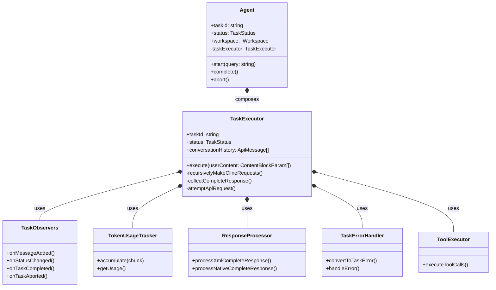
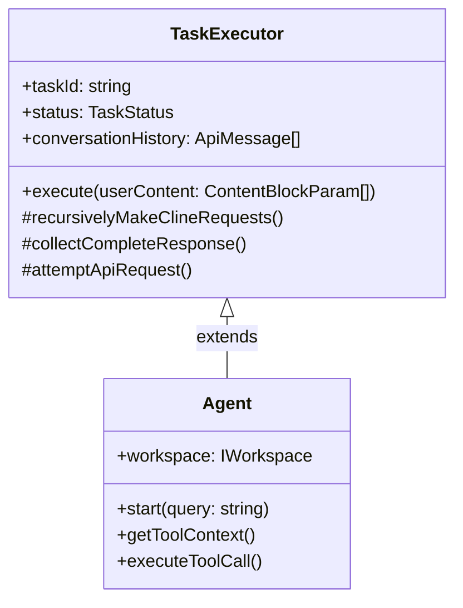
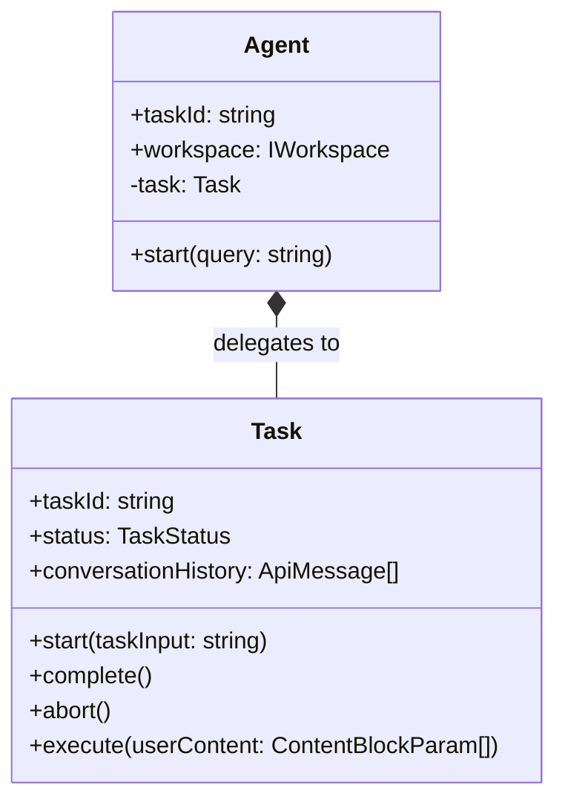

# Agent Task Execution Refactoring Analysis

## Executive Summary

The [`Agent`](libs/agent-lib/src/agent/agent.ts:45) class in [`agent.ts`](libs/agent-lib/src/agent/agent.ts:1) currently has significant code duplication with the [`Task`](libs/agent-lib/src/task/task.entity.ts:78) entity. Both classes implement nearly identical task execution logic, including:

- Status management (idle, running, completed, aborted)
- Core request loop with stack-based retry mechanism
- Message processing and conversation history management
- API request handling with timeout
- Response processing
- Error handling
- Observer pattern for events

This analysis confirms that **refactoring to separate task execution logic is both feasible and recommended**.

## Current State Analysis

### Agent Class Responsibilities

The [`Agent`](libs/agent-lib/src/agent/agent.ts:45) class currently handles:

| Responsibility                             | Location       | Lines |
| ------------------------------------------ | -------------- | ----- |
| Status Management                          | Lines 56-129   | 73    |
| Observer Registration                      | Lines 131-159  | 28    |
| Token/Tool Usage Tracking                  | Lines 161-175  | 14    |
| Lifecycle Methods (start, complete, abort) | Lines 177-209  | 32    |
| Core Request Loop                          | Lines 211-378  | 167   |
| Message Processing                         | Lines 380-465  | 85    |
| Response Processing                        | Lines 467-474  | 7     |
| Error Handling                             | Lines 476-490  | 14    |
| API Request Handling                       | Lines 527-607  | 80    |
| Helper Classes (Observers, Trackers, etc.) | Lines 613-1222 | 609   |

**Total**: ~1,100 lines of task-related logic mixed with agent-specific concerns.

### Task Entity Responsibilities

The [`Task`](libs/agent-lib/src/task/task.entity.ts:78) entity already contains:

| Responsibility                             | Location      | Lines |
| ------------------------------------------ | ------------- | ----- |
| Status Management                          | Lines 80-226  | 146   |
| Observer Registration                      | Lines 152-173 | 21    |
| Token/Tool Usage Tracking                  | Lines 200-211 | 11    |
| Lifecycle Methods (start, complete, abort) | Lines 242-267 | 25    |
| Core Request Loop                          | Lines 273-440 | 167   |
| Message Processing                         | Lines 479-549 | 70    |
| API Request Handling                       | Lines 445-601 | 156   |
| Helper Classes                             | Lines 119-149 | 30    |

**Total**: ~620 lines of task execution logic.

### Code Duplication

The following methods are nearly identical between `Agent` and `Task`:

| Method                         | Agent Lines | Task Lines | Similarity |
| ------------------------------ | ----------- | ---------- | ---------- |
| `recursivelyMakeClineRequests` | 217-378     | 273-440    | ~95%       |
| `collectCompleteResponse`      | 579-607     | 445-475    | ~90%       |
| `attemptApiRequest`            | 527-565     | 551-593    | ~85%       |
| `addAssistantMessageToHistory` | 394-435     | 480-522    | ~90%       |
| `addToConversationHistory`     | 440-465     | 524-549    | ~85%       |
| `resetMessageState`            | 385-389     | 179-183    | 100%       |
| `start`                        | 182-193     | 245-256    | ~80%       |
| `complete`                     | 198-201     | 258-261    | ~90%       |
| `abort`                        | 206-209     | 263-267    | ~90%       |
| `setStatus`                    | 126-129     | 216-219    | ~90%       |
| `isAborted`                    | 119-121     | 224-226    | 100%       |

## Existing Abstractions

The codebase already has several task-related abstractions that can be leveraged:

### 1. Task Observers

- [`TaskObservers`](libs/agent-lib/src/task/observers/TaskObservers.ts:1) - Observer pattern implementation
- Already used by [`Task`](libs/agent-lib/src/task/task.entity.ts:119) entity

### 2. Token Usage Tracking

- [`TokenUsageTracker`](libs/agent-lib/src/task/token-usage/TokenUsageTracker.ts:1) - Token usage tracking
- Already used by [`Task`](libs/agent-lib/src/task/task.entity.ts:120) entity

### 3. Response Processing

- [`ResponseProcessor`](libs/agent-lib/src/task/response/ResponseProcessor.ts:1) - Response processing logic
- Already used by [`Task`](libs/agent-lib/src/task/task.entity.ts:121) entity

### 4. Error Handling

- [`TaskErrorHandler`](libs/agent-lib/src/task/error/TaskErrorHandler.ts:1) - Error handling logic
- Already used by [`Task`](libs/agent-lib/src/task/task.entity.ts:122) entity

### 5. Tool Execution

- [`ToolExecutor`](libs/agent-lib/src/task/tool-execution/ToolExecutor.ts:1) - Tool execution logic
- Already used by [`Task`](libs/agent-lib/src/task/task.entity.ts:123) entity

### 6. Error Prompt Formatting

- [`ErrorHandlerPrompt`](libs/agent-lib/src/task/error-prompt/ErrorHandlerPrompt.ts:1) - Error prompt formatting

## Refactoring Recommendations

### Option 1: Composition Pattern (Recommended)

Create a `TaskExecutor` class that encapsulates all task execution logic, and have `Agent` compose it.



**Pros:**

- Clean separation of concerns
- `Agent` focuses on agent-specific concerns (workspace, tool context)
- `TaskExecutor` focuses on task execution logic
- Reuses existing task abstractions
- Testable in isolation

**Cons:**

- Requires careful dependency management
- Need to handle state synchronization

### Option 2: Inheritance Pattern

Make `Agent` extend a base `TaskExecutor` class.



**Pros:**

- Less code duplication initially
- Shared methods directly available

**Cons:**

- Tight coupling between Agent and TaskExecutor
- Violates composition over inheritance principle
- Less flexible for future changes

### Option 3: Extract Task as Independent Service

Make `Task` a completely independent service that `Agent` delegates to.



**Pros:**

- Maximum separation
- `Task` can be used independently
- Clear boundaries

**Cons:**

- May require more significant refactoring
- Need to handle workspace context injection

## Proposed Refactoring Plan (Option 1 - Composition)

### Phase 1: Extract TaskExecutor Class

Create `libs/agent-lib/src/task/execution/TaskExecutor.ts`:

```typescript
export class TaskExecutor {
  private _status: TaskStatus = 'idle';
  private taskId: string;
  private conversationHistory: ApiMessage[] = [];
  private messageState: MessageProcessingState;

  // Helper classes
  private readonly observers: TaskObservers;
  private readonly tokenUsageTracker: TokenUsageTracker;
  private readonly responseProcessor: ResponseProcessor;
  private readonly errorHandler: TaskErrorHandler;
  private readonly toolExecutor: ToolExecutor;

  constructor(
    taskId: string,
    apiConfiguration: ProviderSettings,
    config: TaskExecutorConfig,
  ) {
    this.taskId = taskId;
    this.api = buildApiHandler(apiConfiguration);
    // Initialize helper classes...
  }

  // Public API
  get status(): TaskStatus {
    return this._status;
  }
  get tokenUsage(): TokenUsage {
    return this.tokenUsageTracker.getUsage();
  }
  get toolUsage(): ToolUsage {
    return this.toolExecutor.getToolUsage();
  }

  onMessageAdded(callback: MessageAddedCallback): () => void {
    /* ... */
  }
  onStatusChanged(callback: TaskStatusChangedCallback): () => void {
    /* ... */
  }
  onTaskCompleted(callback: TaskCompletedCallback): () => void {
    /* ... */
  }
  onTaskAborted(callback: TaskAbortedCallback): () => void {
    /* ... */
  }

  async execute(userContent: ContentBlockParam[]): Promise<boolean> {
    this.setStatus('running');
    return this.recursivelyMakeClineRequests(userContent);
  }

  complete(): void {
    /* ... */
  }
  abort(reason?: string): void {
    /* ... */
  }

  // Private methods (moved from Agent/Task)
  private recursivelyMakeClineRequests(): Promise<boolean> {
    /* ... */
  }
  private collectCompleteResponse(): Promise<ApiStreamChunk[]> {
    /* ... */
  }
  private async *attemptApiRequest(): ApiStream {
    /* ... */
  }
  // ... other private methods
}
```

### Phase 2: Refactor Agent to Use TaskExecutor

Update [`Agent`](libs/agent-lib/src/agent/agent.ts:45) to compose `TaskExecutor`:

```typescript
export abstract class Agent {
  private taskExecutor: TaskExecutor;
  private workspace: IWorkspace;
  private toolCallingHandler: ToolCallingHandler;

  constructor(
    protected config: AgentConfig = defaultAgentConfig,
    private apiConfiguration: ProviderSettings = defaultApiConfig,
    workspace: IWorkspace,
    taskId?: string,
  ) {
    this.workspace = workspace;
    this.taskId = taskId || crypto.randomUUID();

    // Initialize TaskExecutor
    this.taskExecutor = new TaskExecutor(this.taskId, this.apiConfiguration, {
      apiRequestTimeout: this.config.apiRequestTimeout,
      maxRetryAttempts: this.config.maxRetryAttempts,
      consecutiveMistakeLimit: this.config.consecutiveMistakeLimit,
    });

    // Initialize tool calling handler
    this.toolCallingHandler = new ToolCallingHandler();
  }

  // Delegate to TaskExecutor
  public get status(): TaskStatus {
    return this.taskExecutor.status;
  }

  public get tokenUsage(): TokenUsage {
    return this.taskExecutor.tokenUsage;
  }

  public get toolUsage(): ToolUsage {
    return this.taskExecutor.toolUsage;
  }

  onMessageAdded(callback: MessageAddedCallback): () => void {
    return this.taskExecutor.onMessageAdded(callback);
  }

  onStatusChanged(callback: TaskStatusChangedCallback): () => void {
    return this.taskExecutor.onStatusChanged(callback);
  }

  onTaskCompleted(callback: TaskCompletedCallback): () => void {
    return this.taskExecutor.onTaskCompleted(callback);
  }

  onTaskAborted(callback: TaskAbortedCallback): () => void {
    return this.taskExecutor.onTaskAborted(callback);
  }

  async start(query: string): Promise<Agent> {
    return this.taskExecutor.execute([
      {
        type: 'text',
        text: `<task>${query}</task>`,
      },
    ]);
  }

  complete(): void {
    this.taskExecutor.complete();
  }

  abort(reason?: string): void {
    this.taskExecutor.abort(reason);
  }

  // Agent-specific methods remain
  private getToolContext(): ToolContext {
    return { workspace: this.workspace };
  }

  protected async executeToolCall(toolName: string, params: any): Promise<any> {
    return this.toolCallingHandler.handleToolCalling(
      toolName as ToolName,
      params,
      { context: this.getToolContext() },
    );
  }
}
```

### Phase 3: Update Task Entity to Use TaskExecutor

Refactor [`Task`](libs/agent-lib/src/task/task.entity.ts:78) to also use `TaskExecutor`:

```typescript
export class Task {
  private taskExecutor: TaskExecutor;
  taskInput: string = '';

  constructor(
    taskId: string,
    taskInput: string,
    private apiConfiguration: ProviderSettings,
    consecutiveMistakeLimit = DEFAULT_CONSECUTIVE_MISTAKE_LIMIT,
  ) {
    this.taskId = taskId;
    this.taskInput = taskInput;

    // Initialize TaskExecutor
    this.taskExecutor = new TaskExecutor(this.taskId, this.apiConfiguration, {
      apiRequestTimeout: 60000,
      maxRetryAttempts: 3,
      consecutiveMistakeLimit,
    });
  }

  // Delegate all methods to TaskExecutor
  get status(): TaskStatus {
    return this.taskExecutor.status;
  }
  get tokenUsage(): TokenUsage {
    return this.taskExecutor.tokenUsage;
  }
  get toolUsage(): ToolUsage {
    return this.taskExecutor.toolUsage;
  }

  onMessageAdded(callback: MessageAddedCallback): () => void {
    return this.taskExecutor.onMessageAdded(callback);
  }

  // ... other delegated methods

  async start(task?: string, images?: string[]): Promise<Task> {
    return this.taskExecutor.execute([
      {
        type: 'text',
        text: `<task>${task ?? this.taskInput}</task>`,
      },
    ]);
  }
}
```

### Phase 4: Remove Duplicate Code

Remove the following from [`Agent`](libs/agent-lib/src/agent/agent.ts:45):

- Lines 56-129: Status management (delegated to TaskExecutor)
- Lines 131-159: Observer registration (delegated to TaskExecutor)
- Lines 161-175: Token/Tool usage tracking (delegated to TaskExecutor)
- Lines 217-378: `recursivelyMakeClineRequests` method (moved to TaskExecutor)
- Lines 380-465: Message processing methods (moved to TaskExecutor)
- Lines 527-607: API request methods (moved to TaskExecutor)
- Lines 613-707: `AgentObservers` class (use TaskObservers)
- Lines 718-777: `AgentTokenUsageTracker` class (use TokenUsageTracker)
- Lines 782-818: `AgentToolUsageTracker` class (use ToolExecutor's tracking)
- Lines 823-873: `AgentErrorHandler` class (use TaskErrorHandler)
- Lines 878-1045: `AgentResponseProcessor` class (use ResponseProcessor)
- Lines 1050-1222: `AgentToolExecutor` class (use ToolExecutor)

## Benefits of Refactoring

1. **Reduced Code Duplication**: Eliminate ~800 lines of duplicate code
2. **Single Source of Truth**: Task execution logic exists in one place
3. **Better Testability**: TaskExecutor can be tested independently
4. **Clearer Separation of Concerns**: Agent focuses on workspace/context, TaskExecutor focuses on execution
5. **Easier Maintenance**: Bug fixes in task execution only need to be made once
6. **Reusability**: TaskExecutor can be used by other components if needed
7. **Consistency**: Both Agent and Task will have identical task execution behavior

## Risks and Mitigations

| Risk                            | Mitigation                                               |
| ------------------------------- | -------------------------------------------------------- |
| Breaking changes to Agent API   | Keep public API unchanged, delegate internally           |
| State synchronization issues    | Ensure TaskExecutor owns all task-related state          |
| Workspace context not available | Pass workspace context to ToolExecutor via configuration |
| Test failures                   | Update tests to work with new architecture               |
| Performance regression          | Benchmark before/after refactoring                       |

## Migration Strategy

1. Create `TaskExecutor` class alongside existing code
2. Write unit tests for `TaskExecutor`
3. Refactor `Agent` to use `TaskExecutor` (keep old code as fallback)
4. Run existing tests to verify behavior
5. Remove old code from `Agent`
6. Refactor `Task` to use `TaskExecutor`
7. Remove duplicate helper classes
8. Update integration tests

## Next Steps

1. Review this analysis with the team
2. Decide on the refactoring approach (Option 1 recommended)
3. Create implementation tasks
4. Begin Phase 1: Extract TaskExecutor class
