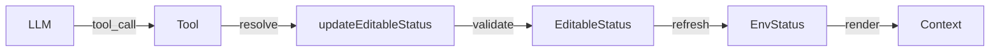
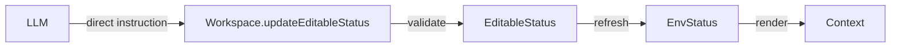

# Direct EditableStatus Interaction Design

## Overview

This document outlines a new architecture for LLM-Workspace interaction that removes the dependency on `toolSet` and enables direct modification of `EditableStatus` fields by the LLM.

## Current Architecture (To Be Replaced)



**Issues with Current Approach:**

- Requires creating wrapper tools for each editable field
- Adds unnecessary indirection layer
- Tool definitions need to be manually maintained
- More complex workflow than necessary

## Proposed New Architecture



### Key Principles

1. **Direct Interaction**: LLM directly calls `updateEditableStatus()` method
2. **Schema-Driven**: EditableStatus fields are self-describing with constraints
3. **Unified Interface**: Single method for all editable fields
4. **Validation Built-in**: Each field has its own validation logic
5. **Context-Aware**: LLM receives current EditableStatus in context

## New Interface Design

### IWorkspace Interface

```typescript
export interface IWorkspace {
  info: WorkSpaceInfo;
  env: Record<string, any>;
  editableStatus: Record<string, EditableStatus>;
  renderContext: () => string;

  /**
   * Core method for LLM to directly update editable status fields
   * @param fieldName - The name of the editable field to update
   * @param value - The new value (null to clear)
   * @returns Result indicating success or failure with error details
   */
  updateEditableStatus: (
    fieldName: string,
    value: string | null,
  ) => Promise<EditableStatusUpdateResult>;

  /**
   * Get the schema definition for editable status fields
   * Used to inform LLM about available fields and their constraints
   */
  getEditableStatusSchema: () => EditableStatusSchema;

  /**
   * Optional: Execute a workspace-specific action (for non-editable operations)
   * This replaces the need for toolSet for workspace-specific actions
   */
  executeAction?: (
    actionName: string,
    params: Record<string, any>,
  ) => Promise<ActionResult>;
}

export interface EditableStatusUpdateResult {
  success: boolean;
  error?: string;
  updatedField?: string;
  previousValue?: string | null;
  newValue?: string | null;
}

export interface EditableStatusSchema {
  fields: Record<string, EditableFieldDefinition>;
}

export interface EditableFieldDefinition {
  description: string;
  type: 'string' | 'number' | 'boolean' | 'enum';
  constraint: string;
  enumValues?: string[]; // For enum type
  dependsOn?: string[]; // Fields this field depends on
  validation?: (value: string | null) => { valid: boolean; error?: string };
}

export interface ActionResult {
  success: boolean;
  data?: any;
  error?: string;
}
```

### Enhanced EditableStatus Interface

```typescript
export interface EditableStatus {
  value: string | null;
  constraint: string;
  description: string; // Human-readable description
  type: 'string' | 'number' | 'boolean' | 'enum';
  enumValues?: string[]; // For enum type
  dependsOn?: string[]; // Fields this field depends on
  readonly: boolean; // If true, cannot be modified by LLM
}
```

## Workflow

### 1. Initial Context Rendering

The `renderContext()` method includes:

- Environment status (read-only state)
- Editable status with current values and constraints
- Available actions (if any)

Example context:

```
################################
------Bookshelf Workspace-------
################################

## Environment Status:
{
  "availableBooks": [...],
  "currentBook": undefined,
  "currentPage": undefined
}

## Editable Status:
  selected_book_name: (not set) [must be one of the available book names]
  current_page: (not set) [must be a positive integer within the current book's page range]

## Available Books:
  - Physiology (450 pages): A comprehensive guide...
  - Anatomy (520 pages): Detailed anatomical structures...
```

### 2. LLM Direct Interaction

Instead of calling a tool, the LLM provides a structured instruction:

```typescript
// LLM output example
{
  "type": "workspace_action",
  "action": "update_editable_status",
  "params": {
    "fieldName": "selected_book_name",
    "value": "Physiology"
  }
}
```

### 3. Workspace Processing

```typescript
// In BookshelfWorkspace
async updateEditableStatus(fieldName: string, value: string | null): Promise<EditableStatusUpdateResult> {
    // 1. Check if field exists
    if (!(fieldName in this.editableStatus)) {
        return {
            success: false,
            error: `Unknown editable field: ${fieldName}`
        };
    }

    const field = this.editableStatus[fieldName];

    // 2. Check if field is readonly
    if (field.readonly) {
        return {
            success: false,
            error: `Field '${fieldName}' is read-only`
        };
    }

    // 3. Validate value
    const validationResult = this.validateEditableFieldValue(fieldName, value);
    if (!validationResult.valid) {
        return {
            success: false,
            error: validationResult.error
        };
    }

    // 4. Store previous value
    const previousValue = field.value;

    // 5. Update editable status
    field.value = value;

    // 6. Refresh environment status
    await this.refreshEnvStatus(fieldName, value);

    // 7. Return success result
    return {
        success: true,
        updatedField: fieldName,
        previousValue,
        newValue: value
    };
}
```

### 4. Context Refresh

After update, the context is automatically refreshed with new values.

## Benefits of New Architecture

1. **Simplicity**: Direct method call instead of tool wrapper
2. **Flexibility**: Easy to add new editable fields without creating new tools
3. **Self-Documenting**: EditableStatus schema describes itself
4. **Type Safety**: Strong typing for field definitions
5. **Reduced Code**: No need for tool creation/maintenance
6. **Better Error Messages**: Direct feedback from validation
7. **Dependency Tracking**: Fields can declare dependencies on other fields

## Migration Strategy

### Phase 1: Interface Updates

1. Update `IWorkspace` interface with new methods
2. Add new type definitions

### Phase 2: Implementation

1. Update `BookshelfWorkspace` to implement new interface
2. Remove `toolSet` property
3. Remove tool creation methods (`createUpdateSelectedBookTool`, etc.)
4. Keep `semantic_search_tool` as a special action if needed

### Phase 3: Testing

1. Update tests to use direct `updateEditableStatus` calls
2. Test validation logic
3. Test context refresh

### Phase 4: Documentation

1. Update architecture documentation
2. Provide examples for LLM integration

## Handling Non-Editable Actions

For actions that don't modify EditableStatus (like semantic search), we can use the `executeAction` method:

```typescript
// In BookshelfWorkspace
async executeAction(actionName: string, params: Record<string, any>): Promise<ActionResult> {
    switch (actionName) {
        case 'semantic_search':
            return await this.performSemanticSearch(params.query);
        default:
            return {
                success: false,
                error: `Unknown action: ${actionName}`
            };
    }
}
```

## Example Usage

```typescript
// Initialize workspace
const workspace = new BookshelfWorkspace();
await workspace.init();

// LLM wants to select a book
const result = await workspace.updateEditableStatus(
  'selected_book_name',
  'Physiology',
);
// Result: { success: true, updatedField: 'selected_book_name', previousValue: null, newValue: 'Physiology' }

// LLM wants to navigate to a page
const result2 = await workspace.updateEditableStatus('current_page', '42');
// Result: { success: true, updatedField: 'current_page', previousValue: '1', newValue: '42' }

// LLM tries invalid value
const result3 = await workspace.updateEditableStatus(
  'selected_book_name',
  'InvalidBook',
);
// Result: { success: false, error: 'Book "InvalidBook" not found...' }

// LLM performs a search action
const searchResult = await workspace.executeAction('semantic_search', {
  query: 'heart',
});
// Result: { success: true, data: [...] }
```

## LLM Prompt Integration

The context provided to LLM should include:

```
You are interacting with a workspace. You can modify editable status fields directly.

Available editable fields:
- selected_book_name: Select a book to browse (must be one of the available book names)
- current_page: Navigate to a page (must be a positive integer within the current book's page range)

To update a field, use this format:
{
  "action": "update_editable_status",
  "fieldName": "<field_name>",
  "value": "<new_value>"
}

Current workspace state:
[renderContext() output]
```

## Next Steps

1. Review and approve this design
2. Implement the new interface
3. Update BookshelfWorkspace implementation
4. Write comprehensive tests
5. Update documentation
