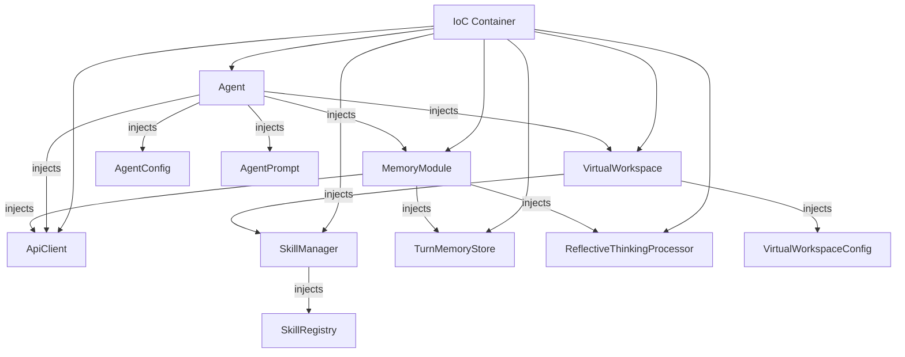

# InversifyJS Dependency Injection Integration Plan

## Overview

This document outlines the plan for integrating InversifyJS dependency injection framework into the `agent-lib` library. The goal is to replace manual dependency injection with a proper IoC container for better testability, maintainability, and flexibility.

**Status: ✅ COMPLETED**

**Design Decisions:**
- ✅ **Complete Dependency Injection** - All services managed by container
- ✅ **VirtualWorkspace container-managed** - Created and managed by IoC container
- ✅ **Backward Compatibility** - Maintain existing AgentFactory API during migration
- ✅ **Lazy Injection** - Use Lazy injection for SkillManager to handle circular dependency

## Current State Analysis

### Existing Dependencies

The `Agent` class currently has these dependencies:
1. **AgentConfig** - Configuration object (plain data, not a service)
2. **VirtualWorkspace** - Workspace context manager
3. **AgentPrompt** - Prompt configuration (plain data)
4. **ApiClient** - API client interface
5. **MemoryModule** - Memory/conversation management

### Current Dependency Flow

```
AgentFactory
    ├── Creates ApiClient via ApiClientFactory
    ├── Creates Agent with manual constructor injection
    └── Agent creates MemoryModule internally (optional injection for testing)
```

### Issues with Current Approach

1. **Tight coupling** - Agent creates MemoryModule internally
2. **Factory pattern complexity** - AgentFactory handles all creation logic
3. **Testing complexity** - Mocks must be manually passed through constructors
4. **No centralized configuration** - Each component manages its own defaults

## Proposed Architecture

### Dependency Graph



### Service Identifiers (TYPES)

```typescript
// Core Services
TYPES.Agent = Symbol('Agent')
TYPES.VirtualWorkspace = Symbol('VirtualWorkspace')
TYPES.ApiClient = Symbol('ApiClient')
TYPES.MemoryModule = Symbol('MemoryModule')

// Supporting Services
TYPES.SkillManager = Symbol('SkillManager')
TYPES.SkillRegistry = Symbol('SkillRegistry')
TYPES.TurnMemoryStore = Symbol('TurnMemoryStore')
TYPES.ReflectiveThinkingProcessor = Symbol('ReflectiveThinkingProcessor')

// Configuration (Factory/Provider pattern)
TYPES.AgentConfig = Symbol('AgentConfig')
TYPES.AgentPrompt = Symbol('AgentPrompt')
TYPES.VirtualWorkspaceConfig = Symbol('VirtualWorkspaceConfig')
TYPES.MemoryModuleConfig = Symbol('MemoryModuleConfig')
TYPES.ProviderSettings = Symbol('ProviderSettings')
```

## Implementation Steps

### Step 1: Create DI Infrastructure

**File: `libs/agent-lib/src/di/types.ts`**
```typescript
export const TYPES = {
    // Services
    Agent: Symbol('Agent'),
    VirtualWorkspace: Symbol('VirtualWorkspace'),
    ApiClient: Symbol('ApiClient'),
    MemoryModule: Symbol('MemoryModule'),
    SkillManager: Symbol('SkillManager'),
    SkillRegistry: Symbol('SkillRegistry'),
    TurnMemoryStore: Symbol('TurnMemoryStore'),
    ReflectiveThinkingProcessor: Symbol('ReflectiveThinkingProcessor'),
    
    // Factories
    AgentFactory: Symbol('AgentFactory'),
    
    // Configuration
    AgentConfig: Symbol('AgentConfig'),
    AgentPrompt: Symbol('AgentPrompt'),
    VirtualWorkspaceConfig: Symbol('VirtualWorkspaceConfig'),
    MemoryModuleConfig: Symbol('MemoryModuleConfig'),
    ProviderSettings: Symbol('ProviderSettings'),
};
```

### Step 2: Create Interfaces (if needed)

Most interfaces already exist. We'll need to ensure all services have proper interfaces:

- `ApiClient` - Already exists ✓
- `VirtualWorkspace` - Concrete class, may need extraction
- `MemoryModule` - Concrete class, may need extraction
- `SkillManager` - Already has interface
- `TurnMemoryStore` - Concrete class
- `ReflectiveThinkingProcessor` - Concrete class

### Step 3: Create Interfaces for Key Services

**IVirtualWorkspace Interface:**
```typescript
export interface IVirtualWorkspace {
    render(): Promise<string>;
    handleToolCall(name: string, params: any): Promise<any>;
    getAllTools(): ToolRegistration[];
    getSkillManager(): ISkillManager;
    // ... other methods
}
```

**IMemoryModule Interface:**
```typescript
export interface IMemoryModule {
    startTurn(workspaceContext: string, taskContext?: string): void;
    completeTurn(): void;
    performThinkingPhase(workspaceContext: string, toolResults: ToolResult[]): Promise<ThinkingPhaseResult>;
    // ... other methods
}
```

### Step 4: Annotate Classes with @injectable and @inject

**Agent Class Modifications:**
```typescript
@injectable()
export class Agent {
    constructor(
        @inject(TYPES.AgentConfig) public config: AgentConfig,
        @inject(TYPES.VirtualWorkspace) workspace: IVirtualWorkspace,
        @inject(TYPES.AgentPrompt) private agentPrompt: AgentPrompt,
        @inject(TYPES.ApiClient) apiClient: ApiClient,
        @inject(TYPES.MemoryModule) memoryModule: IMemoryModule,
        @inject(TYPES.TaskId) @optional() taskId?: string,
    ) {
        // ... existing code
    }
}
```

**MemoryModule Modifications:**
```typescript
@injectable()
export class MemoryModule implements IMemoryModule {
    private config: MemoryModuleConfig;
    private turnStore: TurnMemoryStore;
    private apiClient: ApiClient;
    private thinkingProcessor: ReflectiveThinkingProcessor;

    constructor(
        @inject(TYPES.ApiClient) apiClient: ApiClient,
        @inject(TYPES.MemoryModuleConfig) @optional() config: Partial<MemoryModuleConfig> = {},
        @inject(TYPES.TurnMemoryStore) turnStore?: TurnMemoryStore,
        @inject(TYPES.ReflectiveThinkingProcessor) @optional() processor?: ReflectiveThinkingProcessor,
    ) {
        this.config = { ...defaultMemoryConfig, ...config };
        this.turnStore = turnStore || new TurnMemoryStore();
        this.apiClient = apiClient;
        this.thinkingProcessor = processor || new ReflectiveThinkingProcessor(apiClient, this.config);
    }
}
```

**VirtualWorkspace Modifications with Lazy Injection:**
```typescript
@injectable()
export class VirtualWorkspace implements IVirtualWorkspace {
    private config: VirtualWorkspaceConfig;
    private components: Map<string, ComponentRegistration>;
    private skillManager: SkillManager;
    private toolSet = new Map<string, ToolRegistration>();
    private skillToolNames: Set<string> = new Set>();

    constructor(
        @inject(TYPES.VirtualWorkspaceConfig) config: VirtualWorkspaceConfig,
        @inject(TYPES.SkillManager) @lazy() skillManagerFactory: () => SkillManager,
    ) {
        this.config = config;
        this.components = new Map();
        // Lazy initialization to avoid circular dependency
        this.skillManager = skillManagerFactory();
        this.initializeGlobalTools();
        this.initializeSkills();
    }
}
```

### Step 5: Create Container Module with Lazy Injection Support

**File: `libs/agent-lib/src/di/container.ts`**
```typescript
import 'reflect-metadata';
import { Container, interfaces } from 'inversify';
import { TYPES } from './types.js';
import { Agent } from '../agent/agent.js';
import { VirtualWorkspace } from '../statefulContext/virtualWorkspace.js';
import { MemoryModule } from '../memory/MemoryModule.js';
import { TurnMemoryStore } from '../memory/TurnMemoryStore.js';
import { ReflectiveThinkingProcessor } from '../memory/ReflectiveThinkingProcessor.js';
import { SkillManager } from '../skills/SkillManager.js';
import { ApiClientFactory } from '../api-client/ApiClientFactory.js';
import type { AgentConfig, AgentPrompt, VirtualWorkspaceConfig, MemoryModuleConfig, ProviderSettings } from '../types/index.js';
import { defaultAgentConfig } from '../agent/agent.js';
import { defaultMemoryConfig } from '../memory/MemoryModule.js';

export interface AgentCreationOptions {
    config?: Partial<AgentConfig>;
    apiConfiguration?: Partial<ProviderSettings>;
    agentPrompt?: AgentPrompt;
    taskId?: string;
    virtualWorkspaceConfig?: Partial<VirtualWorkspaceConfig>;
    observers?: any;
}

export class AgentContainer {
    private container: Container;

    constructor() {
        this.container = new Container({
            defaultScope: 'Transient',
            skipBaseClassChecks: true
        });
        this.setupBindings();
    }

    private setupBindings(): void {
        // Core services
        this.container.bind(TYPES.Agent).to(Agent);
        this.container.bind(TYPES.VirtualWorkspace).to(VirtualWorkspace).inSingletonScope();
        
        // API Client - dynamic creation based on ProviderSettings
        this.container.bind<ApiClient>(TYPES.ApiClient).toDynamicValue((context) => {
            const config = context.container.get<ProviderSettings>(TYPES.ProviderSettings);
            return ApiClientFactory.create(config);
        });
        
        // Memory module and its dependencies
        this.container.bind(TYPES.MemoryModule).to(MemoryModule).inRequestScope();
        this.container.bind(TYPES.TurnMemoryStore).to(TurnMemoryStore).inRequestScope();
        this.container.bind(TYPES.ReflectiveThinkingProcessor).to(ReflectiveThinkingProcessor).inRequestScope();
        
        // Skills - use factory to handle circular dependency with VirtualWorkspace
        this.container.bind<SkillManager>(TYPES.SkillManager).toDynamicValue((context) => {
            // Get the workspace reference lazily
            const workspace = () => context.container.get<IVirtualWorkspace>(TYPES.VirtualWorkspace);
            return new SkillManager({
                onSkillChange: (skill) => workspace()?.handleSkillChange?.(skill)
            });
        });
        
        // Configuration defaults
        this.container.bind<AgentConfig>(TYPES.AgentConfig).toConstantValue(defaultAgentConfig);
        this.container.bind<MemoryModuleConfig>(TYPES.MemoryModuleConfig).toConstantValue(defaultMemoryConfig);
        
        // Default ProviderSettings (can be overridden)
        this.container.bind<ProviderSettings>(TYPES.ProviderSettings).toConstantValue({
            apiProvider: 'zai',
            apiKey: process.env['GLM_API_KEY'] || '',
            apiModelId: 'glm-4.5',
        });
        
        // Default VirtualWorkspaceConfig
        this.container.bind<VirtualWorkspaceConfig>(TYPES.VirtualWorkspaceConfig).toConstantValue({});
    }

    /**
     * Create an Agent with the provided options
     * Creates a child container for each agent to ensure isolated scope
     */
    public createAgent(options: AgentCreationOptions = {}): Agent {
        const childContainer = this.container.createChild();
        
        // Apply custom configuration to child container
        if (options.config) {
            const mergedConfig: AgentConfig = { ...defaultAgentConfig, ...options.config };
            childContainer.rebind<AgentConfig>(TYPES.AgentConfig).toConstantValue(mergedConfig);
        }
        
        if (options.apiConfiguration) {
            const defaultSettings: ProviderSettings = {
                apiProvider: 'zai',
                apiKey: process.env['GLM_API_KEY'] || '',
                apiModelId: 'glm-4.5',
            };
            const mergedSettings: ProviderSettings = { ...defaultSettings, ...options.apiConfiguration };
            childContainer.rebind<ProviderSettings>(TYPES.ProviderSettings).toConstantValue(mergedSettings);
        }
        
        if (options.agentPrompt) {
            childContainer.bind<AgentPrompt>(TYPES.AgentPrompt).toConstantValue(options.agentPrompt);
        } else {
            // Provide default prompt if not specified
            childContainer.bind<AgentPrompt>(TYPES.AgentPrompt).toConstantValue({
                capability: 'Default agent capability',
                direction: 'Default agent direction'
            });
        }
        
        if (options.virtualWorkspaceConfig) {
            childContainer.rebind<VirtualWorkspaceConfig>(TYPES.VirtualWorkspaceConfig).toConstantValue(options.virtualWorkspaceConfig);
        }
        
        if (options.taskId) {
            childContainer.bind<string>(TYPES.TaskId).toConstantValue(options.taskId);
        }
        
        return childContainer.get<Agent>(TYPES.Agent);
    }

    /**
     * Get the root container for advanced usage
     */
    public getContainer(): Container {
        return this.container;
    }

    /**
     * Create a child container with custom bindings
     */
    public createChildContainer(): Container {
        return this.container.createChild();
    }
}

// Singleton instance
let globalContainer: AgentContainer | null = null;

export function getGlobalContainer(): AgentContainer {
    if (!globalContainer) {
        globalContainer = new AgentContainer();
    }
    return globalContainer;
}

export function resetGlobalContainer(): void {
    globalContainer = null;
}
```

### Step 5: Update AgentFactory

**File: `libs/agent-lib/src/agent/AgentFactory.ts` (Modified)**
```typescript
import { AgentContainer } from '../di/container.js';

export class AgentFactory {
    private static container: AgentContainer | null = null;

    private static getContainer(): AgentContainer {
        if (!this.container) {
            this.container = new AgentContainer();
        }
        return this.container;
    }

    static create(
        workspace: VirtualWorkspace,
        agentPrompt: AgentPrompt,
        options: AgentFactoryOptions = {}
    ): Agent {
        const container = this.getContainer();
        
        // For backward compatibility, we still accept workspace as parameter
        // But in the future, this should be managed by the container
        return container.createAgent({
            ...options,
            agentPrompt,
            // workspace will be bound to the container
        });
    }
}
```

### Step 6: Lifecycle Management

**Scope Strategy:**
- **Transient** - Agent instances (each request gets new agent)
- **Singleton** - MemoryModule, TurnMemoryStore (shared within agent lifecycle)
- **Request** - Per-request scoped services (if needed in future)

## Migration Strategy

### Phase 1: Add DI Infrastructure (Non-Breaking)
1. Add `import 'reflect-metadata'` at entry point
2. Create `di/` directory with types.ts and container.ts
3. Create interfaces for IVirtualWorkspace and IMemoryModule
4. Add @injectable decorators to classes (without changing constructor signatures yet)
5. Keep existing AgentFactory working alongside new container

### Phase 2: Gradual Migration
1. Migrate TurnMemoryStore and ReflectiveThinkingProcessor (no dependencies)
2. Migrate MemoryModule with @inject decorators
3. Migrate ApiClient implementations with @injectable
4. Migrate SkillManager with lazy injection support
5. Migrate VirtualWorkspace with lazy injection for SkillManager
6. Finally migrate Agent class with full @inject decorators

### Phase 3: Update Factory and Tests
1. Update AgentFactory to use container internally (maintain backward compatible API)
2. Add new container-based API for direct usage
3. Update unit tests to use container
4. Add integration tests for DI setup
5. Update documentation

## Testing Strategy

### Unit Tests with DI
```typescript
import 'reflect-metadata';
import { Container } from 'inversify';
import { TYPES } from '../di/types.js';
import { AgentContainer } from '../di/container.js';

describe('Agent with DI', () => {
    let container: AgentContainer;
    let mockApiClient: ApiClient;
    let mockWorkspace: IVirtualWorkspace;

    beforeEach(() => {
        container = new AgentContainer();
        
        // Override with mocks if needed
        const childContainer = container.createChildContainer();
        
        mockApiClient = createMockApiClient();
        childContainer.unbind(TYPES.ApiClient);
        childContainer.bind<ApiClient>(TYPES.ApiClient).toConstantValue(mockApiClient);
        
        mockWorkspace = createMockWorkspace();
        childContainer.unbind(TYPES.VirtualWorkspace);
        childContainer.bind<IVirtualWorkspace>(TYPES.VirtualWorkspace).toConstantValue(mockWorkspace);
    });

    it('should create agent with injected dependencies', () => {
        const agent = container.createAgent({
            agentPrompt: {
                capability: 'Test capability',
                direction: 'Test direction'
            }
        });
        expect(agent).toBeInstanceOf(Agent);
    });

    it('should use custom configuration', () => {
        const agent = container.createAgent({
            config: { apiRequestTimeout: 60000 }
        });
        expect(agent.config.apiRequestTimeout).toBe(60000);
    });
});
```

## Benefits of This Approach

1. **Testability** - Easy to inject mocks without complex constructor chains
2. **Loose Coupling** - Components depend on interfaces, not concrete implementations
3. **Configuration Management** - Centralized configuration through container
4. **Lifecycle Management** - Automatic scope management (singleton, transient)
5. **Extensibility** - Easy to swap implementations (e.g., different ApiClient)

## Design Decisions Made

1. ✅ **VirtualWorkspace container-managed** - Created and managed by IoC container
2. ✅ **Lazy injection for SkillManager** - Use factory pattern to avoid circular dependency
3. ✅ **Configuration merging in container** - Child containers handle config merging
4. ✅ **Backward compatibility maintained** - AgentFactory keeps existing API, uses container internally

## File Structure

```
libs/agent-lib/src/
├── di/
│   ├── types.ts           # Service identifiers (TYPES constant)
│   ├── container.ts       # AgentContainer class with bindings
│   └── index.ts           # Export DI utilities
├── agent/
│   ├── agent.ts           # Add @injectable, @inject decorators
│   └── AgentFactory.ts    # Use container internally, maintain API
├── memory/
│   ├── MemoryModule.ts    # Add @injectable, @inject, implement IMemoryModule
│   ├── TurnMemoryStore.ts # Add @injectable
│   └── ReflectiveThinkingProcessor.ts  # Add @injectable
├── api-client/
│   ├── ApiClient.interface.ts  # Already exists
│   ├── OpenaiCompatibleApiClient.ts  # Add @injectable
│   └── BamlApiClient.ts    # Add @injectable
├── skills/
│   ├── SkillManager.ts     # Add @injectable, handle lazy injection
│   └── SkillRegistry.ts    # Add @injectable
└── statefulContext/
    ├── virtualWorkspace.ts  # Add @injectable, implement IVirtualWorkspace
    └── types.ts            # Add IVirtualWorkspace interface
```

## Implementation Status

### Completed Tasks ✅

1. ✅ **DI Infrastructure Created**
   - `di/types.ts` - Service identifiers (TYPES constant)
   - `di/container.ts` - AgentContainer class with bindings
   - `di/index.ts` - Export DI utilities

2. ✅ **Interfaces Created**
   - `IVirtualWorkspace` interface in `statefulContext/types.ts`
   - `IMemoryModule` interface in `memory/types.ts`

3. ✅ **Decorators Added**
   - `@injectable()` and `@inject()` decorators on all key classes
   - Agent class with full DI support
   - VirtualWorkspace with lazy injection for SkillManager
   - MemoryModule with all dependencies injected
   - ApiClient implementations
   - TurnMemoryStore, ReflectiveThinkingProcessor, SkillManager

4. ✅ **AgentFactory Updated**
   - Uses container internally while maintaining backward compatible API
   - Supports both manual workspace creation and container-managed workspaces

5. ✅ **Tests Passing**
   - 41 unit tests passing
   - Container tests in `di/__tests__/container.test.ts`
   - All existing tests continue to work

6. ✅ **Documentation Created**
   - Comprehensive DI README in `libs/agent-lib/src/di/README.md`
   - Integration plan updated with completion status

## Usage Guide

### Quick Start

```typescript
import 'reflect-metadata';
import { getGlobalContainer } from './di/index.js';

const container = getGlobalContainer();
const agent = container.createAgent({
    agentPrompt: {
        capability: 'You are a helpful assistant',
        direction: 'Follow user instructions carefully'
    },
    config: {
        apiRequestTimeout: 60000
    }
});

await agent.start('Help me write code');
```

### Using AgentFactory (Backward Compatible)

```typescript
import { AgentFactory } from './agent/AgentFactory.js';
import { VirtualWorkspace } from './statefulContext/index.js';

const workspace = new VirtualWorkspace({});
const agent = AgentFactory.create(
    workspace,
    {
        capability: 'You are a helpful assistant',
        direction: 'Follow user instructions carefully'
    },
    {
        config: { apiRequestTimeout: 60000 },
        apiConfiguration: { apiModelId: 'gpt-4' }
    }
);
```

### Testing with Mocks

```typescript
import 'reflect-metadata';
import { AgentContainer } from './di/container.js';
import { TYPES } from './di/types.js';
import type { ApiClient } from './api-client/index.js';

const container = new AgentContainer();
const internalContainer = container.getContainer();

// Mock ApiClient
const mockApiClient: ApiClient = {
    makeRequest: vi.fn().mockResolvedValue({
        toolCalls: [],
        textResponse: 'Mock response',
        requestTime: 100,
        tokenUsage: { promptTokens: 10, completionTokens: 5, totalTokens: 15 }
    })
};

internalContainer.rebind<ApiClient>(TYPES.ApiClient).toConstantValue(mockApiClient);

const agent = container.createAgent({
    agentPrompt: { capability: 'Test', direction: 'Test' }
});
```

### Configuration

The container supports custom configuration:

```typescript
const agent = container.createAgent({
    agentPrompt: { capability: 'Test', direction: 'Test' },
    config: {
        apiRequestTimeout: 60000,
        maxRetryAttempts: 5
    },
    apiConfiguration: {
        apiProvider: 'openai',
        apiKey: 'your-key',
        apiModelId: 'gpt-4'
    },
    taskId: 'task-123',
    virtualWorkspaceConfig: {
        id: 'custom-workspace',
        name: 'Custom Workspace'
    }
});
```

## Next Steps

1. ✅ Review and approve this architecture plan
2. ✅ Create the DI infrastructure files (`di/types.ts`, `di/container.ts`)
3. ✅ Create interfaces (`IVirtualWorkspace`, `IMemoryModule`)
4. ✅ Begin Phase 1: Add decorators to classes
5. ✅ Begin Phase 2: Migrate components in dependency order
6. ✅ Begin Phase 3: Update AgentFactory and tests
7. ✅ Update documentation

## Usage Examples

### Using the Container Directly (New Way)
```typescript
import 'reflect-metadata';
import { getGlobalContainer } from './di/container.js';

const container = getGlobalContainer();
const agent = container.createAgent({
    agentPrompt: {
        capability: 'You are a helpful assistant',
        direction: 'Follow user instructions carefully'
    },
    config: {
        apiRequestTimeout: 60000
    }
});

await agent.start('Help me write code');
```

### Using AgentFactory (Backward Compatible)
```typescript
import { AgentFactory } from './agent/AgentFactory.js';

// Existing API still works
const agent = AgentFactory.create(
    workspace,  // Will be managed by container internally
    agentPrompt,
    {
        config: { apiRequestTimeout: 60000 },
        apiConfiguration: { apiModelId: 'gpt-4' }
    }
);
```
