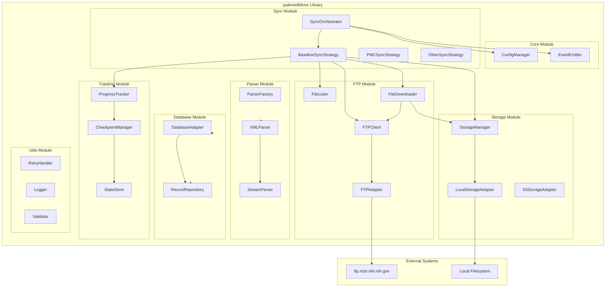

# PubMed Mirror Framework Architecture

## Overview

The PubMed Mirror framework is designed to synchronize and mirror PubMed data from the NCBI FTP server. The framework supports three synchronization strategies:

1. **Baseline** - Initial full PubMed index sync
2. **PMC** - PubMed Central full-text articles
3. **Other** - Additional PubMed data sources

This document focuses on the **Baseline** synchronization implementation.

## Architecture Diagram



## Module Design

### 1. Core Module

#### ConfigManager

Manages configuration for the mirror system.

```typescript
interface PubMedMirrorConfig {
  // FTP Configuration
  ftp: {
    host: string;
    port: number;
    user: string;
    password: string;
    secure: boolean;
    timeout: number;
  };

  // Storage Configuration
  storage: {
    type: 'local' | 's3';
    basePath: string;
    maxRetries: number;
    chunkSize: number;
  };

  // Sync Configuration
  sync: {
    strategy: 'baseline' | 'pmc' | 'other';
    concurrentDownloads: number;
    batchSize: number;
    resumeFromCheckpoint: boolean;
  };

  // Parser Configuration
  parser: {
    batchSize: number;
    streamProcessing: boolean;
    validateXML: boolean;
  };

  // Database Configuration
  database: {
    type: 'postgresql' | 'mongodb';
    connectionString: string;
    batchSize: number;
  };
}
```

#### EventEmitter

Event system for progress tracking and notifications.

```typescript
interface MirrorEvents {
  'sync:start': SyncStartEvent;
  'sync:progress': SyncProgressEvent;
  'sync:complete': SyncCompleteEvent;
  'sync:error': SyncErrorEvent;
  'file:downloaded': FileDownloadedEvent;
  'file:parsed': FileParsedEvent;
  'batch:inserted': BatchInsertedEvent;
  'checkpoint:saved': CheckpointSavedEvent;
}
```

### 2. Sync Module

#### SyncOrchestrator

Main orchestrator for synchronization operations.

```typescript
interface SyncOrchestrator {
  // Start synchronization
  sync(options: SyncOptions): Promise<SyncResult>;

  // Pause synchronization
  pause(): Promise<void>;

  // Resume synchronization
  resume(): Promise<void>;

  // Cancel synchronization
  cancel(): Promise<void>;

  // Get current status
  getStatus(): SyncStatus;
}

interface SyncOptions {
  strategy: 'baseline' | 'pmc' | 'other';
  resume?: boolean;
  fromDate?: Date;
  toDate?: Date;
  limit?: number;
}

interface SyncResult {
  success: boolean;
  filesDownloaded: number;
  filesProcessed: number;
  recordsInserted: number;
  duration: number;
  errors: Error[];
}
```

#### BaselineSyncStrategy

Implements baseline synchronization from PubMed FTP.

```typescript
interface BaselineSyncStrategy {
  // List all baseline files
  listFiles(): Promise<FtpFileInfo[]>;

  // Filter files based on criteria
  filterFiles(files: FtpFileInfo[], options: FilterOptions): FtpFileInfo[];

  // Download files
  downloadFiles(files: FtpFileInfo[]): Promise<DownloadResult[]>;

  // Parse downloaded files
  parseFiles(filePaths: string[]): Promise<ParseResult[]>;

  // Store parsed records
  storeRecords(records: PubMedRecord[]): Promise<StoreResult>;
}

interface FtpFileInfo {
  name: string;
  size: number;
  modifiedDate: Date;
  path: string;
}
```

### 3. FTP Module

#### FTPClient

Wrapper around basic-ftp with connection pooling and retry logic.

```typescript
interface FTPClient {
  // Connect to FTP server
  connect(): Promise<void>;

  // Disconnect from FTP server
  disconnect(): Promise<void>;

  // List files in directory
  list(path: string): Promise<FtpFileInfo[]>;

  // Download file
  download(remotePath: string, localPath: string): Promise<void>;

  // Check if file exists
  exists(path: string): Promise<boolean>;

  // Get file size
  size(path: string): Promise<number>;
}
```

#### FileLister

Lists and filters files from FTP server.

```typescript
interface FileLister {
  // List all files in baseline directory
  listBaselineFiles(): Promise<FtpFileInfo[]>;

  // List all files in update directory
  listUpdateFiles(since?: Date): Promise<FtpFileInfo[]>;

  // Filter files by date range
  filterByDateRange(
    files: FtpFileInfo[],
    start: Date,
    end?: Date,
  ): FtpFileInfo[];

  // Filter files by pattern
  filterByPattern(files: FtpFileInfo[], pattern: RegExp): FtpFileInfo[];
}
```

#### FileDownloader

Downloads files with progress tracking and resume capability.

```typescript
interface FileDownloader {
  // Download single file
  downloadFile(file: FtpFileInfo, destination: string): Promise<DownloadResult>;

  // Download multiple files concurrently
  downloadFiles(
    files: FtpFileInfo[],
    destination: string,
  ): Promise<DownloadResult[]>;

  // Resume interrupted download
  resumeDownload(
    file: FtpFileInfo,
    partialPath: string,
  ): Promise<DownloadResult>;
}

interface DownloadResult {
  file: FtpFileInfo;
  success: boolean;
  localPath: string;
  bytesDownloaded: number;
  duration: number;
  error?: Error;
}
```

### 4. Storage Module

#### StorageManager

Manages file storage operations.

```typescript
interface StorageManager {
  // Store file
  store(source: string, destination: string): Promise<void>;

  // Retrieve file
  retrieve(path: string): Promise<Buffer>;

  // Delete file
  delete(path: string): Promise<void>;

  // Check if file exists
  exists(path: string): Promise<boolean>;

  // List files in directory
  list(directory: string): Promise<string[]>;

  // Get file stats
  stats(path: string): Promise<FileStats>;
}

interface FileStats {
  size: number;
  created: Date;
  modified: Date;
  isDirectory: boolean;
}
```

#### LocalStorageAdapter

Local filesystem storage implementation.

```typescript
interface LocalStorageAdapter extends StorageManager {
  // Ensure directory exists
  ensureDirectory(path: string): Promise<void>;

  // Get available disk space
  getAvailableSpace(): Promise<number>;

  // Clean old files
  cleanOldFiles(before: Date): Promise<number>;
}
```

### 5. Parser Module

#### XMLParser

Parses PubMed XML files.

```typescript
interface XMLParser {
  // Parse file to PubMed records
  parseFile(filePath: string): Promise<PubMedRecord[]>;

  // Parse stream of XML data
  parseStream(stream: Readable): AsyncIterableIterator<PubMedRecord>;

  // Parse batch of files
  parseBatch(filePaths: string[]): Promise<PubMedRecord[][]>;
}

interface PubMedRecord {
  pmid: string;
  pmcId?: string;
  doi?: string;
  title: string;
  abstract?: string;
  authors: Author[];
  publicationDate?: Date;
  journal: JournalInfo;
  meshHeadings?: MeshHeading[];
  keywords?: string[];
  publicationsTypes: string[];
  rawXml?: string;
}

interface Author {
  lastName: string;
  foreName?: string;
  initials?: string;
  affiliations?: string[];
}

interface JournalInfo {
  name: string;
  issn?: string;
  volume?: string;
  issue?: string;
  pages?: string;
  pubDate?: Date;
}

interface MeshHeading {
  descriptorName: string;
  qualifierNames?: string[];
  majorTopic: boolean;
}
```

#### StreamParser

Memory-efficient streaming XML parser.

```typescript
interface StreamParser {
  // Create parsing stream
  createStream(): Transform;

  // Parse XML stream incrementally
  parseStream(stream: Readable): AsyncIterableIterator<PubMedRecord>;

  // Set batch size for buffered parsing
  setBatchSize(size: number): void;
}
```

### 6. Database Module

#### DatabaseAdapter

Database abstraction layer.

```typescript
interface DatabaseAdapter {
  // Connect to database
  connect(): Promise<void>;

  // Disconnect from database
  disconnect(): Promise<void>;

  // Insert records
  insertRecords(records: PubMedRecord[]): Promise<InsertResult>;

  // Update records
  updateRecords(records: PubMedRecord[]): Promise<UpdateResult>;

  // Upsert records
  upsertRecords(records: PubMedRecord[]): Promise<UpsertResult>;

  // Query records
  query(query: QueryOptions): Promise<PubMedRecord[]>;

  // Execute transaction
  transaction<T>(callback: (tx: Transaction) => Promise<T>): Promise<T>;
}

interface InsertResult {
  insertedCount: number;
  errors: Error[];
}

interface UpsertResult {
  insertedCount: number;
  updatedCount: number;
  errors: Error[];
}
```

#### RecordRepository

High-level repository for PubMed records.

```typescript
interface RecordRepository {
  // Save records to database
  save(records: PubMedRecord[]): Promise<SaveResult>;

  // Find record by PMID
  findByPMID(pmid: string): Promise<PubMedRecord | null>;

  // Find records by date range
  findByDateRange(start: Date, end: Date): Promise<PubMedRecord[]>;

  // Bulk upsert records
  bulkUpsert(records: PubMedRecord[]): Promise<BulkUpsertResult>;

  // Get statistics
  getStatistics(): Promise<RepositoryStatistics>;
}
```

### 7. Tracking Module

#### ProgressTracker

Tracks synchronization progress.

```typescript
interface ProgressTracker {
  // Initialize tracking
  initialize(totalFiles: number): void;

  // Update progress
  updateProgress(category: ProgressCategory, current: number): void;

  // Get current progress
  getProgress(): ProgressInfo;

  // Mark complete
  complete(): void;

  // Reset tracking
  reset(): void;
}

enum ProgressCategory {
  Discovery = 'discovery',
  Downloading = 'downloading',
  Parsing = 'parsing',
  Storing = 'storing',
}

interface ProgressInfo {
  totalFiles: number;
  discovered: number;
  downloaded: number;
  parsed: number;
  stored: number;
  failed: number;
  percentage: number;
  currentFile?: string;
  estimatedTimeRemaining?: number;
}
```

#### CheckpointManager

Manages checkpoints for resume capability.

```typescript
interface CheckpointManager {
  // Save checkpoint
  saveCheckpoint(checkpoint: Checkpoint): Promise<void>;

  // Load checkpoint
  loadCheckpoint(): Promise<Checkpoint | null>;

  // Clear checkpoint
  clearCheckpoint(): Promise<void>;

  // Validate checkpoint
  validateCheckpoint(checkpoint: Checkpoint): boolean;
}

interface Checkpoint {
  id: string;
  timestamp: Date;
  strategy: SyncStrategy;
  completedFiles: string[];
  pendingFiles: string[];
  lastProcessedFile?: string;
  metadata: Record<string, any>;
}
```

#### StateStore

Persistent storage for sync state.

```typescript
interface StateStore {
  // Save state
  save(state: SyncState): Promise<void>;

  // Load state
  load(): Promise<SyncState | null>;

  // Update state
  update(updates: Partial<SyncState>): Promise<void>;

  // Clear state
  clear(): Promise<void>;
}

interface SyncState {
  id: string;
  status: SyncStatus;
  strategy: SyncStrategy;
  startedAt: Date;
  completedAt?: Date;
  progress: ProgressInfo;
  checkpoint?: Checkpoint;
  errors: Error[];
  metadata: Record<string, any>;
}

enum SyncStatus {
  Idle = 'idle',
  Running = 'running',
  Paused = 'paused',
  Completed = 'completed',
  Failed = 'failed',
  Cancelled = 'cancelled',
}
```

### 8. Utils Module

#### RetryHandler

Handles retry logic with exponential backoff.

```typescript
interface RetryHandler {
  // Execute with retry
  retry<T>(fn: () => Promise<T>, options?: RetryOptions): Promise<T>;

  // Execute with circuit breaker
  executeWithCircuitBreaker<T>(
    fn: () => Promise<T>,
    options?: CircuitBreakerOptions,
  ): Promise<T>;
}

interface RetryOptions {
  maxAttempts?: number;
  initialDelay?: number;
  maxDelay?: number;
  backoffMultiplier?: number;
  retryableErrors?: (error: Error) => boolean;
}
```

#### Logger

Structured logging system.

```typescript
interface Logger {
  debug(message: string, meta?: any): void;
  info(message: string, meta?: any): void;
  warn(message: string, meta?: any): void;
  error(message: string, meta?: any): void;
}
```

#### Validator

Validates data integrity.

```typescript
interface Validator {
  // Validate PubMed record
  validateRecord(record: PubMedRecord): ValidationResult;

  // Validate XML file
  validateXML(filePath: string): Promise<ValidationResult>;

  // Validate file integrity
  validateFileIntegrity(
    filePath: string,
    expectedSize: number,
  ): Promise<ValidationResult>;
}

interface ValidationResult {
  valid: boolean;
  errors: ValidationError[];
}
```

## Directory Structure

```
libs/pubmedMirror/
├── src/
│   ├── lib/
│   │   ├── core/
│   │   │   ├── config-manager.ts
│   │   │   ├── event-emitter.ts
│   │   │   └── types.ts
│   │   ├── sync/
│   │   │   ├── sync-orchestrator.ts
│   │   │   ├── baseline-sync-strategy.ts
│   │   │   ├── pmc-sync-strategy.ts
│   │   │   └── other-sync-strategy.ts
│   │   ├── ftp/
│   │   │   ├── ftp-client.ts
│   │   │   ├── ftp-adapter.ts
│   │   │   ├── file-lister.ts
│   │   │   └── file-downloader.ts
│   │   ├── storage/
│   │   │   ├── storage-manager.ts
│   │   │   ├── local-storage-adapter.ts
│   │   │   └── s3-storage-adapter.ts
│   │   ├── parser/
│   │   │   ├── parser-factory.ts
│   │   │   ├── xml-parser.ts
│   │   │   └── stream-parser.ts
│   │   ├── database/
│   │   │   ├── database-adapter.ts
│   │   │   ├── record-repository.ts
│   │   │   └── models.ts
│   │   ├── tracking/
│   │   │   ├── progress-tracker.ts
│   │   │   ├── checkpoint-manager.ts
│   │   │   └── state-store.ts
│   │   ├── utils/
│   │   │   ├── retry-handler.ts
│   │   │   ├── logger.ts
│   │   │   └── validator.ts
│   │   ├── pubmed-mirror.ts          # Main entry point
│   │   └── pubmed-mirror.spec.ts
│   └── index.ts
├── package.json
├── tsconfig.json
├── tsconfig.lib.json
├── tsconfig.spec.json
├── vite.config.ts
└── README.md
```

## Usage Example

```typescript
import { PubMedMirror } from '@your-org/pubmedMirror';

// Initialize mirror
const mirror = new PubMedMirror({
  ftp: {
    host: 'ftp.ncbi.nlm.nih.gov',
    port: 21,
    user: 'anonymous',
    password: 'anonymous@example.com',
    secure: false,
    timeout: 30000,
  },
  storage: {
    type: 'local',
    basePath: '/data/pubmed',
    maxRetries: 3,
  },
  sync: {
    strategy: 'baseline',
    concurrentDownloads: 5,
    batchSize: 100,
  },
  database: {
    type: 'postgresql',
    connectionString: process.env.DATABASE_URL,
    batchSize: 1000,
  },
});

// Listen to events
mirror.on('sync:progress', (progress) => {
  console.log(`Progress: ${progress.percentage}%`);
});

mirror.on('file:downloaded', (event) => {
  console.log(`Downloaded: ${event.fileName}`);
});

// Start baseline sync
const result = await mirror.sync({
  strategy: 'baseline',
  resume: true,
});

console.log(`Sync complete: ${result.recordsInserted} records inserted`);
```

## Key Features

1. **Resumable Sync** - Checkpoint-based resume capability
2. **Concurrent Downloads** - Parallel file downloading
3. **Stream Processing** - Memory-efficient XML parsing
4. **Error Handling** - Comprehensive retry and error recovery
5. **Progress Tracking** - Real-time progress updates
6. **Modular Design** - Easy to extend and test
7. **Type Safety** - Full TypeScript support
8. **Event-Driven** - Flexible event system for integration

## Next Steps

1. Implement core interfaces and types
2. Implement FTP client and file operations
3. Implement storage adapters
4. Implement XML parser
5. Implement database integration
6. Implement progress tracking
7. Add comprehensive tests
8. Add documentation and examples
