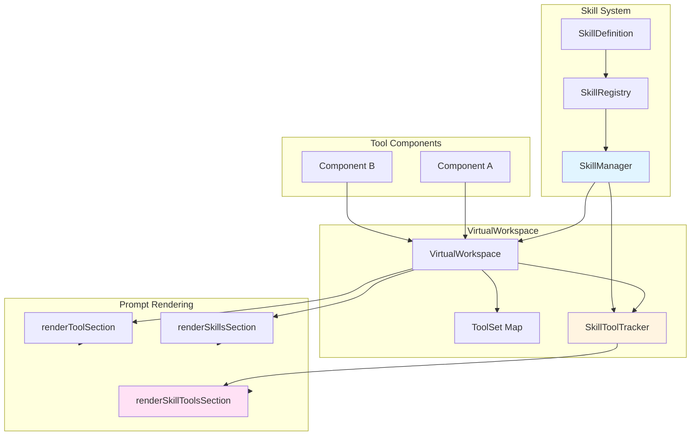

# Skill-Based Tool Control Architecture

## Executive Summary

This document outlines the architecture for extending the current skill system to control tool availability and tool prompt rendering through skill activation/deactivation. Currently, skills only provide on-demand prompt loading, but do not control which tools are available to the LLM.

## Current Architecture Analysis

### Existing Components

1. **Skill System** (`libs/agent-lib/src/skills/`)
   - `SkillDefinition.ts`: Builder for TypeScript-based skills
   - `SkillManager.ts`: Runtime skill activation and management
   - `SkillRegistry.ts`: Loading and registration of skills
   - `types.ts`: Core type definitions

2. **VirtualWorkspace** (`libs/agent-lib/src/statefulContext/virtualWorkspace.ts`)
   - Manages multiple `ToolComponent` instances
   - Maintains a global `toolSet` Map of all available tools
   - Has a `SkillManager` for skill lifecycle
   - Currently has DISABLED tool management in `handleSkillChange()` (lines 126-147)

3. **ToolComponent** (`libs/agent-lib/src/statefulContext/toolComponent.ts`)
   - Abstract base class for components with tools
   - Each component has its own `toolSet: Map<string, Tool>`
   - Tools are rendered via `renderToolSection()`

### Current Limitations

1. **No Tool Control**: Skills define `tools[]` in their definition, but these are NOT added/removed from the workspace's available tools
2. **Disabled Code**: The `handleSkillChange()` method in `VirtualWorkspace` has commented-out code that would have managed skill tools
3. **Static Tool Availability**: Tools from components are always available regardless of active skill
4. **No Tool Prompt Rendering**: Skill-specific tools don't have dedicated prompt sections

## Proposed Architecture

### Design Goals

1. **Skill-Scoped Tools**: Tools should only be available when their associated skill is active
2. **Tool Prompt Rendering**: Active skill tools should be rendered in a dedicated section
3. **Backward Compatibility**: Existing components and skills should continue to work
4. **Clear Separation**: Distinguish between "component tools" (always available) and "skill tools" (skill-scoped)

### Architecture Overview



### Key Components

#### 1. Extended Type Definitions

**New types in `skills/types.ts`:**

```typescript
/**
 * Tool source - where a tool originates from
 */
export enum ToolSource {
    /** Always-available component tool */
    COMPONENT = 'component',
    /** Skill-scoped tool (only available when skill is active) */
    SKILL = 'skill',
    /** Global tool (always available) */
    GLOBAL = 'global'
}

/**
 * Extended tool registration with source tracking
 */
export interface ToolRegistration {
    /** The tool definition */
    tool: Tool;
    /** Where this tool comes from */
    source: ToolSource;
    /** Component key (for component tools) */
    componentKey?: string;
    /** Skill name (for skill tools) */
    skillName?: string;
    /** Whether the tool is currently enabled/available */
    enabled: boolean;
}

/**
 * Skill tool state tracking
 */
export interface SkillToolState {
    /** Name of the skill */
    skillName: string;
    /** Tools provided by this skill */
    tools: Tool[];
    /** Whether this skill is currently active */
    active: boolean;
    /** Tool names added to workspace */
    addedToolNames: string[];
}
```

#### 2. SkillManager Extensions

**New methods in `SkillManager.ts`:**

```typescript
export class SkillManager {
    // ... existing methods ...

    /**
     * Get tools from the currently active skill
     */
    getActiveSkillTools(): Tool[] {
        return this.activeSkill?.tools ?? [];
    }

    /**
     * Get tool names from the currently active skill
     */
    getActiveSkillToolNames(): string[] {
        return this.activeSkill?.tools?.map(t => t.toolName) ?? [];
    }

    /**
     * Check if a tool name belongs to the active skill
     */
    isToolFromActiveSkill(toolName: string): boolean {
        return this.getActiveSkillToolNames().includes(toolName);
    }

    /**
     * Get tool state for all skills
     */
    getAllSkillToolStates(): SkillToolState[] {
        return Array.from(this.registry.values()).map(skill => ({
            skillName: skill.name,
            tools: skill.tools ?? [],
            active: this.activeSkill?.name === skill.name,
            addedToolNames: skill.tools?.map(t => t.toolName) ?? []
        }));
    }
}
```

#### 3. VirtualWorkspace Enhancements

**Key changes to `virtualWorkspace.ts`:**

1. **Re-enable and enhance `handleSkillChange()` method:**

```typescript
private handleSkillChange(skill: Skill | null): void {
    // Remove previous skill tools from toolSet
    for (const toolName of this.skillToolNames) {
        const registration = this.toolSet.get(toolName);
        if (registration?.source === ToolSource.SKILL) {
            this.toolSet.delete(toolName);
        }
    }
    this.skillToolNames.clear();

    // Add new skill tools
    if (skill?.tools) {
        for (const tool of skill.tools) {
            this.toolSet.set(tool.toolName, {
                tool,
                source: ToolSource.SKILL,
                skillName: skill.name,
                enabled: true
            });
            this.skillToolNames.add(tool.toolName);
        }
    }

    // Notify tool availability change
    this.onToolAvailabilityChange?.();
}
```

2. **Add new method for rendering skill tools:**

```typescript
/**
 * Render skill-specific tools section
 */
renderSkillToolsSection(): TUIElement | null {
    const activeSkill = this.skillManager.getActiveSkill();
    if (!activeSkill?.tools || activeSkill.tools.length === 0) {
        return null;
    }

    const container = new tdiv({
        styles: {
            showBorder: true,
            border: { line: 'double' }
        }
    });

    container.addChild(new tdiv({
        content: `SKILL TOOLS: ${activeSkill.displayName}`,
        styles: { align: 'center' }
    }));

    const toolSection = renderToolSection(activeSkill.tools);
    container.addChild(toolSection);

    return container;
}
```

3. **Update `_render()` to include skill tools:**

```typescript
private async _render(): Promise<TUIElement> {
    const container = new tdiv({ /* ... */ });

    // ... existing header rendering ...

    // Add skills section
    container.addChild(this.renderSkillsSection());

    // Add skill tools section (NEW)
    const skillToolsSection = this.renderSkillToolsSection();
    if (skillToolsSection) {
        container.addChild(skillToolsSection);
    }

    // ... rest of rendering ...
}
```

4. **Add tool availability callback:**

```typescript
private onToolAvailabilityChange?: (() => void) | undefined;

/**
 * Set callback for when tool availability changes
 */
setOnToolAvailabilityChange(callback: () => void): void {
    this.onToolAvailabilityChange = callback;
}
```

#### 4. Tool Availability Query

**New method in `VirtualWorkspace`:**

```typescript
/**
 * Check if a tool is currently available
 */
isToolAvailable(toolName: string): boolean {
    const registration = this.toolSet.get(toolName);
    return registration?.enabled ?? false;
}

/**
 * Get all currently available tools
 */
getAvailableTools(): Tool[] {
    return Array.from(this.toolSet.values())
        .filter(reg => reg.enabled)
        .map(reg => reg.tool);
}

/**
 * Get tool source information
 */
getToolSource(toolName: string): { source: ToolSource; owner: string } | null {
    const registration = this.toolSet.get(toolName);
    if (!registration) return null;

    return {
        source: registration.source,
        owner: registration.componentKey ?? registration.skillName ?? 'global'
    };
}
```

### Implementation Steps

#### Phase 1: Type System Extensions
1. Add `ToolSource` enum to `skills/types.ts`
2. Add `ToolRegistration` interface
3. Add `SkillToolState` interface
4. Update `Tool` interface if needed (likely not)

#### Phase 2: SkillManager Enhancements
1. Add `getActiveSkillTools()` method
2. Add `getActiveSkillToolNames()` method
3. Add `isToolFromActiveSkill()` method
4. Add `getAllSkillToolStates()` method

#### Phase 3: VirtualWorkspace Core Changes
1. Update `toolSet` type to use `ToolRegistration`
2. Re-enable and enhance `handleSkillChange()` method
3. Add `renderSkillToolsSection()` method
4. Update `_render()` to include skill tools
5. Add tool availability query methods

#### Phase 4: Component Integration
1. Update component registration to track tool source
2. Ensure backward compatibility with existing components

#### Phase 5: Testing
1. Unit tests for SkillManager extensions
2. Unit tests for VirtualWorkspace tool management
3. Integration tests for skill activation/deactivation
4. Tests for tool availability queries

#### Phase 6: Documentation
1. Update README.md in skills directory
2. Add examples of skill-defined tools
3. Document the tool availability model
4. Update architecture documentation

## Usage Examples

### Defining a Skill with Tools

```typescript
import { defineSkill } from '../skills/SkillDefinition.js';
import { myTool1, myTool2 } from '../myTools.js';

export default defineSkill({
    name: 'my-skill',
    displayName: 'My Skill',
    description: 'A skill with tools',
    version: '1.0.0',
    
    capabilities: ['Capability 1', 'Capability 2'],
    workDirection: 'How to use this skill...',
    
    // Tools only available when this skill is active
    tools: [myTool1, myTool2],
    
    onActivate: async () => {
        console.log('Skill activated - tools now available');
    },
    
    onDeactivate: async () => {
        console.log('Skill deactivated - tools removed');
    }
});
```

### Using Skill-Based Tools

```typescript
// Activate skill - tools become available
await workspace.activateSkill('my-skill');

// Tools are now in the workspace
const availableTools = workspace.getAvailableTools();
// Includes myTool1, myTool2

// Check tool source
const source = workspace.getToolSource('myTool1');
// { source: 'skill', owner: 'my-skill' }

// Deactivate skill - tools are removed
await workspace.deactivateSkill();

// Tools no longer available
const toolsAfter = workspace.getAvailableTools();
// myTool1, myTool2 are gone
```

## Backward Compatibility

The design maintains backward compatibility:

1. **Existing Components**: Component tools remain always-available
2. **Existing Skills**: Skills without `tools` array work as before
3. **Global Tools**: Global tools (like `attempt_completion`) remain unchanged
4. **Optional Feature**: Tool control is opt-in via skill definition

## Migration Path

For existing code:

1. **No changes required** for components without skill-defined tools
2. **Gradual adoption**: Add tools to skills one at a time
3. **Testing**: Each skill can be tested independently

## Future Enhancements

Potential future improvements:

1. **Tool Dependencies**: Skills could declare dependencies on other skills' tools
2. **Tool Composition**: Skills could extend/reuse tools from other skills
3. **Tool Versioning**: Support for multiple versions of the same tool
4. **Tool Permissions**: Fine-grained access control for tools
5. **Tool Metrics**: Track tool usage per skill

## Summary

This architecture extends the skill system to control tool availability through skill activation, while maintaining backward compatibility and clear separation of concerns. The implementation is phased to allow gradual adoption and testing.
