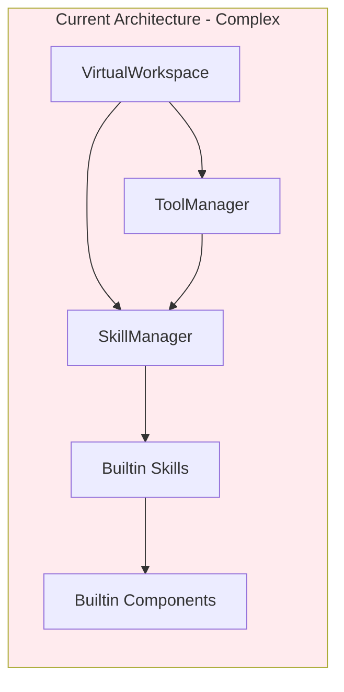
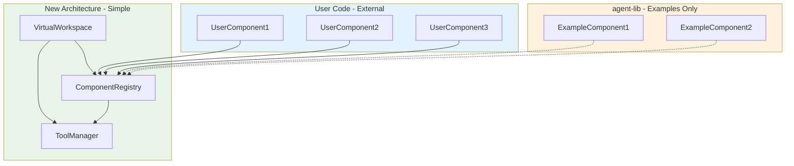

# VirtualWorkspace Refactoring Plan

## Goal

Transform agent-lib into a true agent development framework where:
1. Users can write ToolComponents externally (outside agent-lib package)
2. VirtualWorkspace directly manages ToolComponents without skill system
3. Built-in components serve as examples and debugging tools only

## Current Architecture Analysis

### Current Component Flow



### Problems with Current Design

1. **Skill system adds unnecessary complexity**
   - SkillManager manages skill lifecycle
   - Skills contain component definitions
   - Components are tightly coupled to skills

2. **Components locked inside agent-lib**
   - All builtin components in `libs/agent-lib/src/components/`
   - Users cannot easily create external components
   - DI tokens must be defined in agent-lib's TYPES

3. **VirtualWorkspace has too many responsibilities**
   - Skill management
   - Tool management
   - Component lifecycle
   - Rendering

## Proposed Architecture

### Simplified Component Flow



### Key Changes

| Aspect | Current | Proposed |
|--------|---------|----------|
| Component Registration | Via Skills | Direct registration |
| Skill System | Required | Removed |
| DI Container | Required for components | Optional |
| Component Location | agent-lib only | Any package |
| Tool Discovery | Via SkillManager | Direct from ComponentRegistry |

## Detailed Refactoring Steps

### Phase 1: Simplify VirtualWorkspace

#### 1.1 Remove SkillManager dependency from VirtualWorkspace

**File: `libs/agent-lib/src/statefulContext/virtualWorkspace.ts`**

Remove:
- `skillManager: SkillManager` property
- `activeSkill: Skill | null` property
- `initializeSkills()` method
- Skill-related imports

Add:
- `componentRegistry: ComponentRegistry` property
- Direct component registration methods

#### 1.2 Create ComponentRegistry

**New File: `libs/agent-lib/src/components/ComponentRegistry.ts`**

```typescript
/**
 * ComponentRegistry - Manages ToolComponent registration and lifecycle
 * 
 * Simple registry that allows external packages to register components
 */
export class ComponentRegistry {
    private components: Map<string, ToolComponent> = new Map();
    
    /**
     * Register a component
     */
    register(id: string, component: ToolComponent): void {
        this.components.set(id, component);
    }
    
    /**
     * Register multiple components
     */
    registerAll(components: Record<string, ToolComponent>): void {
        for (const [id, comp] of Object.entries(components)) {
            this.register(id, comp);
        }
    }
    
    /**
     * Get a component by ID
     */
    get(id: string): ToolComponent | undefined {
        return this.components.get(id);
    }
    
    /**
     * Get all registered components
     */
    getAll(): ToolComponent[] {
        return Array.from(this.components.values());
    }
    
    /**
     * Get all tools from all components
     */
    getAllTools(): Tool[] {
        const tools: Tool[] = [];
        for (const component of this.components.values()) {
            tools.push(...component.getTools());
        }
        return tools;
    }
    
    /**
     * Clear all components
     */
    clear(): void {
        this.components.clear();
    }
}
```

### Phase 2: Update VirtualWorkspace API

#### 2.1 New VirtualWorkspace constructor

```typescript
interface VirtualWorkspaceConfig {
    id: string;
    name: string;
    components?: ToolComponent[];  // Direct component passing
    renderMode?: 'tui' | 'markdown';
}

class VirtualWorkspace {
    constructor(config: VirtualWorkspaceConfig) {
        this.componentRegistry = new ComponentRegistry();
        
        // Register components directly
        if (config.components) {
            for (const comp of config.components) {
                this.componentRegistry.register(comp.constructor.name, comp);
            }
        }
    }
    
    /**
     * Register a component at runtime
     */
    registerComponent(id: string, component: ToolComponent): void {
        this.componentRegistry.register(id, component);
    }
    
    /**
     * Get all available tools
     */
    getAllTools(): Tool[] {
        return this.componentRegistry.getAllTools();
    }
}
```

### Phase 3: Update ToolComponent for External Use

#### 3.1 Ensure ToolComponent is properly exported

**File: `libs/agent-lib/src/index.ts`**

```typescript
// Core exports for external component development
export { ToolComponent } from './statefulContext/toolComponent.js';
export type { Tool, ToolParameter } from './statefulContext/types.js';
export { VirtualWorkspace } from './statefulContext/virtualWorkspace.js';
export { ComponentRegistry } from './components/ComponentRegistry.js';
```

#### 3.2 Create component development guide

**New File: `docs/component-development-guide.md`**

### Phase 4: Move Skills to Examples

#### 4.1 Keep skill system as optional example

- Move `libs/agent-lib/src/skills/` to `examples/skills/`
- Or keep as deprecated with migration guide

#### 4.2 Convert builtin skills to example components

- Each skill becomes an example of how to create components
- Document the migration path

## Migration Guide for Users

### Before (with Skills)

```typescript
// Old way - skills locked in agent-lib
import { getBuiltinSkills } from 'agent-lib';

const workspace = new VirtualWorkspace({
    skillMode: true
});

// Skills loaded automatically
```

### After (Direct Components)

```typescript
// New way - user creates components
import { VirtualWorkspace, ToolComponent, Tool } from 'agent-lib';

// User creates their own component
class MySearchComponent extends ToolComponent {
    getTools(): Tool[] {
        return [{
            name: 'search',
            description: 'Search for items',
            parameters: { ... },
            execute: async (params) => { ... }
        }];
    }
}

// User creates workspace with their components
const workspace = new VirtualWorkspace({
    id: 'my-workspace',
    name: 'My Workspace',
    components: [
        new MySearchComponent(),
        // Add more components as needed
    ]
});
```

## Decision

**User Decision (2024-03-13):**
1. ✅ **Completely remove skill system** - No optional layer
2. ✅ **No DI container** - Direct component instantiation
3. ✅ **Builtin components stay in agent-lib as examples** - Not a separate package

## Implementation Order

1. **Create ComponentRegistry** - New simple registry class
2. **Update VirtualWorkspace** - Remove SkillManager, add ComponentRegistry
3. **Update exports** - Ensure all necessary types/classes are exported
4. **Create documentation** - Component development guide
5. **Delete skill system** - Remove `libs/agent-lib/src/skills/` directory
6. **Update tests** - Ensure all tests pass with new architecture

## Breaking Changes

| Change | Impact | Migration |
|--------|--------|-----------|
| Remove SkillManager | High | Convert skills to components |
| Remove skill loading | Medium | Register components directly |
| Change VW constructor | Medium | Use new config interface |
| Remove DI container | High | Direct component instantiation |

## Benefits

1. **Simplicity** - One concept (Component) instead of two (Skill + Component)
2. **Flexibility** - Users can create components in any package
3. **Testability** - Easier to test individual components
4. **Tree-shaking** - Only include components you need
5. **Clear API** - Direct registration, no magic
